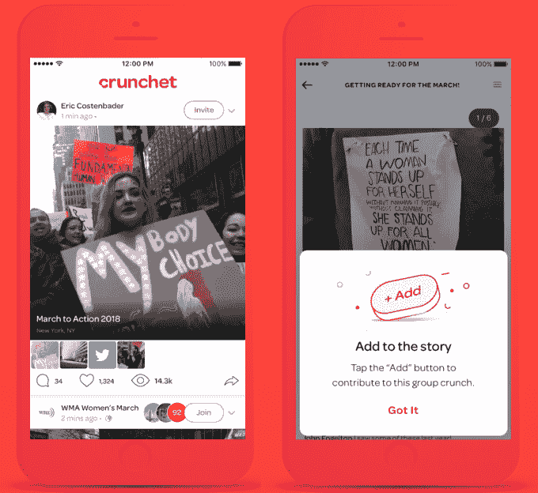
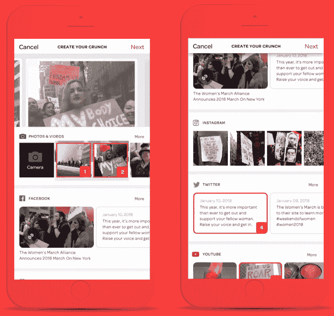

# 女子三月拥抱协作社交应用 Crunchet 

> 原文：<https://web.archive.org/web/https://techcrunch.com/2018/01/20/womens-march-app/>

今天全国妇女游行的参与者将通过每一个可以想象的社交网络倡导选民登记，因此其中一个规划组织与一个新的应用程序结盟，让你可以合并来自不同应用程序的帖子。

[Crunchet](https://web.archive.org/web/20230307142249/https://www.crunchet.com/) 将帮助[妇女游行联盟](https://web.archive.org/web/20230307142249/https://womensmarchalliance.org/)和 Chicago march 创建脸书、Instagram、Twitter、Twitch、YouTube、Spotify 的拼贴画，上传的内容可以作为一个单独的故事在任何地方分享。用户也可以合作，被邀请或要求成为其他人的 Crunchet 帖子的贡献者。

“我们创建这个网站的原因是我们觉得它在社交媒体上缺乏吸引力，”Crunchet 的联合创始人丹尼斯·霍尔泽(Denise Holzer)告诉我。该公司希望在被动的社交网络偷窥和只发布自己的信息之间架起一座桥梁。“克朗彻让你加入一个故事，”霍尔泽说。

“女性游行之所以成功，是因为社交媒体工具，”2017 年纽约市游行的领导者之一、女性游行联盟的创始人凯瑟琳·西米翁科(Katherine Siemionko)表示。“考虑到年轻人是我们的目标市场，像 Crunchet 这样的工具可能会让我们比脸书这样的老工具更快地接触到他们，而年轻人正在远离这些工具。”

妇女游行联盟的凯瑟琳·西米恩科

自从一年前在第一次妇女游行期间试运行以来，Crunchet 已经筹集了超过 150 万美元的种子资金，建立了一个 14 人的团队，并在 50 所大学派驻了大使。虽然这款应用程序仍有一些缺陷，但在社交联合发布和跨网络聚合内容这两个概念上都有潜力。

Crunchet 的 iOS 应用程序 (Android 将于春季推出)允许你登录所有其他应用程序，然后在那里选择你的内容，粘贴链接或上传图片。这一切都被放置在可旋转的旋转木马中，这样人们就不必在每个应用程序之间跳转来查看你在某个主题上的所有帖子。你甚至可以通过 Spotify 给你的帖子添加配乐。然后你把你的链接拿到任何你想分享的地方。

Crunchet 有自己的 feed，它支持脸书式的算法排序，这种排序可以掩埋帖子。您可以看到您关注的人的所有帖子，这样您就不会错过像今天这样的重要时刻的更新。

一个障碍可能是，其他地方的算法可能更喜欢本地内容，而不是在 Crunchet 上查看这些内容和更多内容的链接。霍尔泽希望，多个 Crunchet 用户合作发布你在别处无法获得的协作帖子，将会吸引点击量，并鼓励人们合作制作有意义的内容。

不过，算法问题可能会让 Crunchet 的增长雄心进一步复杂化。你可以将社交媒体疲劳和拥挤的应用空间视为一种优势，让人们有理由使用 Crunchet，这样他们就不必在每个应用上撰写多余的帖子。但这可能会让人们认为他们已经有太多的方式来分享。霍尔泽承认，“最大的挑战是让人们尝试它”，这是很少有社交应用能克服的障碍，即使没有脸书抄袭它们的特别之处的威胁。该公司正计划进行一轮首轮融资，以吸引更多资源来扩大规模。

除了今天的妇女游行，你可以在美国各地的城市甚至国外参加，Crunchet 计划与艺术、音乐、时尚、电子竞技和其他节日以及抗议和集会合作。无论是说服人们加入“投票权力”运动，还是仅仅帮助他们发现美好的事物， [Crunchet](https://web.archive.org/web/20230307142249/https://itunes.apple.com/us/app/crunchet/id1065689984?mt=8) 都可以让在任何地方分享变得像在任何地方分享一样简单。