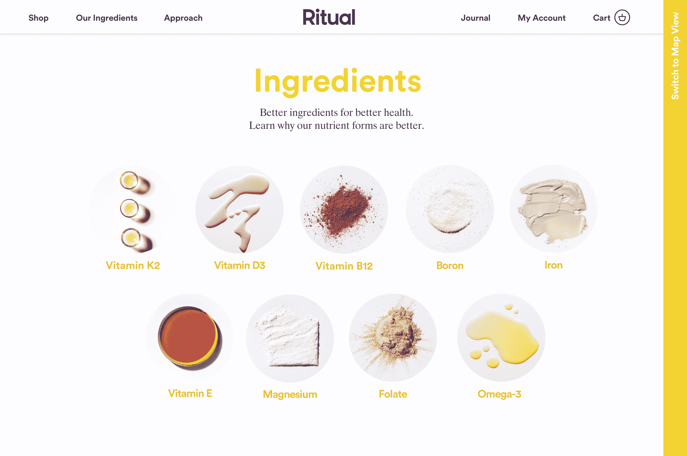

# 女性维生素创业仪式现在开始接受订单，投资者 TechCrunch 提供了 350 万美元

> 原文：<https://web.archive.org/web/https://techcrunch.com/2016/10/19/womens-vitamin-startup-ritual-is-now-open-for-orders-with-3-5-million-more-from-investors/>

# 女性维生素创业仪式现已开始接受订单，投资者将再投资 350 万美元

[礼](https://web.archive.org/web/20221006145521/https://ritual.com/)，一家专注于女性营养的[扰乱战场](https://web.archive.org/web/20221006145521/https://beta.techcrunch.com/startup-battlefield/disrupt-ny-2016/)创业公司，今天正式上线。

去年春天，当 Ritual 的创始人 Kat Schneider 上台展示她的商业模式时，我们[首先](https://web.archive.org/web/20221006145521/https://beta.techcrunch.com/2016/05/10/ritual-wants-to-reinvent-the-vitamin/)告诉你该公司旨在为女性制造更好的维生素。她进入了这个想法的最后几轮，最终输给了一个互动游戏网络，这个网络很快被微软抢走。

现在，Ritual 已经把它的想法带给了大众，它的在线订阅订购流程今天就要上线了。

你可能想知道为什么 TechCrunch 对维生素感兴趣。这是什么技术？当然，在商店和网上你可以买到很多维生素。我通常通过亚马逊订购。

技术部分既存在于施耐德所谓的成分来源的“开源”数据中，也存在于正在申请专利的珠状油胶囊中，用于持续释放其中的营养物质——这是在正确的时间以不会相互抵消的方式向身体输送营养物质的必要部分。例如，锌和镁[在一起不能很好地发挥作用](https://web.archive.org/web/20221006145521/https://labdoor.com/article/a-guide-to-timing-supplement-intake)如果一起服用。

仪式也只包括你在标准美国饮食中实际需要的补充物，而忽略了我们在食物中已经发现的丰富的东西。例如，我们摄入大量的维生素 C，所以药片里没有。

这个过程相当简单。您订购 30 天的订阅维生素；当他们来的时候，你每天吃两个，直到另一个盒子来。

配料也很简单，而且是女性经常需要的。只是维生素 D(像湾区这样多云或多雾气候中的许多人往往缺乏的东西)，维生素 E，维生素 K2 MK7，叶酸，维生素 B12，铁 8，镁，硼和你的 Omega 3 脂肪酸 DHA 和 EPA。

在今天推出该网站的同时，这家初创公司还宣布，它已经完成了由 Forerunner 牵头的 350 万美元的种子轮融资，Norwest 和 NEA 也参与了该轮融资，并获得了 advance Ventures 和 Rivet Ventures 的再投资，使融资总额达到了 500 万美元。

施耐德指出，她的大多数投资者也是女性。“我们这一轮有趣的是有多少女性站出来，”她告诉 TechCrunch。“我认为他们和我们一样，也看到了(维生素)行业的问题。我们正在打造一个超越维生素本身的品牌。我们围绕简单、实用和合理价格打造的品牌确实与女性息息相关。”