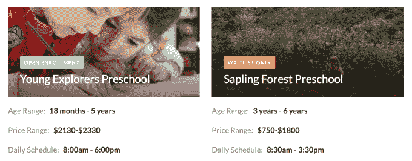
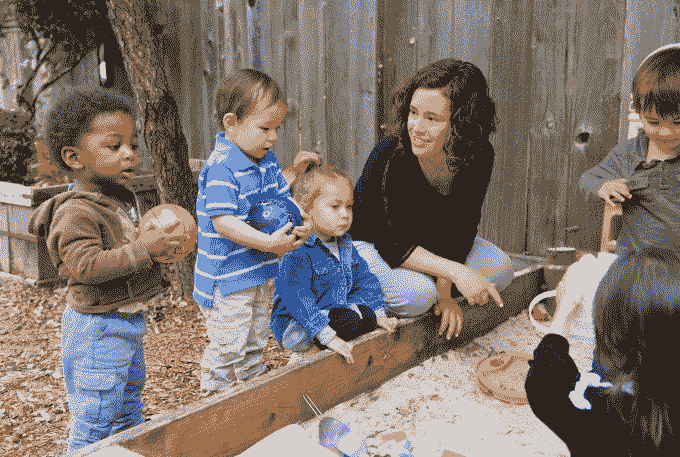
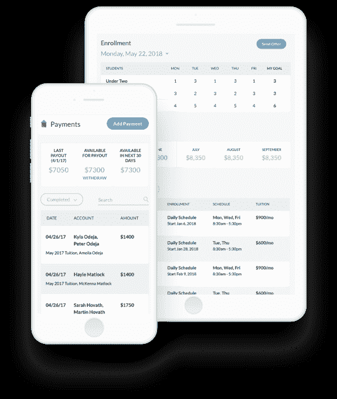

# Wonderschool 筹集 2000 万美元帮助人们开办家庭幼儿园 

> 原文：<https://web.archive.org/web/https://techcrunch.com/2018/08/10/wonderschool-raises-20m-to-help-people-start-in-home-preschools/>

教育工作者的收入已经不够了，那些在幼儿园或托儿所工作的人收入通常会少 48%。与此同时，家长们努力寻找优秀的早期教育项目，让孩子得到足够的关注和空间，但他们不需要特殊的关系或通过艰苦的招生面试才能进入。

任何时候，只要有一次糟糕的经历，人们就会产生情感共鸣，并为此花费大量金钱，这就是创业的机会。进入‘wonder school，这是一家让有执照的教育者和看护者开办家庭幼儿园或日托所的公司。Wonderschool 帮助候选人获得资格认证，建立他们的项目，推出他们的网站，提高入学率，并收取学费 10%的费用。这家初创公司现在正在旧金山湾、洛杉矶和纽约市帮助运营 140 所学校，那里的父母很乐意为他们的孩子提供优势。

这个填补教育市场有利可图的空白的机会为由 T4·安德森·霍洛维茨领导的神奇学校吸引了新的 2000 万美元的首轮融资。在启动两年后，这轮融资使这家初创公司的总融资额达到 2410 万美元。随着 cash 和 Andreessen 合伙人 Jeff Jordan 加入其董事会，Wonderschool 正在寻求建立强大的线索生成和管理软件，以将教师转变为精明的企业家。

寻找好的托儿服务已经成为家庭最艰难的经历之一。联合创始人兼首席执行官克里斯·贝内特说:“我看到在旧金山和纽约等城市，收入尚可的父母仍在努力寻找和负担高质量的托儿服务。“我们希望为父母提供一种解决方案，这种解决方案也有可能创造就业机会，并赋予照顾者权力——这就是 Wonderschool。”

通过在全国范围内产生和联合项目，Wonderschool 可以像软件吃掉学前班一样扩大规模。但是，如果没有对每一位教育工作者的严格监督，Wonderschool 也有可能在它的一家特许经营店发生安全事故，从而毁掉所有人的品牌。

## Airbnb 学校

当联合创始人 Arrel Gray 难以为离家近的女儿找到托儿服务时，Wonderschool 成立了。“我的小妹妹去了家庭幼儿园，所以我建议他去看看，”Bennett 说。“但他对这些选择不是很满意——大部分都满了，有些没有达到他家人的期望。我们还发现，他们很少使用互联网，因此很难找到和联系他们。”

在脸书算法的变化限制了社交商务初创公司 Soldsie 的增长后，这两家公司正在寻求转型。他们的研究发现了幼儿园和托儿所工作人员的工资到底有多低。当我们有了这个想法时，我们想，‘测试这个的最好方法是什么？’班尼特说:“我们为什么不自己开办一所幼儿园呢所以我们在伯克利山租了一所房子，聘请了一位了不起的教育家，建立了一所学校，并开办了一所。这所学校最终获得了巨大的成功。Yelp 上的五星评论。很高的 NPS。父母喜欢这个地方。“这也让老师的工资比以前高出了 3 倍。

有了这个证据，Wonderschool 继续从首轮资本、Omidyar Network、跨文化风险投资、Uncork Capital、Lerer Hippeau、FundersClub 和 Edelweiss 的 Josh Kopelman 那里筹集了 410 万美元。这让班尼特和格雷充实了公司。Wonderschool 将招募现有的教师和护理人员，或者指导人们获得许可，这样他们就可以成为家庭学校的“主管”。Wonderschool 的行为几乎像 Airbnb 一样，把它们变成了在家赚钱的小企业。

教师可以选择他们想要的任何时间表、课程或形式，比如 Montesori 或以自然为中心的学习。Wonderschool 现在有 500 多名董事使用其软件，有些人的收入高达 15 万美元或 20 万美元。作为学费削减 10%的交换，Wonderschool 为董事们提供一个“训练营”,让他们为工作做好准备。它将他们与一名导师配对，然后帮助他们建立自己的网站，并找出他们的定价选项。教练指导训练董事们寻找新的线索，提供有吸引力的旅游，并跟踪他们羽翼未丰的业务。

安德里森、奥米迪亚 、加里社区投资、和第一轮的 2000 万美元将用于扩展 Wonderschool 软件。它能帮助导演填补的每一个学生名额，赚得就越多。这家初创公司还将不得不与像 Wildflower Schools 这样的公司竞争，Bennett 承认他们有类似的商业模式，但他说“我们专注于家庭，他们也专注于蒙特梭利，而我们是课程不可知的。”还有为 18 岁以下学生提供家庭学校教育的山寨班，专注于短期户外教育的 Tinkergarten，以及通过视频聊天将中国孩子与美国老师联系起来的【VIP kid】。

像 Wonderschool 一样，他们正试图扩大规模，以满足现有的巨大需求。Bennett 解释道:“我们面临的挑战是，没有足够的项目来满足需要公立或私立学校教育(一年级或更早)的儿童的需求，而我们的目标是为每个孩子提供足够的供给。”。

尽管如此，安全仍然是首要问题。Bennett 注意到" Wonderschool 有一个支持团队，帮助学校董事准备他们的家园投入运营。在安全方面，每个州的许可证办公室都在获得经营许可证的审批过程中涉及到这一点。”但是，一所学校的问题会动摇所有其他学校的业务吗？“我们有一个平衡的检查系统，我们相信这将使我们能够预见任何潜在的问题，包括定期每周与董事进行检查，以及与家长进行反馈。我们还定期给家长发电子邮件，从家长那里获得反馈，如果我们发现有问题，我们会介入并与主管合作。

如果 Wonderschool 能够通过彻底的监督保持其品牌的清洁，它既可以在一个充斥着报酬过低的英雄的领域创造更好的薪酬工作，又可以向更广泛的学生开放早期教育。贝内特的父母从洪都拉斯移居美国，倾尽全力支持他和他妹妹的教育。现在，他正在为下一代教师打造工具，让更多的孩子在生活中有一个良好的开端。