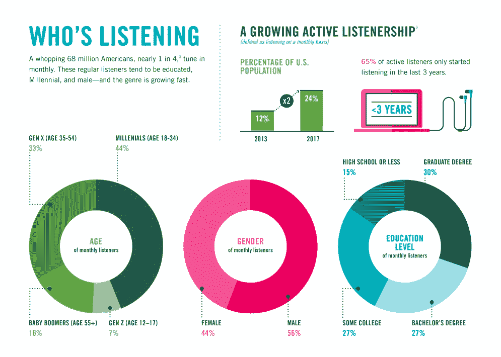
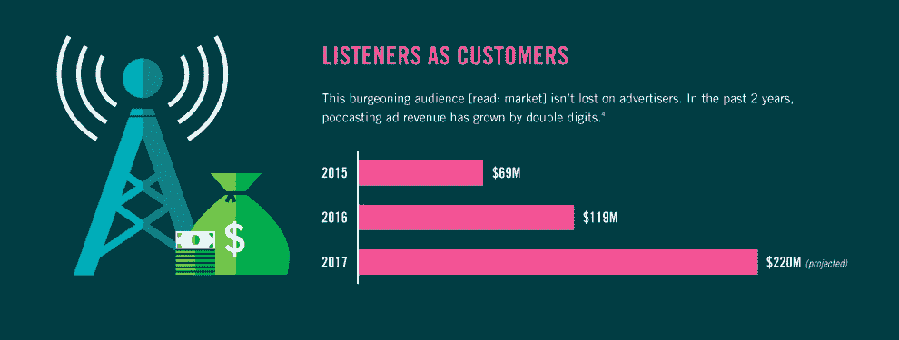

# Wondery 希望成为好莱坞的播客梦工厂 

> 原文：<https://web.archive.org/web/https://techcrunch.com/2018/03/29/wondery-wants-to-become-hollywoods-podcast-dream-factory/>

大约两年前，福克斯国际公司的前首席执行官埃尔南·洛佩斯用他在福克斯网络集团的前老板们的种子投资创办了播客网。

现在，随着声音的崛起，播客被证明是其他讲故事媒体可以抓住的新故事的滋生地——为 21 世纪重新发明无线电的行动似乎是有先见之明的。

现在支持播客业务的不仅仅是福克斯；由著名风险资本和私募股权投资者艾伦·帕特里科夫(Alan Patricof)的 Greycroft Partners 牵头的新投资者承诺投资 500 万美元，以扩大 Wondery 神奇工厂的规模。其他投资者包括 Lerer Hippeau Ventures 和 Advancit Capital，这是沙莉·雷石东(亿万富翁媒体大亨萨姆纳·雷德斯通的女儿)的投资工具。

之前的投资者 BAM Ventures、Watertower Ventures、Fox Networks Group 和 BDMI 也参与了这轮投资。

据[好莱坞报道](https://web.archive.org/web/20221231100601/https://www.hollywoodreporter.com/news/podcast-startup-wondery-raises-5-million-1098386)透露，Wondery 打算增加新的节目，包括*美国创新*、*死亡博士*和*我，幸存者*，并选择了《草地》、《规模》和《历史的潮汐》作为电影和电视的项目。

传统媒体公司正被迫联合起来，整合资产，以保护自己的市场免受来自科技行业的脸书、苹果、亚马逊、Hulu 和网飞等新竞争对手的冲击，而播客等新媒体平台正在为不同类型的工作室的出现开辟机会。

洛佩兹说:“我相信音频行业有巨大的机会。"目前还没有足够高质量的音频内容被制作出来."

洛佩兹称，现代消费者平均每天听四个小时的音乐。尽管大部分是音乐，越来越多的美国人转向播客作为一种新的娱乐形式。播客开始吸引更多的广告收入。

“在播客世界里，广告似乎很有效。他们是本地人，他们融入了演出。Wondery 的首席执行官表示:“听众很欢迎。对于渴望找到新方法来维持广告支持的商业模式的媒体公司来说，这本身就是一个受欢迎的变化。

洛佩兹说，网飞、亚马逊和 Hulu 已经用完全避开广告的订阅模式培养了一代消费者——但是播客仍然有希望。

他说，人口统计学是广告商转向播客的另一个关键原因，康姆斯克研究(由 Wondery 资助)似乎支持他的说法。

根据康姆斯克的数据，近五分之一的 18-49 岁的美国人表示，他们每月至少听一次播客——如果只限于 18-34 岁的男性，这个数字还会增加，而 18-34 岁的男性中有近三分之一会这样做。播客听众也更有可能拥有大学学位，收入超过 10 万美元，并且是电子产品、消费品和娱乐的早期用户。

广告商开始注意到这一点，2016 年在播客广告上花费了 1.19 亿美元，去年估计花费了 2.2 亿美元(根据主要播客网络赞助的一项调查中的估计数字)。

Wondery 的一些播客已经获得了令人印象深刻的数字。 [脏约翰](https://web.archive.org/web/20221231100601/https://wondery.com/shows/dirty-john/)已被下载超过 2000 万次；[美国历史柜员](https://web.archive.org/web/20221231100601/https://wondery.com/shows/american-history-tellers/)已被下载超过 300 万次；洛佩兹说,[商战](https://web.archive.org/web/20221231100601/https://wondery.com/shows/business-wars/)超过 200 万次。

Wondery 也与向观众提供微内容的媒体趋势背道而驰。

洛佩兹说:“我们不制作太多微内容——如果有的话。“我们倾向于被吸引的故事往往在长篇形式下效果更好。我们必须尽可能长时间地吸引他们的注意力。”

洛佩兹的 Wondery 并不是唯一一家从机构投资者那里捞钱建立播客帝国的公司。

在这个国家的另一边，布鲁克林区坐落着 Gimlet Media，这是目前价值 2000 万美元的播客市场之王。Gimlet 从一系列投资者那里筹集资金，包括 WPP、Betaworks、Stripes Group、Lowercase Capital、LionTree Parters、Emerson Collective、Cross Culture Ventures 和音乐管理公司 Troy Carter。

播客的成功也转化为其他形式的选择。正如《纽约时报》昨天指出的，播客正在获得“好莱坞待遇”

Wondery 自己的“[肮脏的约翰](https://web.archive.org/web/20221231100601/https://www.stitcher.com/podcast/wondery/dirty-john)”正在被改编成两个网络的系列节目——氧气频道的真实犯罪故事和 Bravo 频道的脚本系列节目的基础。与此同时，《欢迎来到夜谷》、《爱丽丝没有死》、《消失了》和《犯罪城》都被不同的制作公司改编成了电视剧。

“在过去一年左右的时间里，播客已经成为了*的时尚*,《Alex，Inc .》(一个基于 Gimlet Media 的“Startup”播客的新 ABC 节目)的创作者马特·塔塞斯告诉《纽约时报》。