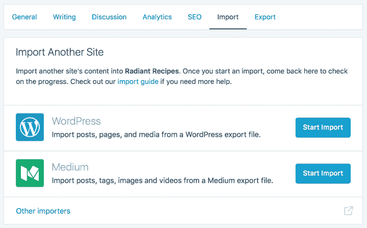

# WordPress.com 让你用新的导入工具抛弃媒体

> 原文：<https://web.archive.org/web/https://techcrunch.com/2017/03/02/wordpresscom-lets-you-ditch-medium-with-new-import-tool/>

# WordPress.com 让你用新的导入工具抛弃媒体

出版平台[传媒](https://web.archive.org/web/20230324074326/https://medium.com/)最近[裁员](https://web.archive.org/web/20230324074326/https://techcrunch.com/2017/01/04/medium-lays-off-50-employees-shuts-down-new-york-and-d-c-offices/)几十人。因此，如果你不想把你的宝贵作品交给一家仍在寻找商业模式的初创公司，只需点击几下鼠标，你就可以把你的内容转移到 WordPress.com 的。

WordPress.com 背后的公司 Automattic 刚刚发布了一款新的导入工具，可以更容易地将你所有的媒体内容复制到 WordPress.com 网站。

Medium 是一个好公民，因为它让您可以方便地导出帖子和草稿。zip 存档文件在您的媒体设置。然后你可以在你的 WordPress.com 设置中点击[导入页面](https://web.archive.org/web/20230324074326/https://wordpress.com/settings/import/)并上传。zip 文件。

上传完成后，需要 15 分钟的时间来发布你所有的带有正确时间戳的文章，并将你的媒体草稿转换成 WordPress 草稿。但仅此而已。

Medium 有一个圆滑的界面和一些很棒的分发工具。比如说，如果你在 Twitter 上已经有了很多粉丝，那么你就很容易获得大量读者。

但 Medium 也想成为文本内容的权威专有平台。该公司可以针对你的文章投放广告，并对你的文章做任何他们想做的事情。多年来，WordPress.com 已经有了一个更开放的方法和清晰的商业模式，我个人更信任 WordPress.com。

即使你想留在 Medium 上，知道有简单的工具可以将你的网站迁移到其他平台也是很好的。因此，如果你不同意 Medium 的决定，你总是可以选择离开它。

**更新:** Medium 不再发布推广故事，现在正在寻找新的收入来源。

