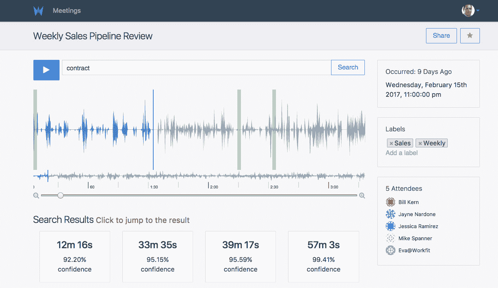
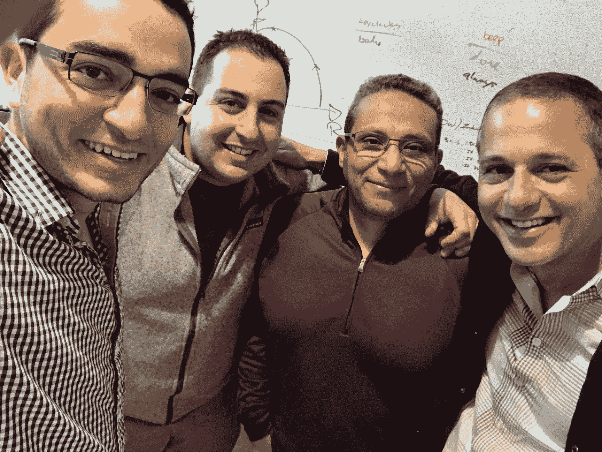

# Workfit 筹集了 550 万美元的种子资金，成为你的人工智能会议助手 

> 原文：<https://web.archive.org/web/https://techcrunch.com/2017/02/27/workfit-raises-5-5-million-seed-round-to-be-your-ai-meeting-assistant/>

# Workfit 筹集了 550 万美元的种子资金，成为你的人工智能会议助手

对话式人工智能正在通过 [Workfit](https://web.archive.org/web/20221209022845/https://www.workfit.com/) 更深入地进入企业，这是一家新的初创公司，承诺让电话会议的后续工作和会议期间的 CRM 更新像在 Google Home 或亚马逊 Echo 上播放歌曲或查看天气一样简单。 [Battery Ventures](https://web.archive.org/web/20221209022845/https://www.battery.com/) 、 [Greycroft Partners](https://web.archive.org/web/20221209022845/http://greycroft.com/) 、 [Salesforce Ventures](https://web.archive.org/web/20221209022845/https://www.salesforce.com/company/ventures/) 和一些天使投资人一起为这家初创公司提供了 550 万美元的种子投资。

围绕企业对话式人工智能的活动普遍上升，突显了 Workfit 的声明。亚马逊的 Alexa 可能是当今最受欢迎的企业友好型对话工具，它与像 [Hipchat](https://web.archive.org/web/20221209022845/https://www.google.com/amp/s/beta.techcrunch.com/2016/11/01/hipchats-voicemybot-tests-the-waters-for-amazon-echo-in-the-workplace/amp/) 和 [Sisense](https://web.archive.org/web/20221209022845/https://beta.techcrunch.com/2016/07/12/sisense-brings-natural-language-queries-with-amazon-echo-integration/) 这样的公司集成，用于团队协作和数据召回。当然，现实情况是，大多数会议并不局限于一个单独的会议室，有回声监听的会议就更少了。

Workfit 的助理 Eva 听取商务会议，并通过强调重要的行动项目向经理伸出援手。除了协调后续工作，Eva 还将接入您的 CRM du jour，以支持语音驱动的更新。这意味着您可以更新给定销售的状态，甚至可以提取或更新数据条目。Workfit 集成了主要的会议主持玩家，如[蓝战士](https://web.archive.org/web/20221209022845/https://www.bluejeans.com/)、 [WebEx](https://web.archive.org/web/20221209022845/https://www.webex.com/) 和 [Zoom](https://web.archive.org/web/20221209022845/https://zoom.us/) 。

Workfit 平台

其他工具，如最近推出的 Chorus.ai 和 [Cogito](https://web.archive.org/web/20221209022845/https://www.google.com/amp/s/beta.techcrunch.com/2016/08/16/cogito-leverages-human-behavior-to-nudge-customer-relationships/amp/) 分别更加专注于使用人工智能来促进销售和提高客户支持的有效性。虽然 Chorus.ai 会用与 Workfit 大致相同的机制加入电话会议，而且两者都会强调关键的行动项目，但 Workfit 在会议中扮演积极的角色没有问题。

Workfit 背后的团队希望企业用户通过明确地发出后续呼叫来帮助助手，而不是退居幕后。该工作流程听起来可能不完美，但该公司认为，无论是否存在人工智能，在会议期间总结要点都是最佳做法，以确保所有人类参与者都在同一页上。伊娃会尽她所能在后台工作，但是在 T4 x . ai 的私人日程安排助理艾米的精神下，她不会被认出来。

“对于消费者人工智能，如果你弹错了歌，那没问题，”Workfit 首席执行官奥马尔·塔瓦科尔断言。“但是 Salesforce 的管道中有错误的信息，这是不对的。”

Workfit 团队从左到右:Geish、David、Ahmad 和 Omar

这就是为什么这家初创公司如此专注于自动语音识别(ASR)的背后逻辑，甚至拉拢了脸书应用人工智能集团的前领导人 Ahmad Abdulkader。尽管在 2017 年从事 ASR 工作不一定很有吸引力，但是通过为特定的用例构建一个系统会有一些收获——在这种情况下，会有很多会议语言。

当被问及销售情况时，Workfit 团队告诉 TechCrunch，他们尚未获得任何销售机会，而且他们仍在考虑早期阶段。Tawakol 之前在 2014 年推动数据管理平台 BlueKai [以 4 亿美元收购 Oracle](https://web.archive.org/web/20221209022845/http://www.oracle.com/us/corporate/press/2150812)的经验无疑有助于简化筹资流程。 [Battery Ventures 是蓝凯的早期投资者。](https://web.archive.org/web/20221209022845/https://www.google.com/amp/s/beta.techcrunch.com/2010/02/01/bluekai-raises-21-million-for-online-target-marketing-data-exchange/amp/)

从这里开始，团队希望个人项目经理领导推动采用。一旦 Workfit 发现一群用户正在某个特定的公司开发，它就会介入尝试完成企业销售。