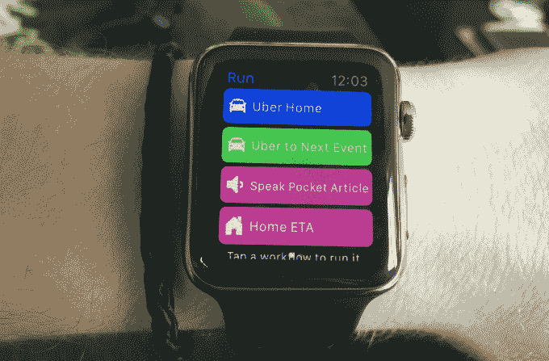
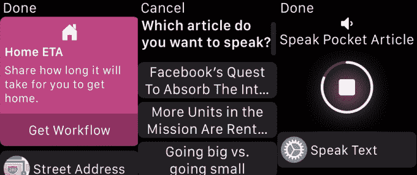

# 工作流程暗示了手表作为计算平台的未来 

> 原文：<https://web.archive.org/web/https://techcrunch.com/2015/05/16/workflow-hints-at-the-future-of-the-watch-as-a-computing-platform/>

由于体面地实现了可操作的通知，Apple Watch 和 Android Wear 都为某些佩戴者提供了大量价值。但在使用 Apple Watch 几周后，很明显大多数应用程序还没有完全弄清楚如何在你的手腕上有用。

对于那些在手表发布前没有手表的开发者来说(他们中的大多数)，很容易认为最好的办法是在 WatchKit SDK 的限制下缩小他们的 iPhone 应用程序——去掉一些无关的功能，在通过 Force Touch，ship 访问的菜单中隐藏一些东西。

[Workflow](https://web.archive.org/web/20221007001948/https://itunes.apple.com/app/workflow-powerful-automation/id915249334) ，这款应用最初是为了让你[在你的 iPhone](https://web.archive.org/web/20221007001948/https://beta.techcrunch.com/2014/12/11/workflow-lets-you-automate-the-stuff-you-do-all-the-time-on-your-iphone/) 或 iPad 上自动完成频繁的任务而开发的，是苹果手表上为数不多的似乎是专门为更小的外形尺寸开发的应用之一。

在手机上，工作流允许用户创建一个操作处方(拍摄 N 张照片，将它们拼凑成 GIF，发送给 X、Y 和 Z 收件人)，并生成一个主屏幕按钮或 iOS 操作扩展，以便随时通过一次点击来执行该任务。

售价 2.99 美元的 Workflow 是 iPhone 高级用户的杀手级应用。但在手表上，它是智能手表上所有应用程序的一个例子，无论是苹果制造的还是其他的。

Apple Watch 上的工作流程已经被精简为动词，而不是提供一个从菜单或图标中选择选项的界面。我想要一个优步的家，或者去参加我日历上的下一个会议。我走在回家的路上，想给我的室友发一个 ETA。也许我在 BART 上，它只是太紧了，无法在我的手机上阅读——没关系，我可以选择一篇袖珍文章，通过插在我后口袋 iPhone 上的耳机来阅读。

不需要记住手势或下载内容来填充提要。这是 WatchKit 应用程序范式的完美应用程序，只需轻轻一点，就可以在手机上执行多条指令。如果需要选择一个目的地或一篇文章，应用程序图库中的预制工作流会提供一些用户可能会选择的选项。

在接下来的几个月里，大多数开发人员会发现，在设计智能手表应用程序时，问自己的最佳问题是，“我可以帮助用户用一次点击做什么？”在可预见的未来，相机、LTE、GPS、屏幕尺寸和电池寿命将使智能手机保持相关，开发人员应该假设用户将始终随身携带一部手机，以完成任何比抬起手腕、滑动一两次和点击一两个按钮更长的动作。

Workflow 的缺陷表明，随着苹果向第三方开发者公开原生功能，应用程序将会变得更好。一些工作流程仍然需要完成一个步骤，比如从连接的手机上的“信息”应用程序中选择自动文本信息的收件人，它通过 Handoff 提供了一个快捷方式。其他人从手表上激活时会有不稳定的行为，因为苹果会关闭蓝牙无线电以节省电量，暂时暂停文章播放。随着苹果在手表上开放资源缓存等功能(希望几周后在 WWDC)，这些和其他小的挫折来源将会消失。