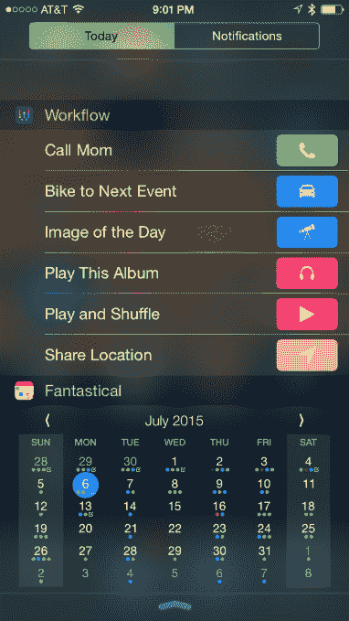
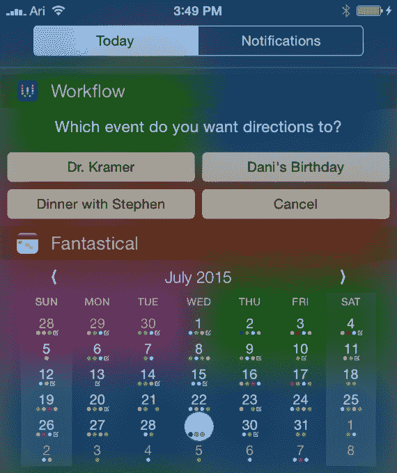

# 工作流让你可以在 iOS 的通知中心 TechCrunch 中设置常用操作的快捷方式

> 原文：<https://web.archive.org/web/https://techcrunch.com/2015/08/27/workflow-lets-you-put-shortcuts-to-frequent-actions-right-in-ioss-notification-center/>

[Workflow](https://web.archive.org/web/20221223172525/https://my.workflow.is/) 是一款聪明但有些极客的应用，面向 iOS 高级用户，帮助你自动执行你在 iPhone 或平板电脑上执行的频繁任务，比如为你的下一个活动订购优步，用你的照片制作 GIF，创建提醒你到达特定目的地的提醒，播放最喜欢的专辑等等，今天早上发布了一个值得注意的更新。

该应用程序现在为 iOS 设备提供了一个 Today Widget，使您可以更轻松、更快速地运行工作流程。现在，你不用启动工作流应用程序，只需下拉通知中心，点击你想要运行的项目，就可以开始自动运行。

在苹果公司放松其今日小工具的操作规则之前，这一强大的功能是不可能实现的。你可能还记得，苹果[最初犹豫](https://web.archive.org/web/20221223172525/https://techcrunch.com/2014/09/29/apple-rejects-launcher-the-app-that-lets-you-launch-other-apps-from-ios-8-notification-center/)是否允许运行安装在你手机上的其他应用程序的小工具，曾经禁止一个叫做 Launcher 的受欢迎的新人进入它的应用程序商店，这让用户非常沮丧。

但该公司后来在今年春天改变了方针，[并允许 Launcher 在](https://web.archive.org/web/20221223172525/https://techcrunch.com/2015/03/18/launcher-the-banned-ios-widget-that-let-you-launch-other-apps-is-back/#.s2agxy:dyCt)回归。这为希望开发其他能够启动应用程序的小部件的开发人员开创了先例，就像 Workflow 现在使用自己的小部件一样。

与用户以前在应用程序中构建的自动化功能类似，更新后的版本允许您从建议操作列表中快速拖放项目，以构建自己的“今日”小部件工作流程，或者浏览预构建的工作流程库以获得想法。在那里，你会发现一个特殊的“今日小工具”部分，可以帮助你发现有用的快捷方式，从实用程序(如“披萨助手”或“下一个事件的方向”)，到快速操作(快速拨号，播放播放列表等)。)分享或健康相关的快捷方式(记录跑步或体重)等。

点击“获取工作流程”按钮或创建自己的工作流程后，只需在 iOS 的通知中心轻轻一点，即可启动新的“今日”小工具自动化功能。可以说，这是 Workflow 现在的杀手级功能——以前，这款应用可能会被埋在你 iPhone 的后屏幕上，被人遗忘，但拥有自己的小工具可以让它成为你日常使用的东西。

尽管看起来像是只吸引热情的高端用户的东西，但对于一个定价为 4.99 美元的移动应用程序来说，Workflow 做得相当好。工作流背后的公司 DeskConnect 的联合创始人阿里·温斯坦(Ari Weinstein)表示，这款应用拥有数十万用户。

他告诉我们，该公司也是盈利的，尽管它还没有筹集到资金。(“尽管我们正在考虑，”他指出。)

除了小部件支持，更新后的应用程序还引入了许多新的操作，包括几个健康相关的操作，几个网络相关的操作(例如，获取您的 IP 地址或网络详细信息)，等等。此外，目前的几项操作也得到了改进——例如，你现在可以输出高分辨率的照片，在 WhatsApp 上发送视频或音频，发布视频，或者在不点击快门的情况下拍照，等等。总的来说，Workflow 提供了 200 多个操作供选择。

此外，还有一个新的“工作流同步”功能，它会自动备份您的工作流，并在设备之间同步它们。

今天的发布是在该应用最近的[更新](https://web.archive.org/web/20221223172525/https://workflow.is/on/your/wrist)之后，[推出了苹果手表支持](https://web.archive.org/web/20221223172525/https://techcrunch.com/2015/05/16/workflow-hints-at-the-future-of-the-watch-as-a-computing-platform/)，允许你直接从手腕上运行工作流程。新版本的工作流程正在[的 iTunes 应用商店推出](https://web.archive.org/web/20221223172525/https://itunes.apple.com/app/workflow-powerful-automation/id915249334)。