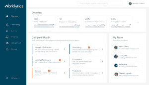
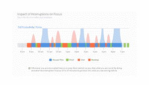

# Worklytics 希望减少无聊的会议，帮助团队提高效率

> 原文：<https://web.archive.org/web/https://techcrunch.com/2018/03/06/worklytics-wants-to-cut-down-on-lame-meetings-and-help-make-teams-more-efficient/>

如果你曾经被困在一个无聊的会议中，你可能会花时间忙于回复电子邮件或 Slack 的消息，甚至只是浏览互联网，等待会议最终结束。

有很多因素会让会议变得无聊，从会议内容到实际发言的人。Phillip Arkcoll 非常了解这个问题，他试图找到一种方法，不仅能让会议更好、更有效率，还能帮助这些团队一起变得更有效率。这就是为什么他和他的联合创始人埃里克·舒尔廷克(Erik Schultink)创立了 Worklytics(T1)，这是一个用来计算人们在吉拉、Github，当然还有会议等协作平台上工作效率的工具。该工具的目标是找出什么在什么团队中起作用，然后向公司提供一些关于如何找出如何全面保持这一点的见解。Worklytics 今年要从 Y Combinator 的冬季班出来了。

Arkcoll 说:“人们所做的许多合作和工作都发生在所有这些平台上。“那时，我们开始思考，随着我们规模的扩大，我们如何能够更好地了解整个组织的情况。我们可以确保人们得到正确的反馈。我们开始研究我们能从所有的数据中得出什么样的见解。我们听说(更大的)公司在这类技术上投资很多——分析是什么造就了伟大的团队和伟大的管理者。我们希望将这些数据产品化，放入一个工具中，并根据团队层面的体验，开始向您提供如何改善员工体验的反馈。”

Worklytics 的一个关键组成部分是确定出色的经理，他们平稳地运营团队，定期达到并超过目标，并为员工提供良好的体验，帮助他们感觉自己在成长。如果一个团队(Worklytics 的数据是匿名的，不是基于每个员工的数据)表现良好，他们可以在这些优秀经理的帮助下，找到适应和帮助员工继续成长和培养内部人才的方法。这可能意味着他们让他们的团队保持快乐，没有无聊的会议，并且总的来说只是把事情做好(T2)。Worklytics 插入了几十个应用程序，以找出许多因素，如代码是否得到审查，员工是否得到定期反馈。

阿克科尔说:“经理的工作是倾听并提供反馈，让他们保持在正确的轨道上，并让他们专注和积极。”“我见过很多公司因为没有良好的反馈回路而倒闭。人们会想，哦，我说的是非正式的，所以这就够了。但是如果你不花时间去真正做到这一点，那是没有用的。如果你有一个下属有 10 名经理的组织，你如何确保所有 10 名经理都定期进行一对一的谈话，确保整个组织的人都这样做，并确保人们得到反馈。这是一个非常普遍的问题，非常简单，但也不经常发生。”

可以肯定的是，这些工具不会像老鹰一样跟踪员工。阿克科尔说，他们不会检查你是在登录脸书还是在随便浏览互联网——毕竟，许多员工在很短的时间内完成了大部分工作，尽管他们仍然每天工作八小时左右。目标是弄清楚员工是否明智地在这些协作应用上花费时间，找到他们可以改善的瓶颈(例如标记经理没有足够的一对一)，并通常授权公司帮助经理采取反过来帮助员工的最佳实践。

Arkcoll 说，他和 Schultink 的部分想法源于他们自己扩大公司规模的经验，在这些公司中，如果没有适当的管理层，这些类型的流程可能会中断。随着公司变得越来越大，工作范围越来越广，很多东西会在通过协作工具的交流中丢失。中层管理者的工作是确保一切顺利进行，团队运转良好，员工感觉自己在成长。

如果反馈循环没有到位，比如一对一或代码审查，那么员工可能会觉得他们没有发展自己的技能(或者实际上没有)，越来越多的工具会带来越来越多的噪音。Worklytics 试图通过这些集成来识别这些中断和噪音，并找出哪些是可行的，哪些是不可行的。“如果你是一个知识工作者，你需要有不受干扰的时间来完成工作，”阿克科尔说。

Arkcoll 说，随着像 Worklytics 这样的工具获得越来越多的有效数据，这是在团队层面上进行的，并且是匿名的，它可以提炼出可能在同一领域甚至一般情况下适用于多家公司的最佳实践。但这也意味着那些可以直接访问这类数据的大公司可能会开始追逐这类工具，比如微软的工具。也有[一些像 StatusToday](https://web.archive.org/web/20230324221521/https://techcrunch.com/2018/02/20/statustoday/) 这样的初创公司正在尝试做类似的事情，尽管他们都有自己解决问题的方式。最终，这将归结为为工具设置正确的目标，并说服公司他们有数据来找出最佳实践，以及什么对员工最好。

“我认为在工业时代，人们考虑的是工厂内部的生产率，我认为这没有意义，”阿克科尔说。“这不是关于你是否在不断地开发小部件或工作，衡量没有意义。试图给人们这种反馈并没有真正的帮助，而且可能会挫伤积极性。我们认为这不是个好主意。我们关注的是公司为员工创造良好的环境，让他们能够完成工作、获取信息、接触经理并获得反馈。你可以雇佣最优秀的人，但是如果他们没有合适的工作环境，他们就看不到结果。这就是我们想要做的，而不是看人们生产出多少小部件。”