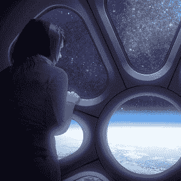
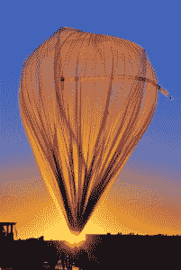
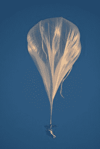
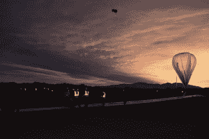
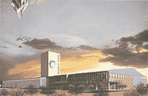

# World View 获得 1500 万美元 B 轮融资，打造全新平流层飞行平台

> 原文：<https://web.archive.org/web/https://techcrunch.com/2016/04/28/world-view-lands-15-million-series-b-to-bring-new-stratosphere-flying-platform-to-life/>

先进的高空气球公司 World View 已经筹集了 1500 万美元的 B 轮融资，由[迦南合伙公司](https://web.archive.org/web/20230329214433/https://www.crunchbase.com/organization/canaan-partners#/entity)牵头。该轮投资还包括来自 Norwest Venture Partners、腾讯、Moment Ventures 和 Base Ventures 的投资。该公司此前筹集了 710 万美元。

这标志着迦南合伙公司的第二次航空航天投资，之前他们投资了 Skybox Imaging。

> “我相信 World View 地面技术的商业应用有能力改变整个行业——从通信到应急响应到天气研究和预报——我们很高兴成为其中的一部分。”迪帕克·卡姆拉，迦南合伙人公司的普通合伙人

世界观体验插图/图片由世界观提供

虽然该公司最出名的可能是他们的[世界景观体验](https://web.archive.org/web/20230329214433/http://worldview.space/)旅游产品，但世界景观计划使用新的资金来推进他们最新产品 Stratollite 的开发和商业应用。

Stratollite 是一种先进的高空气球，可以长时间放置在特定位置。气球可以迅速展开，如果需要，有效载荷可以回收。

凭借这些能力，同温层卫星可用于研究或遥感目的，收集气象数据，或提供通信以在灾害发生时帮助偏远地区的急救人员。

世界视野的人造卫星气球/图片由世界视野提供

World View 的核心技术源于使阿兰·尤斯塔斯打破高空跳伞世界纪录的系统。尤斯塔斯乘坐高空气球到达离地球约 135，000 英尺的高度，然后跳伞回到地面。

高空气球上的阿兰·尤斯塔斯/ Paragon 空间发展公司

World View 的首席执行官 Jane Poynter 告诉 TechCrunch，他们已经为包括美国宇航局和诺斯罗普·格鲁曼公司在内的客户进行了 50 多次短期的同温层卫星飞行。今年晚些时候，他们将发布一系列新的同温层卫星模型，这将使该公司能够在感兴趣的地区进行长途飞行，甚至环游全球。

“这是我们今年将上线的一种新车型。”简·波因特，世界观的首席执行官

与另一家高空气球公司的竞争对手相比，Poynter 表示，World View 的有效载荷能力和长时间停留在特定区域的能力使他们的技术与众不同。

对于短途飞行，同温层卫星可以飞行到 140，000 英尺的高度，有效载荷能力为 1，000 磅。“同温层卫星”还能够携带大约 200 磅的物体到高达 80，000 英尺的高空进行“最终持续数月”的长途飞行

相比之下，自 1994 年开始运营的临近空间公司(Near Space Corporation)目前的[T3 能够携带大约 33 磅到 10 万英尺的重量飞行几天。](https://web.archive.org/web/20230329214433/http://www.nsc.aero/index.php/high-altitude-near-space-capabilities-and-services/drop-testing-and-flight-operations.html)

World View 卫星发射/图片由 World View 提供

谈到成本，World View 没有公布任何细节，但 Poynter 确实说他们的“长航时飞行成本比类似的技术(例如驾驶无人机)低一个数量级。”

早在一月份，World View [选择亚利桑那州](https://web.archive.org/web/20230329214433/https://techcrunch.com/2016/01/19/arizona-votes-to-build-spaceport-for-space-ballooning/)作为他们新总部和发射设施的所在地。发射台 World View 称之为“太空港”——可以用于旅游飞行和同温层卫星发射，尽管同温层卫星气球也可以在全球其他地方发射。

世界视野太空港插图/图片由世界视野提供

虽然该公司目前正专注于加速 Stratollite 的开发，但他们指出，用于他们 World View 体验的 Voyager 高海拔系统共享许多相同的技术，并将并行开发。事实上，宇航员罗恩·嘎兰最近被聘为“世界观体验”的首席飞行员。

> “了不起的是，我们为 Stratollite 开发的技术也适用于我们的太空旅游系统。”简·波因特，世界观的首席执行官

明年对 World View 来说将是重要的一年，因为他们开始发展他们的“太空港”,并建立他们的同温层卫星和旅行者技术。虽然该公司在更雄心勃勃的产品方面仍有很多需要证明，但该公司可能很快就会提供航空航天业以前没有的体验和空中平台。