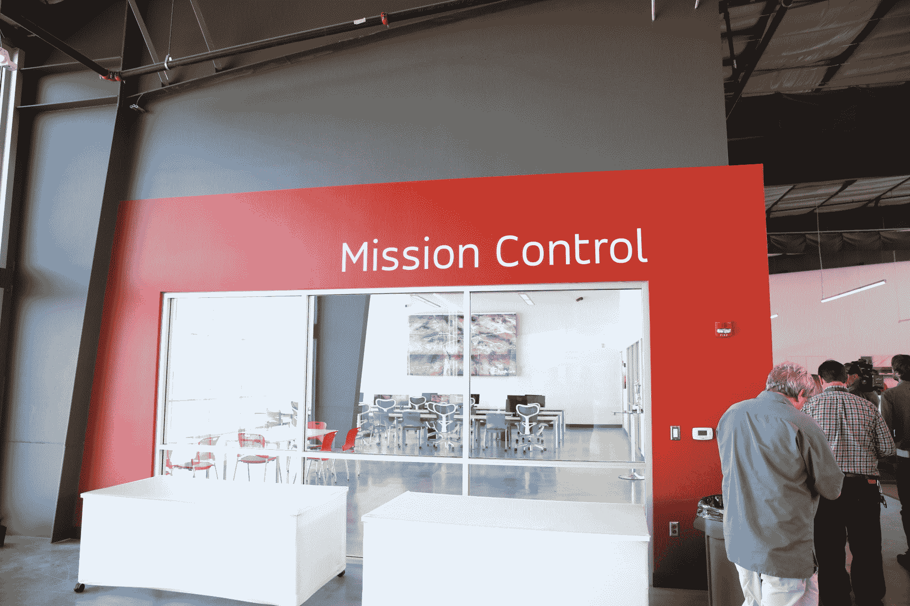
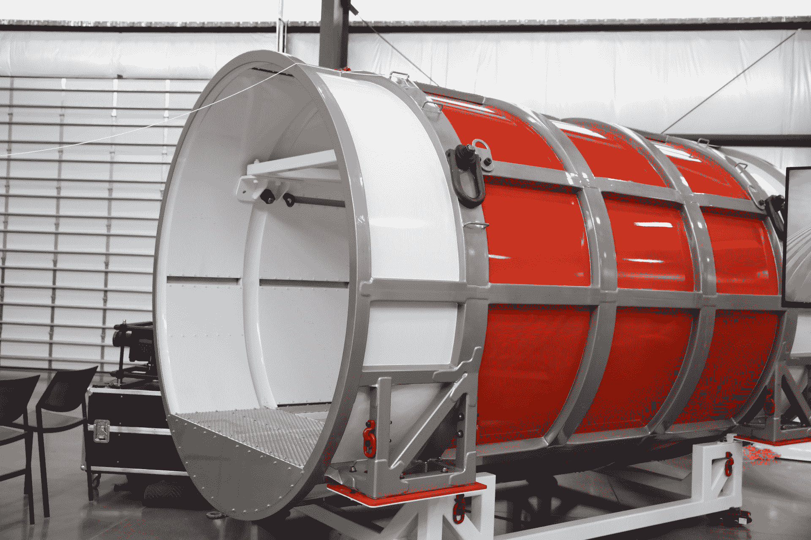
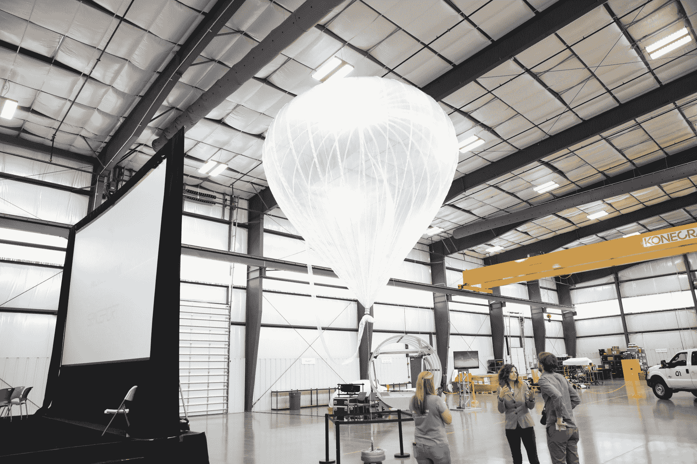
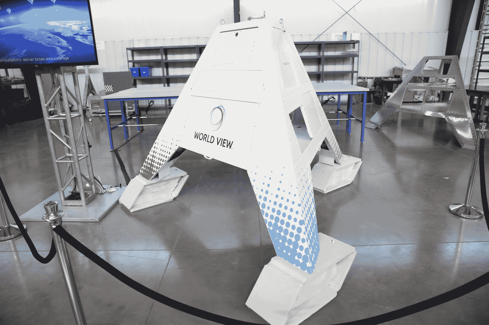

# World View 的“同温层卫星”和新的太空港旨在改变太空业务 

> 原文：<https://web.archive.org/web/https://techcrunch.com/2017/02/23/world-views-stratollites-and-new-spaceport-aim-to-change-the-business-of-space/>

在亚利桑那州图森市的世界展望公司新总部，位于机场附近的崭新建筑的油漆还没干，就在国防承包商雷神公司附近。

该设施和网站，主导了景观，并反映了世界观的主要目标的巨大，这无异于开辟了一个全新的和独特的商业航天业务市场。

## 新领域

首席执行官兼联合创始人简·波因特在新闻发布会上解释说，World View 本质上是一家平流层飞行和探索公司。这意味着它将充气气球发送到太空的最边缘，并携带包括成像和传感器套件在内的有效载荷。其他人过去也这样做过，但挑战在于如何让参与的气球飞行器(被 World View 称为“同温层卫星”)停留在相对固定的位置——这是高层大气操作的一种改变游戏规则的能力。

波因特指出，她的公司正在进入一个最近非常令人兴奋的市场——商业航天。但是，尽管包括 SpaceX 和蓝色起源在内的私营公司开展了很多活动，但波因特表示，World View 关注的平流层传统上被视为一个商机。然而，她表示，这是一个相当大的问题。

世界观首席执行官兼创始人简·波因特。

她指出，能够长时间悬停在特定位置可能在战场上有巨大的好处，但对第一反应者和研究环境也是如此。波因特以飓风为例。飞机和无人机经常飞越飓风，获得精确的数据，但这导致对风暴系统运动的不准确预测，因为它们是不完整的。

理论上，当人们不需要被移动时，你可以以巨大的代价将他们从风暴的路径上移走，仅仅因为你预测的轨迹偏离了。波因特建议，将同温层卫星放置在飓风上方更长的时间可以非常准确地了解飓风将采取的路径，这可以防止不必要的疏散，或者可以帮助疏散那些否则不会被疏散的人。

同样，你可以想象在高风险火灾区域放置一群同温层卫星，通过持续的静态观测提供对野火的早期探测。

[https://web.archive.org/web/20221223085826if_/https://www.youtube.com/embed/GNpi4n1ag0k?feature=oembed](https://web.archive.org/web/20221223085826if_/https://www.youtube.com/embed/GNpi4n1ag0k?feature=oembed)

视频

## 太空港

太空港本身是一个令人印象深刻的大型场所。波因特说，这是“世界上唯一一座专为平流层飞行而建造的建筑”。这座建筑有 600 英尺长，用来放置我们制作大型高空气球的工作台。这些气球被放在这些长桌子上，它们最长时达到 1/10 英里。

该建筑还为气球和同温层卫星提供了专用的任务控制，这看起来有点像一个小型大学教室和你可能从电视和电影中熟悉的 NASA 任务控制室之间的交叉。它坐落在一个 100 英尺高的塔台旁边，这个塔台可以让 World View 为它的气球提供服务，并为它们的发射做准备。

世界视野图森总部的任务控制中心。

World View 在全国范围内进行了搜索，以确定放置该设施的位置。波因特和她的首席技术官兼联合创始人泰伯·麦卡勒姆(Taber McCallum)都已经在他们之前的公司扎根于此，但波因特表示，是商业选择让公司留在了这里。她说，他们接受了来自佛罗里达和新墨西哥的“令人兴奋的提议”，但正是这个设施、同处一地的太空港和制造业，以及靠近机场，才使这一切成为现实。

整个事情本身也是一个工程壮举。它仅用了一年多的时间就建成了，波因特称这是“像这样的设施的闪电般速度。”前宇航员和联合创始人马克·凯利还补充说，图森的“天气非常适合这种操作”，这是关键，因为对世界视图气球成功发射的最大威胁是大风。

## 把人放进豆荚里

凯利解释了为什么平流层在太空探索和旅行中如此被忽视。他说，没有足够的空气供飞机使用，你也不能把传统的航天器放在那里并保持在那里。但是同温层卫星穿针引线，这不仅具有实验和远程观测的潜力——它可能引发一个新的旅游业。

凯利说，这不仅仅是关于飞行同温层卫星，也是关于载人飞行。World View 正在通过一个名为“旅行者”的实验项目寻求这一机会，该项目最终将拥有一个可以容纳 6 名乘客和两名机组人员(外加一个洗手间)的太空舱，并通过气球将他们带上太空。

凯利说，这将使“普通人、游客能够看到我们的地球像一个球漂浮在黑暗的太空中”。这是一次变革性的经历，他说，我个人认为这位前宇航员在这一点上可能是错误的。

当然，它不会对所有人开放，但凯利说，他们可能会为世界上成千上万的人提供去太空的能力，他补充说，World View 可能会在世界各地的许多地方做到这一点——最终。当然，票价会很贵:目前门票的起价约为 75，000 美元，波因特说，由于近期的需求，票价可能会变得更贵。不过，最终它希望通过规模经济将价格降至 5 万美元，甚至 2.5 万美元。

World View 未来载人飞船的空气动力学测试原型。

World View 多久能把人送上太空？目前还没有明确的时间表，但它希望今年能试飞一辆空气动力学测试车，展示他们未来的太空舱在现实世界中的表现。凯利还告诉我，在接下来的几年里，他们有可能在飞机上进行首次载人飞行任务。

## 老问题的现代解决方案

联合创始人兼首席技术官泰伯·麦卡勒姆(Taber McCallum)解释了为什么同温层卫星现在是可能的，但以前没有使用或创造过。他说，他们在 2014 年研究阿兰·尤斯塔斯创纪录的自由落体跳跃时，有了将这项技术商业化的想法。

“我们正在进行阿兰·尤斯塔斯的飞行，我们开始收到一堆要求飞行有效载荷和卫星的请求，”他说。“我们认为市场肯定已经饱和，但电话不断打来，我们得到了美国宇航局的合同。”

麦卡勒姆说，这就像气球飞行一直处于停滞状态——没有人将现代电池技术、现代导航系统或太阳能改进应用到实际上非常古老的气球飞行领域。结合所有这些改进，World View 找到了一种使用空气作为压舱物的方法，并根据需要改变船只的浮力，这使它们能够借助平流层风的模式，通过改变高度来保持它们的位置。

一个到达平流层的气球。

World View 飞行器是太阳能驱动的，所以它在空中停留的时间没有任何固有的限制。也很容易把它带回来，交换有效载荷，然后重新部署它。它可以如此轻柔地着陆，以至于精细的仪器在任务中毫发无损，并且可以再次使用，这在航天飞行中是闻所未闻的。

事实上，联合创始人艾伦·斯特恩解释说，气球消除了我们通常在航天飞行中习惯的许多限制。你可以飞行非常大的质量，而火箭发射时，你经常微观管理重量。最终，你可以让人类实验者和研究一起飞行，你不必担心零重力，这对许多基于太空的实验来说是一个挑战。

## 层子岩最擅长的地方

斯特恩补充说，同温层卫星也在你无法进行红外天文学研究的高度以上运行。你可以直接对平流层取样，这对于监测环境破坏的影响是很有用的。你可以使用非常小的光学系统来成像，这是不贵的，因为当你在更远的地方，比如在太空中，不需要昂贵的大光学系统。

斯特恩将 World View 的技术潜力比作个人家庭计算引发的革命，以及我们在 1977 年如何预测到所有的个人电脑的使用。

层卫星，可装备各种传感器和其他有效载荷。

World View 表示，它已经运行了 50 多个任务，客户包括诺斯罗普·格鲁曼公司、哈佛大学、亚利桑那州立大学、国防部和美国国家航空航天局。事实上，本月早些时候，它通过与 Ball Aerospace 的新飞行建立了重要的合作伙伴关系。鲍尔发射了分辨率足够好的光学仪器，从 77，000 英尺的高度跟踪地面上的单个车辆，这显然具有有趣的意义。

该公司的下一步是从其新的太空港和总部开始实际发射，它说这将很快发生。发射台已经准备好，正在等待；它可能很快就会成为游客触摸天空的出发点。