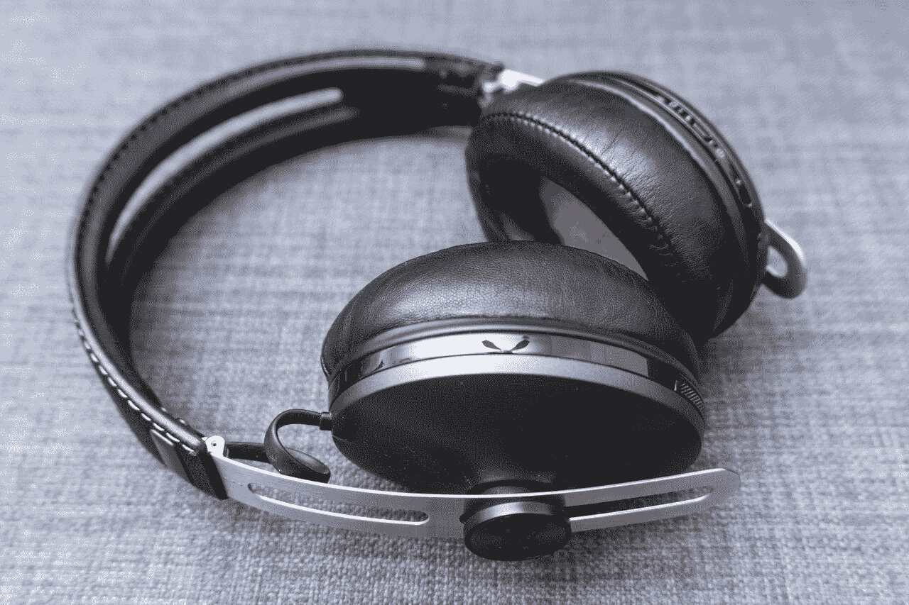
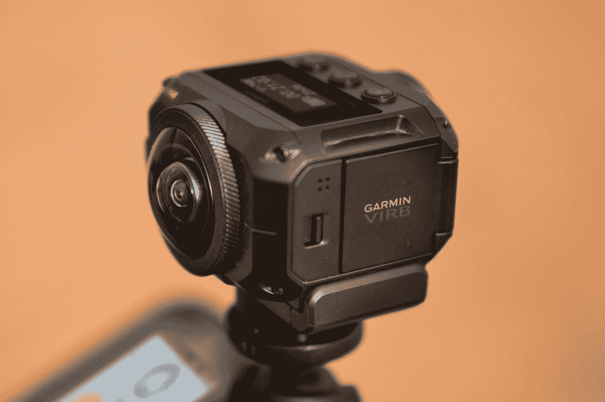
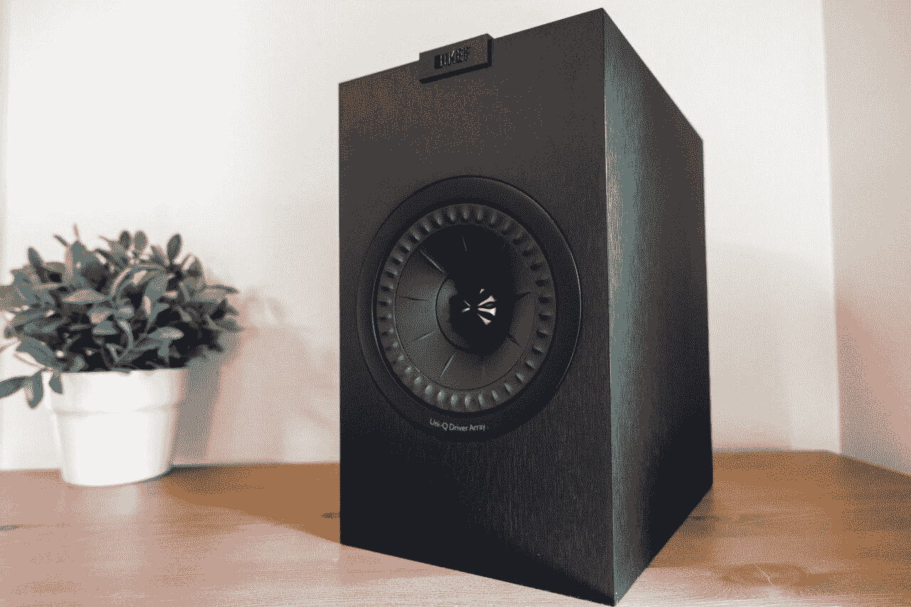
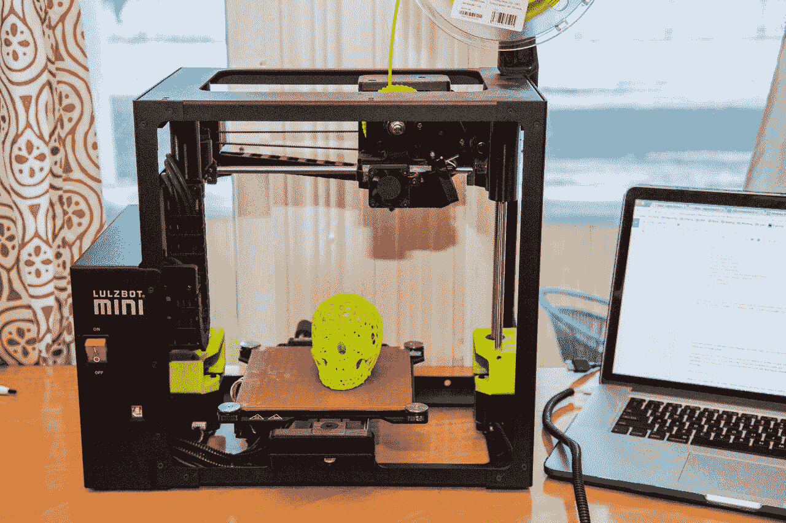

# 技术迷值得升级的小工具 

> 原文：<https://web.archive.org/web/https://techcrunch.com/2018/06/06/worthwhile-gadget-upgrades-for-the-tech-obsessed/>

马库拉·邓巴撰稿人

More posts by this contributor

***编者按:**本帖与*[*wire cutter*](https://web.archive.org/web/20221207035943/https://thewirecutter.com/?utm_source=techcrunch&utm_medium=referral&utm_campaign=syndication&utm_content=gaming-setup)*合作完成。当读者选择购买 Wirecutter 独立选择的编辑精选时，Wirecutter 和 TechCrunch 会赚取附属佣金。*

很有可能，在你的圈子里，有人以了解和掌握最新技术为荣。虽然你或你痴迷于小工具的熟人可能有很多新设备可供选择，但著名的笔记本电脑、相机或手机可能不会配备所有的铃铛和哨子。

我们收集了一些我们最喜欢的升级选择，这些选择带有额外或特殊的功能，可以增加功能、质量和整体性能。

照片:凯尔·菲茨杰拉德

**蓝牙无线耳机:森海塞尔 HD1 无线**

听音乐是许多人的日常活动，一副好的耳机会让世界变得不同。我们为[蓝牙无线耳机](https://web.archive.org/web/20221207035943/https://thewirecutter.com/reviews/best-bluetooth-headphones/?utm_source=techcrunch&utm_medium=referral&utm_campaign=syndication&utm_content=gadget-upgrades)、[森海塞尔 HD1 无线耳机](https://web.archive.org/web/20221207035943/https://click.linksynergy.com/deeplink?id=7m8EnekPF5E&mid=42592&u1=tchcrsyndzz1737&murl=https%3A%2F%2Fen-us.sennheiser.com%2Fhd1-wireless-headphones-with-mic)挑选的升级产品价格并不便宜，但这套设备提供的声音是我们的测试小组从蓝牙模型中听到的最好的声音。

这森海塞尔 HD1 无线有一个坚实的，复古的建设和更好的通话清晰度，这对有两个麦克风。它的罩杯没有竞争对手的大，但这并没有降低舒适度。

在我们测试的所有蓝牙无线耳机中，这款最接近于一套全能的完美耳机。对于那些迷失在自己喜爱的歌曲中并经常忘记给耳机充电的人来说，森海塞尔 HD1 无线耳机提供了 22 小时的电池续航时间，可以持续播放更长时间。

照片:杰弗里·莫里森

**360 度摄像机:佳明 VIRB 360**

有了 [360 度相机](https://web.archive.org/web/20221207035943/https://thewirecutter.com/reviews/best-360-degree-camera/?utm_source=techcrunch&utm_medium=referral&utm_campaign=syndication&utm_content=gadget-upgrades)，在崎岖不平、积水、有时不利的环境中捕捉精彩镜头变得更加容易。除了高质量的录制功能，坚固的 360 度摄像机还应该易于使用，并具有增加其功能的特性。

[Garmin VIRB 360](https://web.archive.org/web/20221207035943/http://www.anrdoezrs.net/links/5513721/type/dlg/sid/tchcrsyndzz23543/https:/buy.garmin.com/en-US/US/p/562010) 还能提供更多功能。它的画面质量和数字视频稳定性明显优于竞争对手，其镜头(以 5.7K 拍摄)对于专业项目来说足够好。VIRB 很紧凑，没有外壳，可以在 33 英尺深的水中录音。我们喜欢它的 360 度图像和视频质量，如果需要，它还能做更多事情。

照片:迈克·帕尔曼

**无人机:DJI Phantom 4 Pro**

驾驶[无人机](https://web.archive.org/web/20221207035943/https://thewirecutter.com/reviews/best-drones/?utm_source=techcrunch&utm_medium=referral&utm_campaign=syndication&utm_content=gadget-upgrades)本身就是一种体验，但驾驶一架更智能、续航时间更长的无人机会让派对持续下去。[DJI Phantom 4 Pro](https://web.archive.org/web/20221207035943/https://www.amazon.com/dp/B01MXLLDQ8?tag=wctchcrsynd-20&ascsubtag=tchcrsyndzz16675)(亚马逊)，我们的无人机升级选择，是为经验丰富的摄像师和摄影师准备的，他们可以在获得最佳图像和 4K 视频方面获得更多帮助。

Phantom 4 Pro 有一个机械快门和一个 2000 万像素的 1 英寸 CMOS 传感器，可以产生更精细的镜头。虽然它比其他 DJI 车型更贵，但它是最安全的车型之一，并且拥有先进的碰撞检测传感器，有助于它悬停时的稳定性。

虽然我们认为它的四英里范围、舒适的控制器(包括 5.5 英寸、1080p 的屏幕)和障碍感应系统是它的最佳功能之一，但它的手动摄影控制为技能和定制留下了空间。

摄影:克里斯·海诺宁

**书架音箱:KEF Q15**

为了获得更清晰的声音和更多细节，我们推荐 [KEF Q15](https://web.archive.org/web/20221207035943/https://www.amazon.com/dp/B071P6KQZX?tag=wctchcrsynd-20&ascsubtag=tchcrsyndzz20406) (亚马逊)，这是测试期间的最爱，也是我们对[书架扬声器](https://web.archive.org/web/20221207035943/https://thewirecutter.com/reviews/best-bookshelf-speakers/?utm_source=techcrunch&utm_medium=referral&utm_campaign=syndication&utm_content=gadget-upgrades)的升级选择。无论是用于设置气氛还是背景娱乐，您都会注意到 Q15 套装传递声音的方式有所不同。

音响发烧友、音乐家和日常听众将能够察觉到其深入低音的优越性，以及更容易分辨的乐器声音。

很大程度上，Q15 的特殊设计的 Uni-Q 驱动器有助于其整体性能。它的黑色或白色表面简单而温和，足以搭配大多数家庭的装饰——当扬声器打开时，吸引力会增强。

照片:西格娜·布鲁斯特

**适合初学者的家用 3D 打印机:Aleph Objects LulzBot Mini**

拥有一台[家用 3D 打印机](https://web.archive.org/web/20221207035943/https://thewirecutter.com/reviews/best-home-3d-printer/?utm_source=techcrunch&utm_medium=referral&utm_campaign=syndication&utm_content=gadget-upgrades)的制造商和创新技术爱好者会被自动认为很酷。真正令人印象深刻的是 3D 打印机能够生产什么和如何生产。[Aleph Objects LulzBot Mini](https://web.archive.org/web/20221207035943/http://www.anrdoezrs.net/links/5513721/type/dlg/sid/tchcrsyndzz24637/http:/www.newark.com/lulzbot/kt-pr0035na/lulzbot-mini-3d-printer/dp/84Y7449)通过提供更高的质量和数量，将印刷生产提升了几个层次。刚刚起步的初学者会发现这款打印机的简单软件和预装打印设置的指导很有帮助。

我们喜欢它的加热床，一旦打印完成，它就可以让打印变得不那么困难。想要尝试更困难的东西的创意人员可以这样做，因为 LulzBot Mini 可以很好地处理复杂的设计。

*本指南可能已被* [*线切割*](https://web.archive.org/web/20221207035943/https://thewirecutter.com/?utm_source=techcrunch&utm_medium=referral&utm_campaign=syndication&utm_content=gadget-upgrades) *更新。来自 Wirecutter 的提示:当读者选择购买我们独立选择的编辑精选时，我们可能会获得支持我们工作的会员佣金。*