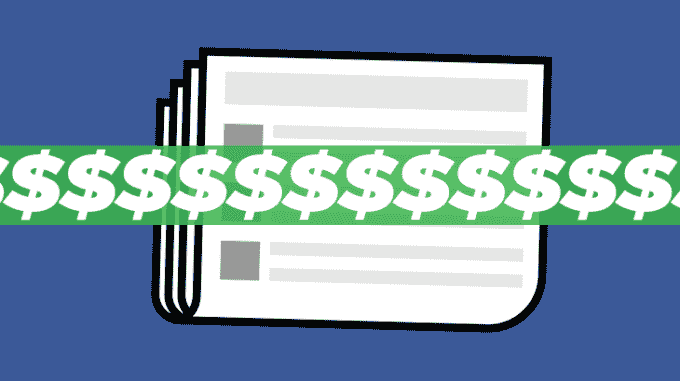
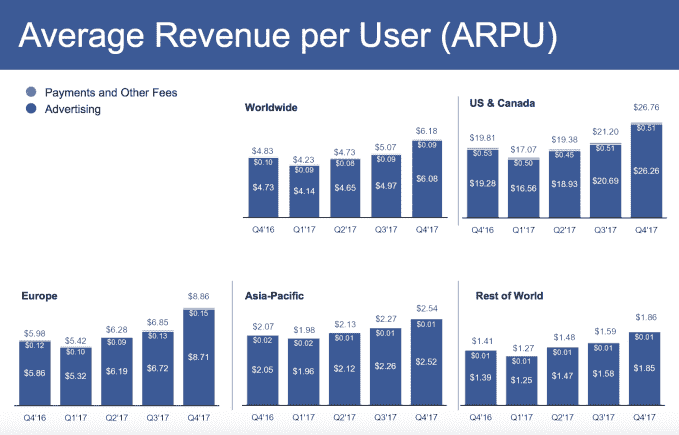

# 11 美元脸书订阅的心理影响 

> 原文：<https://web.archive.org/web/https://techcrunch.com/2018/04/15/would-it-make-us-love-or-hate-ads/>

被要求付钱给脸书移除广告会让你欣赏他们的价值还是更加怨恨他们？当脸书考虑提供无广告订阅服务时，除了能赚多少钱，还有更深层次的问题。脸书有机会让我们决定如何补偿社交网络。但是选择并不总是让人快乐。

今年 2 月，我探索了一个想法，即[脸书如何通过让我们支付每月订阅费](https://web.archive.org/web/20230203205358/https://techcrunch.com/2018/02/17/facebook-subscription/)而不是将我们的注意力卖给广告商，来消除数据隐私的反弹并提高福利。最大的收获是:

*   马克·扎克伯格坚持认为**脸书将对所有人**保持免费，包括那些付不起月租费的人，所以订阅将是广告的一种选择，而不是强迫每个人付费的替代品
*   部分地**将商业模式从最大化你在脸书上花费的总时间**中分离出来，可以让它实际上更好地优先使用时间，因为它不必牺牲广告收入
*   每月订阅费需要抵消脸书的广告收入。在美国，加拿大脸书在 2017 年从 2.39 亿用户中赚了 199 亿美元。这意味着那里的普通用户每月要支付 7 美元

然而，我的分析忽略了一些心理影响，比如告诉人们，他们只有在负担得起的情况下才能放弃广告，广告商无处不在的影响力的丧失，以及哪些用户愿意掏钱的现实。不过另一方面，我也忽略了价格标签可能会给对定向广告感到愤怒的用户带来的顿悟。

## 什么对每个人都是最好的

这段对话很有意义，因为扎克伯格被国会两次问到脸书可能提供订阅的问题。扎克伯格认可广告支持应用的优点，但从未排除让用户购买高级版本。“我们今天不提供让人们付费不显示广告的选项，”扎克伯格说，后来他解释说，“总的来说，我认为广告体验将是最好的。我认为总的来说，人们喜欢不需要付费的服务。世界各地的许多人都支付不起服务费用，这与我们的使命最为契合。”

但是“今天”这个词给了我们一线希望，那就是我们将来也许能够支付。

2018 年 4 月 11 日，脸书首席执行官兼创始人马克·扎克伯格在 DC 华盛顿州国会山举行的美国众议院能源和商业委员会关于脸书的听证会上作证。(图片:索尔·勒布/法新社/盖蒂图片社)

然而，除了移除广告，我们还会为什么付费呢？。脸书已经允许担心自己隐私的用户选择退出一些广告，只是不把广告看成一个整体。扎克伯格为免费互联网服务四处游说，这使得脸书似乎不太可能开发有价值的功能，并将其留给用户

Spotify 只让付费用户点播他们想听的任何歌曲，而广告支持的用户则被困在 shuffle 上。LinkedIn 只允许付费用户给任何他们想要的人发信息，并以“特色申请人”的身份出现在招聘者面前，而广告支持的用户只能给他们的关系发信息。网飞只让付费用户使用它。

但脸书将社交网络视为一项人权，可能会给所有用户提供它开发的任何额外功能，如新闻订阅过滤器，以剔除政治或婴儿照片。脸书也可能不会出售侵犯隐私的功能，比如 LinkedIn 用户可以看到谁访问了他们的个人资料。事实上，除了移除广告，我不会打赌脸书会提供任何重要的付费功能。这可能会让销售变得困难。

与此同时，试图触及每一个人口统计成员的广告商可能不希望人们付费选择退出广告。如果他们试图推广一部新电影、一家连锁餐厅或一场选举活动，他们会希望在目标受众中获得尽可能强的渗透力。订阅模式在无处不在的脸书广告上打了一个洞，促使企业使用这款应用。

## 怨恨 Vs 欣赏

但最大的问题是，脸书真的很擅长用广告赚钱。因为从不向用户收费，它赚了一大笔钱。[2017 年 400 亿美元](https://web.archive.org/web/20230203205358/https://investor.fb.com/investor-news/press-release-details/2018/Facebook-Reports-Fourth-Quarter-and-Full-Year-2017-Results/default.aspx)。说服人们用钱包支付比眼球更多的钱可能很难。那些愿意付钱的人可能比平均水平高得多。

让我们看看美国和加拿大市场，在那里，脸书的人均收入最高，因为他们比世界其他地区的人更富有，可支配收入更多，因此广告费用也更高。美国和加拿大用户平均每月从脸书广告中获得 7 美元。但那些愿意并有能力支付的人可能比普通用户更富有，所以奢侈品公司会花更多的钱向他们做广告，而且可能比普通用户花更多的时间浏览脸书，所以他们会看到更多的广告。

准备好面对价格冲击吧，因为对于脸书来说，要抵消这些富有的铁杆用户的广告收入，它可能需要每月收取 11 到 14 美元的费用。

由于没有额外的功能，他们可以免费获得的东西的价格可能看起来太高了。许多能负担得起的人仍然不会证明它是合理的，不管与他们支付的其他媒体订阅相比，他们在脸书上花了多少时间。那些真的买不起的人可能会突然对他们多年来一直平静滚动的脸书广告感到更加不满。每一个都提醒人们，他们没有钱逃离脸书的数据矿。

但是，也许人们会有完全相反的感觉——当面对高昂的订阅价格时，不得不看这些广告真的没有那么糟糕。

人们常常看不到免费得到的东西的价值。面对价格标签会让他们更加认识到他们自愿进入的价值交换。社交网络的运营需要资金，他们必须以某种方式付费。看到广告让脸书的灯亮着，让它的实验室充满未来的产品，让它的投资者高兴。

这就是为什么脸书只能让 4%、1%、或 0.1%的用户付费并不重要。对于脸书来说，建立一个订阅选项，让用户有选择的感觉，并提供他们已经免费获得的价值，这可能是值得的。

*更多关于脸书的重大新闻，请看我们最近的报道:*