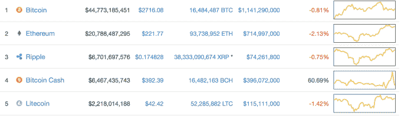
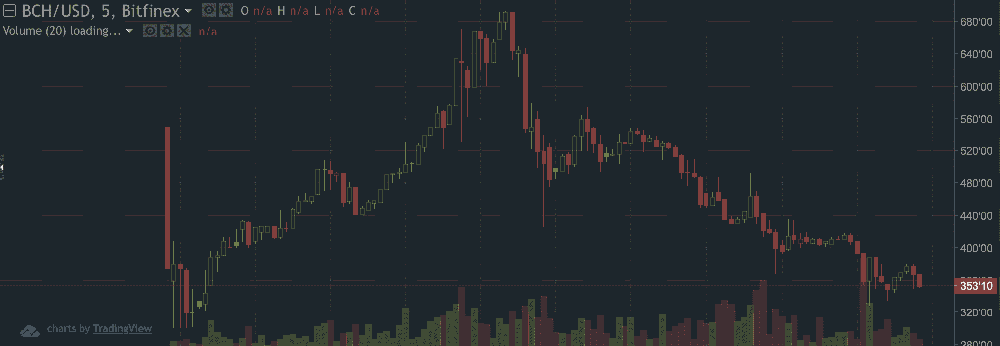

# WTF 是比特币现金，有什么价值吗？

> 原文：<https://web.archive.org/web/https://techcrunch.com/2017/08/02/wtf-is-bitcoin-cash-and-is-it-worth-anything/>

昨天早上比特币的区块链[分叉](https://web.archive.org/web/20230406055520/https://techcrunch.com/2017/07/31/what-should-you-do-before-tomorrows-bitcoin-split/)——这意味着一种独立的加密货币被创造出来，叫做[比特币现金](https://web.archive.org/web/20230406055520/https://www.bitcoinabc.org/)。

分叉的工作方式不是从 0 号块开始创建全新的加密货币(和区块链),而是创建共享相同历史的复制版本。因此，在比特币现金的新区块链上的所有过去的交易都与比特币核心的区块链相同，未来的交易和余额完全相互独立。

对于实际问题，所有这一切真正意味着，在分叉之前拥有比特币的每个人现在都拥有相同数量的比特币现金，记录在比特币现金分叉的区块链中。

但这并不容易。如果你控制着自己的私钥，或者在一家声称可以用比特币现金贷记用户余额的交易所持有你的比特币，你就没事了，而且[现在就可以访问](https://web.archive.org/web/20230406055520/https://bitcoinmagazine.com/articles/beginners-guide-claiming-your-bitcoin-cash-and-selling-it/)你新发现的加密货币。

如果你在比特币基地这样的提供商那里持有比特币，该提供商在分叉之前表示，他们不打算向用户分发比特币现金，甚至根本不打算与新的区块链互动，那么你可能就不走运了。

需要澄清的是，这并不意味着像比特币基地和双子星这样的公司将你的比特币现金据为己有。只是他们认为这是一种干扰，从长远来看没有任何价值。如果这被证明是假的，并且硬币有价值，这些公司将很可能最终把它们分发给用户。

## 比特币现金有什么特别的？

如果你对加密货币有所了解，你就会知道有大量的加密货币。[喜欢成千上万的他们](https://web.archive.org/web/20230406055520/https://coinmarketcap.com/)。有些是合法的，本质上不同于比特币(可以说比比特币更好)，有些只是试图快速赚钱的模仿者。

*比特币现金只是另一种经过改造的加密货币。*

但是现在它得到了更多的关注，原因如下:

第一，它是由于分叉比特币核心而产生的，而不是从零开始产生的。但这并不新鲜— [其他加密货币过去也从比特币](https://web.archive.org/web/20230406055520/https://en.wikipedia.org/wiki/List_of_bitcoin_forks)中分出来，远不及比特币现金目前的价值。话虽如此，但这确实意味着，昨天之前持有比特币的任何人现在都有可能获得等量的比特币现金，这引起了人们的极大关注，因为人们说这是“免费的钱”。

其次，它之所以受到关注，是因为硬分叉被安排在比特币核心激活其名为 BIP 148 的代码变化的时候，这本身就是一个备受关注的事件。这一比特币改进提案是主要参与者和激活的隔离见证人数月谈判的结果，这将有助于比特币核心规模向前发展。

## 它有价值吗？

目前，比特币现金实际上价值不菲——至少在账面上是如此。一些人以每枚硬币约 400 美元的价格交易它，这使它成为目前市值第四大的加密货币。

但事情是这样的——目前出售比特币现金真的很难。虽然一些交易所增加了新的交易货币，但流动性非常低，这就是为什么有人说价格被人为夸大了。因为大多数交易所还不接受存款，所以唯一可以交易的比特币现金是分叉后交易所贷记的货币。在交易所外或在不支持交易的交易所内持有比特币现金的用户只能等待。

因此，这个故事的寓意是，一旦人们可以转移比特币，可能会有大量的比特币现金等待出售。这是因为没有太多的动机来保留硬币，尤其是当人们认为它被高估并想迅速兑现时。价格已经下跌——看看今天的美元价格。在为新货币提供市场的交易所 Bitfinex T1 上，美元已经从 680 美元的高点跌至 350 美元左右。

【T2

这并不是说它会一文不值。看看[以太坊经典](https://web.archive.org/web/20230406055520/https://ethereumclassic.github.io/)就知道了，以太坊的硬叉。在那次分叉后，它下降到每 ETC 约 1 美元，但几个月后，现在每 ETC 约值 15 美元。当然，与普通以太坊目前 220 美元的价格相比，这个价格就相形见绌了。

顺便说一下，如果你想知道为什么交易所不接受比特币现金存款，那是因为现在几乎不可能通过区块链发送比特币现金。这是因为新分叉的区块链还没有[调整难度](https://web.archive.org/web/20230406055520/https://en.bitcoin.it/wiki/Difficulty)，每 2016 街区自动发生一次。所以挖掘区块和确认交易花费了太多时间。作为参考，今天开采一个区块花了 10 个小时，而本应开采 10 分钟。大多数交易所在存入存款之前需要 6 或 7 次大宗确认，所以你可以看到比特币现金基本上不可能流动。

## 现在怎么办？

那么下一步是什么？加密货币社区的普遍共识是，大多数人一有机会就会出售比特币现金——如果发生这种情况，将进一步压低价格。但是总有机会人们会涌向这枚硬币，它实际上保持或升值。本质上，就像 crypto 中的其他东西一样，没有人知道接下来会发生什么。