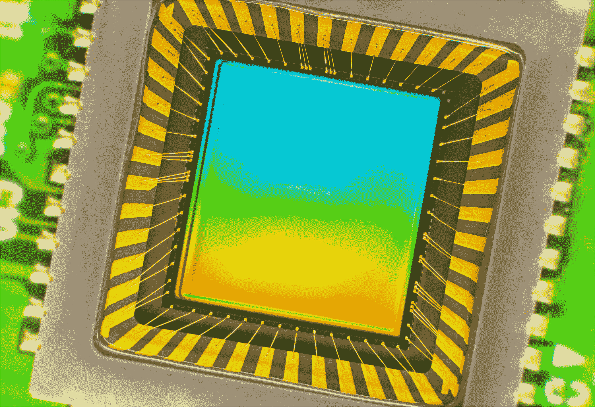
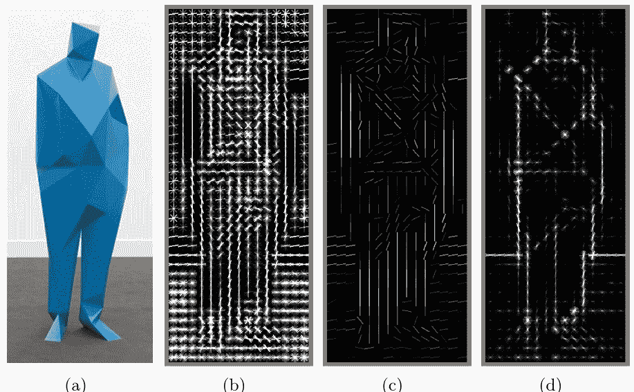
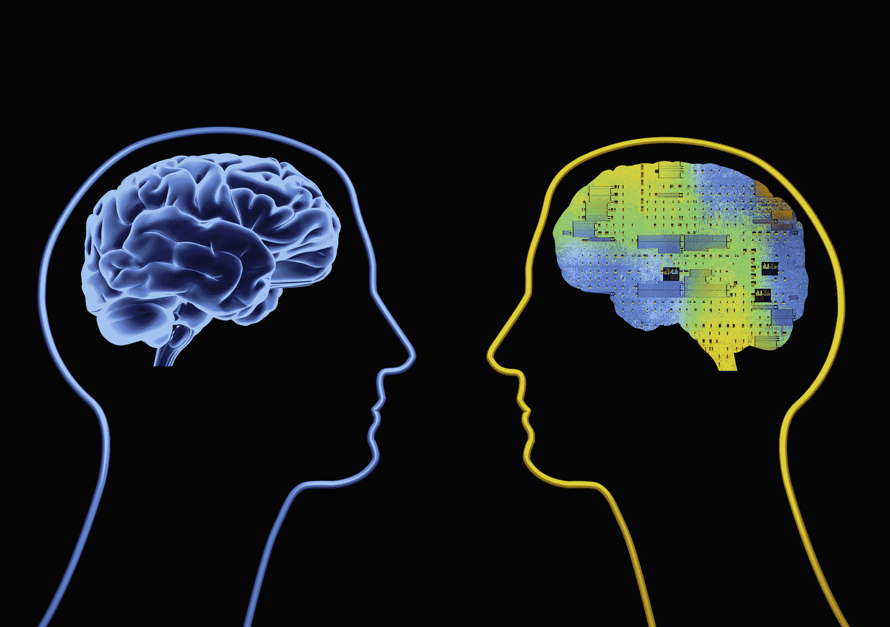

# WTF 是计算机视觉？

> 原文：<https://web.archive.org/web/https://techcrunch.com/2016/11/13/wtf-is-computer-vision/>

房间对面的某人扔给你一个球，你接住了。简单吧？

事实上，这是我们试图理解的最复杂的过程之一——更不用说重现了。发明一台看起来像我们一样的机器是一项看似困难的任务，不仅因为很难让计算机做到这一点，还因为我们不完全确定我们首先是如何做到这一点的。

实际发生的事情大致是这样的:球的图像穿过你的眼睛，到达你的视网膜，视网膜进行一些初步的分析，并将它发送到大脑，在那里视觉皮层更彻底地分析图像。然后它将它发送到大脑皮层的其余部分，大脑皮层将它与它已经知道的一切进行比较，对对象和维度进行分类，并最终决定做些什么:举手接球(已经预测了它的路径)。这发生在几分之一秒内，几乎没有意识到的努力，几乎从未失败。所以重建人类的视觉不仅仅是一个困难的问题，而是一系列的问题，每一个都依赖于另一个。

没人说过这很容易。也许人工智能的先驱马文·明斯基除外，他在 1966 年指导一名研究生“将一台相机连接到一台计算机，并让它描述它看到的东西”可怜的孩子:50 年后，我们仍在努力。

严肃的研究开始于 50 年代，沿着三条截然不同的路线展开:复制眼睛(困难)；复制视觉皮层(非常困难)；以及复制大脑的其余部分(可以说是有史以来尝试过的最困难的问题)。

## 看

重塑眼睛是我们最成功的领域。在过去的几十年里，我们已经创造了传感器和图像处理器，在某些方面可以达到甚至超过人眼的能力。随着更大、更完美的光学镜头和纳米尺度的半导体子像素的制造，现代相机的精度和灵敏度简直令人难以置信。相机还可以每秒记录数千张图像，并以极高的精度探测距离。

数码相机中常见的图像传感器。

然而，尽管它们的输出保真度很高，但这些设备在许多方面并不比 19 世纪的针孔相机好多少:它们仅仅记录了来自给定方向的光子的分布。有史以来最好的相机传感器都不能识别球，更不用说抓住球了。

换句话说，硬件在没有软件的情况下受到了严重的限制——事实证明，这是一个更大的问题。但是现代摄影技术确实提供了一个丰富灵活的工作平台。

## 来描述

这不是一个完整的视觉神经解剖学课程的地方，但可以说，我们的大脑是从一开始就建立在头脑中的。大脑中用于视觉的部分比其他任何任务都多，这种专业化一直延伸到细胞本身。数十亿个细胞一起工作，从视网膜嘈杂杂乱的信号中提取模式。

比方说，如果在某个角度的一条线上有对比，或者在某个方向上有快速运动，那么一组神经元就会相互兴奋。更高层次的网络将这些模式聚合成元模式:一个圆圈，向上移动。另一个网络附和道:圆圈是白色的，有红线。另一个原因是:它的规模越来越大。从这些粗糙但互补的描述中，一幅画面开始浮现。

一种“梯度方向直方图”，使用类似于在大脑视觉区发现的技术来寻找边缘和其他特征。

对计算机视觉的早期研究，认为这些网络复杂得不可思议，采取了一种不同的方法:*“自上而下”的推理——一本书看起来像/this/，所以要注意/this/模式，除非它是侧着的，在这种情况下，它看起来更像/this/。一辆汽车看起来像/这个/并且移动起来像/这个/。*

> 我们几乎无法对我们的大脑如何工作给出一个可行的定义，更不用说如何模拟它了。

对于受控环境中的一些物体来说，这很好，但是想象一下，试图从每个角度描述你周围的每一个物体，包括灯光、运动和上百种其他事物的变化。很明显，要达到幼儿般的识别水平，需要大量的数据，这是不切实际的。

模仿大脑中发现的东西的“自下而上”的方法更有希望。计算机可以对一幅图像进行一系列变换，发现边缘、它们所暗示的物体、多幅图片呈现时的透视和运动等等。这个过程涉及大量的数学和统计数据，但它们相当于计算机试图将它看到的形状与它经过训练识别的形状进行匹配，这些形状是在其他图像上训练的，就像我们的大脑一样。

  上图(来自普渡大学[电子实验室](https://web.archive.org/web/20230212131432/http://e-lab.github.io/))显示的是计算机显示，通过计算，高亮显示的物体看起来和行为像该物体的其他例子，达到一定程度的统计确定性。

自底向上架构的支持者可能会说“我早就告诉过你了。”只是直到最近几年，人工神经网络的创建和运行还不切实际，因为它们需要大量的计算。并行计算的进步已经侵蚀了这些障碍，在过去的几年里，对模仿(仍然非常近似)我们大脑中的系统的研究和使用出现了爆炸式增长。模式识别的过程已经加快了几个数量级，我们每天都在取得更大的进步。

## 去理解

当然，你可以建立一个系统来识别苹果的每一个品种，从每个角度，在任何情况下，静止或运动，咬过的苹果，任何东西——但它不能识别橙子。就此而言，它甚至不能告诉你苹果是什么，它是否可以食用，它有多大，或者它们是用来做什么的。

问题是，没有操作系统，即使是好的硬件和软件也没有多大用处。

对我们来说，这是我们大脑的其余部分:短期和长期记忆，来自我们其他感官的输入，注意力和认知，从与世界的万亿次互动中吸取的十亿次教训，用我们几乎不理解的方法写成的一个由相互连接的神经元组成的网络，比我们见过的任何东西都复杂。

> 计算机视觉的未来在于将我们已经创造的强大但特定的系统与更广泛的系统相集成。

这是计算机科学和更一般的人工智能的前沿汇聚之处——也是我们目前正在旋转车轮的地方。在计算机科学家、工程师、心理学家、神经科学家和哲学家之间，我们几乎无法对我们的大脑如何工作提出一个可行的定义，更不用说如何模拟它了。

这并不意味着我们走进了死胡同。计算机视觉的未来是将我们已经创建的强大而具体的系统与更广泛的系统相集成，这些系统专注于有点难以确定的概念:上下文、注意力、意图。

也就是说，计算机视觉即使处于萌芽阶段，仍然非常有用。它在我们的相机里，识别面孔和微笑。它在自动驾驶汽车中，阅读交通标志，观察行人。它在工厂机器人中，监测问题并在人类同事周围导航。在他们像我们一样看到之前还有很长的路要走——如果这是可能的话——但是考虑到手头任务的规模，他们能看到已经很了不起了。