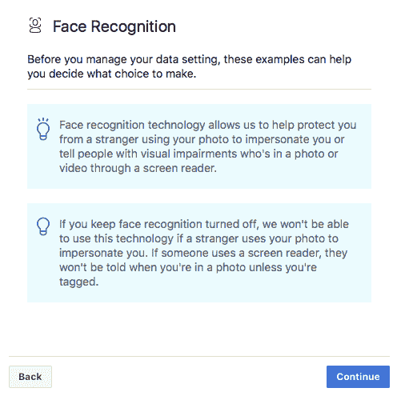

# WTF 是暗纹设计？

> 原文：<https://web.archive.org/web/https://techcrunch.com/2018/07/01/wtf-is-dark-pattern-design/>

如果你是一名 UX 设计师，你不需要这篇文章来告诉你深色图案设计。但也许你选择这里是因为渴望重申你已经知道的东西——对你的专业知识感觉良好。

还是你的良心刺痛了你？继续，你可以诚实…或者，嗯，你可以吗？

第三种可能性:也许你正在使用的一个应用程序以一种说服你点击这篇文章而不是其他数字内容的方式呈现了这篇文章。当我们谈论深色图案设计时，我们谈论的就是那些难以察觉的轻微推动——注意什么，在哪里点击/点击。

但不仅仅如此。*黑暗*开始发挥作用，因为 UX 的设计选择被选中是故意骗人的。促使用户放弃比他们意识到的更多的东西。或者同意一些事情，如果他们真正理解他们被迫做出的决定，他们可能不会同意。

说白了，暗纹设计就是设计出来的欺骗和不诚实……还坐得舒服？

这种技术，正如它今天在网上部署的那样，通常依赖并利用这样一个事实，即内容超载的消费者会浏览他们看到的东西，特别是如果这些东西看起来很无聊，并且他们正在尝试做其他事情——比如注册一项服务，完成一次购买，获得他们真正想看的东西，或者找到他们的朋友发给他们的东西。

操纵时间是黑暗图案设计的一个关键因素。换句话说,*当你看到一个通知的时候，可以决定你如何回应它。或者你是否注意到了。干扰通常会加剧认知超载——欺骗性设计利用它们让网络用户在关键决策时刻更难完全控制自己的能力。*

用于获得同意收集用户个人数据的黑暗模式通常结合了不受欢迎的中断和内置的逃跑路线——提供了一种简单的方法来摆脱阻碍你实际尝试做什么的沉闷菜单。

颜色鲜艳的“同意并继续”按钮是这种深色图案设计的一个常见特征。这些引人注目的标志几乎普遍出现在同意流程中——鼓励用户*而不是*阅读或考虑服务的条款和条件，因此*而不是*理解他们同意的内容。

这是聚光灯后门的“同意”。

这是因为人类在面对无聊和/或看起来复杂的东西时很懒。而且因为信息太多容易淹没。大多数人会选择阻力最小的道路。尤其是当它以方便的、按钮式的形式出现时。

同时，深色图案设计将确保选择退出(如果有的话)几乎看不见；灰色背景上的灰度文本是通常的选择。

一些欺骗性的设计甚至包括一个行动号召，显示在他们希望你按下的彩色按钮上——带有类似“好的，看起来很棒！”的文字—进一步推动决策。

同样，不太明显的选择退出选项可能会使用负面的暗示，暗示你点击这里将会错过一些东西，或者冒着不好的事情发生的风险。

可怕的事实是，欺骗性的设计非常容易被描绘出来。

就 T & Cs 而言，这真的是瓮中捉鳖。因为人类讨厌无聊或困惑，有无数种方法可以让决策看起来令人厌烦或复杂——无论是用微小的灰度字体呈现大量令人费解的法律术语，这样就没有人会费心阅读它，再加上当人们点击“确定”时默认选择加入；故意使用混乱的措辞和/或混乱的按钮/开关设计，使得用户无法确定什么是打开的，什么是关闭的(因此，什么是选择退出，什么是选择加入),甚至无法确定选择退出是否实际上意味着选择加入您真的不想要的东西…

摩擦是这种黑暗艺术的另一个关键工具:例如，如果你想退出，设计需要更多的点击和交互。例如为每一个数据共享事务进行切换——用户可能需要点击数百个单独的控件，而不是只需点击几下甚至一个按钮就可以同意所有事情。这种权衡是有意单向的。这不符合消费者的利益。

欺骗性的设计还会让人觉得选择退出是不可能的。例如，默认选择用户分享他们的数据，如果他们试图找到一种选择退出的方式，要求他们找到一个很难找到的替代点击，然后还要求他们滚动到冗长的条款和条件的底部，找出一个隐藏的开关，他们实际上可以选择退出。

2016 年，脸书使用该技术将 WhatsApp 用户的账户与脸书账户[联系起来，实施了一次重大数据盗窃。尽管之前有人声称这样的隐私大转弯永远不会发生。绝大多数 WhatsApp 用户可能从未意识到他们可以说不——更不用说理解同意他们的账户被链接的隐私含义了。](https://web.archive.org/web/20230330170958/https://techcrunch.com/2016/08/25/whatsapp-to-share-user-data-with-facebook-for-ad-targeting-heres-how-to-opt-out/)

电子商务网站有时也会提示性地展示一个可选的(有价格的)附件，让它看起来像是交易的一个必不可少的部分。比如在航班退房过程中使用一个颜色鲜艳的“继续”按钮，但它也会自动捆绑一个可选的额外服务，如保险，而不是直接询问人们是否想购买。

或者当用户忙于结账时，使用预先选择的复选框将低价商品或小额慈善捐赠偷偷放入购物篮，这意味着许多客户直到购买后才会注意到这一点。

航空公司还被发现使用欺骗性设计来推销价格更高的选择，例如通过掩盖较便宜的航班和/或掩盖价格，因此更难找出最具成本效益的选择。

在电子邮件营销中，阻挠退订的黑暗模式非常、非常普遍。比如退订 UX，要求你点击荒谬的次数，并不断重申，是的，你真的想退出。

这些额外的屏幕往往被欺骗性地设计成类似于“退订成功”的屏幕，人们希望在他们拔出营销挂钩时看到这些屏幕。但是如果你仔细看，在典型的非常小的字体上，你会发现他们实际上仍然在询问你是否想要退订。诀窍是让你认为自己已经退订了，从而让你不退订。

另一个经常使用的欺骗性设计旨在操纵在线同意流，通过提供一些有选择性的有偏见的例子来对用户产生不利影响——这给人一种决策周围有帮助背景的错觉。但实际上，这是一种通过呈现一种自私的扭曲观点来操纵用户的涡轮增压式尝试，这种观点绝不是对同意的后果的全面和平衡的描述。

充其量这是虚伪的。更明显的是，这是欺骗性和不诚实的。

这只是在脸书同意流程中出现的选择性偏见例子中的一个例子，该流程用于鼓励欧洲用户打开其面部识别技术。点击“继续”会将用户引导至决策屏幕，但前提是他们已经看到了这个有偏见的间隙…

脸书在这里也使用了情绪操纵，用其选择性例子的措辞来说，通过利用人们的恐惧(声称其技术将“帮助保护你免受陌生人的伤害”)和利用人们的善意(声称你的同意将有助于视力障碍者)——试图通过让人们感到恐惧或内疚来达成一致。

如果一个人类对你做这种事，你不会喜欢这种情感操纵的行为。但脸书经常试图操纵用户的感受，让他们按照自己的意愿行事。

例如，推动用户发布更多内容——例如通过从你的个人资料和朋友的个人资料中生成一个“回忆”的人工幻灯片，然后建议你在你的时间线上分享这些未经请求的内容(推动你这样做是因为，嗯，如果你选择不分享，你的朋友会怎么想？).当然，这符合其商业利益，因为发布到脸书的内容越多，就会产生更多的参与度，从而带来更多的广告浏览量。

或者——在阻止某人删除其账户的最后努力中——众所周知，脸书会使用他们脸书朋友的名字和照片，声称如果你离开该服务，这样的人会“想念你”。所以突然就把离开脸书和抛弃朋友混为一谈了。

分散注意力是另一种欺骗性的设计技术，用来从用户那里偷走比他们意识到的更多的东西。例如，看起来很可爱的卡通片会让你对某个品牌产生警告感，比如当他们定期要求你检查你的隐私设置时。

脸书再次使用了这种技术。围绕其隐私审查流程的卡通外观和感觉旨在让您放心地向公司提供更多您的数据。

你甚至可以说，谷歌的整个品牌是一个黑暗的图案设计:幼稚的颜色和声音，它表明一些安全和有趣的东西。甚至好玩。它产生的感觉——以及它所做的工作——与该公司实际从事的业务没有任何关系:监视和跟踪人们，以说服你买东西。

另一个深色图案设计的例子是:当你正在考虑购买机票或酒店房间，或者正在看一双鞋子的时候，会弹出通知，提醒你“快点！”因为只剩下 X 个座位或对了。

这利用了人们的 FOMO，试图通过让潜在客户觉得他们没有时间考虑或做更多研究来加速交易，从而阻碍他们做出更理性、更明智的决定。

更糟糕的是，没有办法知道这个价格是否真的只剩下两个座位。就像优步在其应用程序中展示的幽灵车[一样——它声称这是为了说明的目的，而不是对可供招呼的汽车的准确描述——网络用户不得不相信他们被告知的是真的。](https://web.archive.org/web/20230330170958/https://www.theguardian.com/technology/2015/aug/07/have-ubers-phantom-cars-disappeared)

但是你为什么要相信那些有意误导你的公司呢？

## 黑暗模式指向道德真空

黑暗图案设计这个词在互联网上已经很古老了，尽管你可能听说过它是最近才流传开来的。维基百科将这个新词归功于 UX 设计师哈里·布里格诺尔，早在 2010 年，他就注册了一个网站(【darkpatterns.org】)来记录这种做法，并称其为不道德。

“黑暗模式往往在 A/B 和多元测试中表现非常好，只是因为欺骗用户做某事的设计比让用户做出明智决定的设计更有可能实现更多的转化，”[在 2011 年](https://web.archive.org/web/20230330170958/https://alistapart.com/article/dark-patterns-deception-vs.-honesty-in-ui-design)写道——这恰恰凸显了为什么网页设计师会变得如此狡猾:表面上看，它很有效。愤怒和不信任随后而来。

将近 10 年后，Brignull 的网站仍然勇敢地呼吁欺骗性的设计。所以也许他应该把这个页面重新命名为*永恒之堂*耻辱。(是的，在你指出之前，你确实可以在那些被称为黑暗模式设计的品牌中找到 TechCrunch 母公司 Oath 拥有的品牌……公平地说，黑暗模式同意流在媒体实体中可耻地广泛存在，其中许多媒体实体旨在通过数据饥渴的广告定位来赚钱免费内容。)

当然，欺骗性设计的基本概念可以追溯到人类历史。例如，参见原始特洛伊木马。(一种“反向”黑暗图案设计——考虑到希腊人故意建造了一个引人注目的奇观来激起特洛伊人的好奇心，让他们放松警惕并将其带入有城墙的城市，让致命的陷阱出现。)

基本上，人类制造的工具越多，他们就越有可能蒙骗别人。互联网只是在某种程度上加强了这种做法，并放大了相关的道德问题，因为欺骗可以远程进行，规模非常非常大。在这里，对你撒谎的人甚至不必冒个人负罪感的风险，因为他们在撒谎时不必看着你的眼睛。

如今，触犯黑暗模式设计通常意味着你会不知不觉地同意收集你的个人数据，并与大量从后台交易人们信息中获利的数据经纪人分享——而不清楚他们这样做，也不清楚他们到底在做什么，以将你的数据变成他们的黄金。所以，是的，你是在用你的隐私为免费的消费服务买单。

黑暗模式设计的另一个方面是倾向于鼓励互联网用户形成依赖于应用和服务的上瘾习惯。通常这种成瘾形成的黑暗模式在屏幕上不太明显——除非你开始数你收到的通知数量，或者情感勒索触发你发送一条“朋友周年纪念”的信息，或者不错过“连胜游戏”的机会。

这是 Nir Eyal [“上钩”的产品设计学校](https://web.archive.org/web/20230330170958/https://techcrunch.com/2014/10/14/product-psychology-explains-how-to-get-users-hooked-on-products-designed-around-habit-and-context/)。这实际上最近遇到了一点反弹，大型科技公司现在竞相提供所谓的[“数字福祉”工具](https://web.archive.org/web/20230330170958/https://techcrunch.com/2018/05/08/android-rolls-out-a-suite-of-time-management-controls-to-promote-more-healthy-app-usage/)，让用户脱钩。然而，这些工具仍然在很大程度上由平台控制。所以你不可能被鼓励完全放弃他们的服务。

深色图案设计也会直接让你花钱。例如，如果你被骗去注册或继续订阅你并不真正想要的服务。虽然这种[公然令人震惊的订阅欺骗](https://web.archive.org/web/20230330170958/https://techcrunch.com/2013/09/27/not-so-vip/)更难逃脱。因为消费者很快就会注意到，他们每月被骗了 50 美元，而这是他们从未打算过的。

这并不是说电子商务现在没有欺骗性犯罪。深色图案通常变得更加微妙。比如，促使你以更快的速度进行交易，或者追加销售你并不真正需要的东西。

尽管消费者通常会意识到他们被卖给了一些他们最终不想要或不需要的东西。这就是为什么欺骗性设计不是一个可持续的商业策略，即使抛开道德问题。

简而言之，这是以牺牲声誉和品牌忠诚度为代价的短期思维。尤其是当消费者现在有大量的在线平台，他们可以发泄和谴责欺骗他们的品牌。所以，欺骗你的顾客，后果自负。

也就是说，人们需要更长的时间才能意识到他们的隐私正在被出卖。如果他们意识到。这就是为什么黑暗图案设计已经成为庞大的、面向非消费者的广告技术和数据经纪行业的核心使能工具，该行业通过悄悄地吸取人们的数据而变得肥胖——这要归功于黑暗图案设计的使能油脂。

把它想象成一只无形地缠绕在消费者网络上的臃肿的吸血鬼章鱼，利用它无数的触角和吸盘不断操纵决策和关闭用户代理，以保持数据流动——利用它需要的所有 A/B 测试技术和游戏化工具来获胜。

“情况变得越来越糟，”布里格诺尔表示同意，并讨论了他在近十年前开始批判性记录的这种做法。“科技公司经常因不道德行为出现在国际新闻中。5-6 年前不是这样。他们对深色图案的使用只是冰山一角。与不道德的商业策略相比，不道德的用户界面微不足道。”

“UX 设计可以被描述为一个企业选择的对待客户的方式，”他补充说，因此欺骗性的网页设计只是一个更深层次的互联网弊病的症状。

他认为，根本问题实际上是关于“美国社会普遍的道德行为”。

对商业意图的欺骗性混淆无疑贯穿于数据经纪和广告技术行业，这些行业背后隐藏着大量“免费”的消费者互联网。在这里，消费者显然被蒙在鼓里，所以他们看不到也不会反对他们的个人信息是如何被传递、分割和利用来试图操纵他们的。

从广告技术的角度来看，令人担忧的是操纵在显而易见的时候不起作用。定向广告的目标是根据通过秘密监视人们的在线活动(通过他们的数据推断他们是谁)收集的情报来操纵人们的决策。这可能是一个购买决定。同样，这也可能是一次投票。

现在，数据挖掘和行为剖析正在被大规模使用，以试图影响民主进程，赌注已经大大增加。

因此，毫不奇怪，脸书在解释其平台上的某个用户为什么会看到某个特定的广告时如此吞吞吐吐。因为如果支撑算法决定投放特定广告的巨大监视操作被弄清楚，看到它的人可能*觉得*被操纵了。然后，他们可能不太倾向于看好他们被敦促购买的品牌。或者他们被迫形成的政治观点。脸书的广告技术业务将会遭受损失。

正如 Birgnull 所说，试图促使你交出个人信息的黑暗图案设计只是一个庞大而阴暗的行业的冰山一角，这个行业通过设计进行欺骗和操纵——因为它依赖于人们不在乎自己隐私的谎言。

但是人们显然很关心隐私。只要看看广告技术实体在如何收集和使用消费者数据的问题上混淆视听和欺骗消费者的程度就知道了。如果人们不介意公司监视他们，为什么不直接告诉他们这正在发生？

如果人们真的不介意与任何人分享他们的个人和私人信息，并且完全不介意无论去哪里都被跟踪，并保留所有他们认识和有关系的人的记录，为什么广告技术行业首先需要监视他们？他们可以直接问你要所有的密码。

黑暗图案设计所带来的欺骗不仅侵蚀隐私，而且具有将网络用户置于无处不在的秘密监控之下的令人不寒而栗的效果，它还可能带来大规模的破坏性歧视。因为在未经人们同意的情况下，根据从数据中收集的推论做出的不透明决定可能意味着——例如——只有某些类型的人会看到某些类型的优惠和价格，而其他人则不会。

脸书被迫对其广告平台做出改变，此前有证据显示，它允许广告商针对一个名为“种族亲和力”的广告定位类别进行广告定位，即脸书用户，他们的在线活动表明对“与特定种族社区相关的内容”感兴趣，该类别可能被用于播放歧视受保护群体的住房和就业广告。

最近，与克里姆林宫支持的通过脸书平台针对美国和其他国家的虚假信息运动有关的重大政治广告丑闻，以及涉及有争议的政治咨询公司剑桥分析公司(Cambridge Analytica)的大规模脸书用户数据盗窃事件，这些事件部署了测验应用程序，以不恰当地吸取人们的数据，以便为政治广告目标建立心理特征，这些事件突显了平台所带来的风险，这些平台通过[系统地将用户蒙在鼓里](https://web.archive.org/web/20230330170958/https://techcrunch.com/2018/04/28/facebooks-dark-ads-problem-is-systemic/)。

这些丑闻的结果是，脸书已经开始在一定程度上披露谁在为其平台上的一些广告付费和运营。但其平台和运营的许多方面仍不为人知。即使那些被稍微开放的组件在大多数用户看来仍然是模糊的——这要感谢该公司的[继续使用黑暗模式](https://web.archive.org/web/20230330170958/https://techcrunch.com/2018/04/17/facebook-gdpr-changes/)来操纵人们在没有实际理解的情况下接受。

然而，虽然黑暗模式设计多年来一直是广告技术行业引擎中非常成功的润滑油，允许它在未经同意的背景数据处理中逃脱，但逐渐地，逐渐地，这个行业的一些更阴暗的做法被曝光，[关闭了](https://web.archive.org/web/20230330170958/https://techcrunch.com/2018/03/28/facebook-will-cut-off-access-to-third-party-data-for-ad-targeting/)——包括劣质安全做法的后果，有这么多公司参与了人们数据的交易和挖掘。数据泄露的机会更多了。

围绕隐私的法律也越来越严格。[欧盟数据保护规则的变化](https://web.archive.org/web/20230330170958/https://techcrunch.com/2018/01/20/wtf-is-gdpr/)是为什么黑暗模式设计最近重新出现在网上对话中的一个关键原因。随着 [GDPR 收紧关于同意的规定，这种做法现在面临更大的法律威胁。](https://web.archive.org/web/20230330170958/https://techcrunch.com/2018/04/18/data-experts-on-facebooks-gdpr-changes-expect-lawsuits/)

本周，挪威消费者委员会的一项研究批评脸书和谷歌系统地部署设计选择，促使人们做出负面影响他们自己隐私的决定——例如数据共享默认值，以及在选择退出的过程中注入摩擦，以便更少的人会选择退出。

该报告指出的另一个操纵设计决策尤其说明了公司为了让用户做他们想做的事情会堕落到什么样的欺骗程度——监督机构指出，脸书如何在同意决策流程中在其用户界面上绘制假红点，以鼓励用户认为他们有一个消息或通知。从而促使人们不看任何小字就同意。

公平和道德的设计要求人们以牺牲用户利益为代价，积极选择任何有利于商业服务的行为。然而，通常情况恰恰相反:网络用户不得不努力保护他们的信息或避免被他们不想要的东西刺痛。

你可能会认为脸书收集的个人数据类型微不足道，因此想知道如果该公司使用欺骗性的设计来获得人们的同意，这有什么大不了的？但是，人们的信息可以被用于的目的一点也不微不足道——正如剑桥分析丑闻所表明的那样。

脸书最近在欧洲的一次数据抓取也突显了它如何在其平台上使用黑暗模式，试图将日益敌视隐私的技术正常化。

今年早些时候，它开始要求欧洲人同意以面部识别为目的处理他们的自拍照——这是一项极具争议的技术，该地区的监管干预此前已经阻止了这项技术。然而现在，由于脸书对操纵同意流的信心，它基本上找到了一种绕过欧盟公民基本权利的方法——通过在社会上操纵欧洲人来超越他们自己的最大利益。

这种操纵也不仅限于某些监管更严格的地区；脸书[就是这样对待所有用户的](https://web.archive.org/web/20230330170958/https://techcrunch.com/2018/04/17/facebook-gdpr-changes/)。由于欧盟新的数据保护法规将于 5 月 25 日生效，欧洲用户刚刚在全球推出之前首先收到了最新的一套黑暗图案设计。

首席执行官马克·扎克伯格甚至在五月的一次欧洲会议上[舞台上](https://web.archive.org/web/20230330170958/https://techcrunch.com/2018/05/25/facebook-google-face-first-gdpr-complaints-over-forced-consent/)幸灾乐祸这种欺骗性的操作方式的成功——声称“绝大多数”用户“自愿”通过其新的同意流程选择定向广告。

事实上，同意流是被操纵的，脸书甚至不提供对其平台上定向广告的绝对选择退出。它给用户的“选择”是同意它的定向广告，还是删除他们的账户，完全离开这项服务。当与脸书平台的力量和它利用的网络效应来保持人们使用它的服务相比时，这并不是一个真正的选择。

“强迫同意”是隐私运动组织的早期目标，他们利用 GDPR 在某些欧盟成员国打开了集体执行个人数据权利的大门。

当然，如果你阅读了脸书或谷歌关于隐私的公关，你会发现他们声称非常关心隐私——称他们给予人们管理和控制对其信息的访问所需的所有控制。 但是控件带有不诚实的使用说明 [根本不是真正的控件](https://web.archive.org/web/20230330170958/https://techcrunch.com/2018/03/28/it-was-not-consent-it-was-concealment/) 。不存在的选择退出闻起来更像是锁定。

平台当然仍然牢牢地控制着驾驶席，因为——除非法院另有判决——它们不仅控制着按钮和控制杆，还控制着按钮和控制杆的位置、大小、颜色，以及最终按钮和控制杆的存在与否。

由于这些大型科技广告巨头作为服务已经变得如此占主导地位，他们能够对自己的用户施加巨大的影响——甚至跟踪互联网其余大部分地区的非用户，给予他们的控制甚至比事实上被锁定的人更少，即使从技术上来说，服务用户可能能够删除一个账户或放弃消费者网络的一个主要部分。

大型科技平台也可以利用它们的规模来分析大规模的用户行为，并 A/B 测试最能欺骗人们的黑暗模式设计。因此，用户自愿集体同意放弃他们的隐私的想法仍然是 蹲在消费互联网上的弥天大谎。

人们仅仅是在选择已经为他们预先选定的选择。

这就是现状。但是黑暗图案设计的未来看起来越来越模糊。

变革即将来临。

改变的是有人试图从法律上挑战数字欺诈，尤其是在隐私和同意方面。这是在多起丑闻暴露了一些未经同意的数据挖掘所支持的非常见不得人的做法之后——让用户权利的风险和侵蚀变得清晰。

欧洲的 GDPR 已经收紧了关于同意的要求，并创造了通过值得执行的处罚来纠正的可能性。它已经导致一些数据处理业务完全退出或者退出欧洲。

有牙齿的新法律使法律挑战变得可行，这在以前是不可能的。尽管整个行业的重大变革需要时间，因为这需要等待法官和法院的裁决。

“这是一件非常好的事情，”GDPR 的布里格诺尔说。虽然他还没有准备好称之为欺骗性设计真正需要的致命一击，但他警告说:“我们将不得不等待，看看咬的力量是否像树皮一样强大。”

与此同时，每一次数据保护丑闻都让公众意识到隐私是如何被滥用的，以及由此带来的风险——对个人(如身份欺诈)和整个社会(无论是选举干预还是更广泛的煽动有害社会分裂的企图)都是如此。

因此，虽然黑暗图案设计在今天的消费者网络中基本上无处不在，但它用来屏蔽和支持的欺骗性做法已经过时了。旅行的方向——也是创新的方向——是支持隐私、支持用户控制，因此是反欺骗性的设计。即使最根深蒂固的修炼者太过于既得利益而不战而降。

那么，未来是什么样子的呢？什么是‘光纹设计’？前进的道路——至少在隐私和同意方面——必须以用户为中心。这意味着真诚地请求许可——通过*启用*而不是禁用用户代理来诚实地赢得信任。

设计必须支持可用性和清晰性，呈现一个真实的、诚信的选择。这意味着没有隐私敌意的默认:所以选择加入，而不是选择退出，同意是自由给予的，因为它是基于真实的信息而不是自私的欺骗，因为它也可以随时被随意撤销。

设计也要有同理心。它必须理解并对多样性保持敏感——提供清晰的选项，而不是故意压制。目标是缩小提供的产品和客户认为他们得到的产品之间的认知差距。

那些希望看到向轻松模式和简单交易转变的人还指出，诚实实现的在线交易对所有相关方来说都将更幸福、更健康——因为它们将反映人们真正想要的东西。因此，公司将为品牌忠诚度和有机可持续增长奠定基础，而不是欺骗性地获取短期收益。

轻模式路径的替代方案也很明显:不信任感上升、愤怒情绪上升、丑闻增多，最终消费者会放弃让他们感到厌恶、觉得被利用的品牌和服务。因为没有人喜欢被剥削的感觉。即使人们没有完全删除一个账户，他们也可能会改变他们的互动方式，减少分享，减少信任，减少参与，寻找他们感觉良好的替代品。

如果大规模欺骗继续下去，同样不可避免的是:更多的监管。如果企业不遵守道德规范，将会制定法律来强制改变。

因为当然，你可以欺骗人们一段时间。但这不是一个可持续的策略。只要看看美国和欧盟立法者现在对扎克伯格施加的政治压力就知道了。欺骗是一场漫长的游戏，最终几乎总是失败。

前进的道路必须是一个新的消费者网络服务的道德交易——远离通过欺骗性的数据抓取将免费访问货币化的商业模式。

这意味着相信你的用户会信任你，因为你的企业提供了人们关心的创新和诚实的服务。

这也意味着重新构建系统，通过设计实现隐私烘焙。基于区块链的微支付可能提供一种打开基于使用的收入流的方式，可以为广告提供替代或补充。

就广告技术而言，也有一些有趣的项目正在进行中——例如总部位于区块链的 Brave browser(T1 ),其目标是建立一个广告定位系统，该系统可以进行本地的设备定位(只需要知道用户的语言和大致的区域位置)，而不是目前基于云的广告交换模型，该模型建立在大规模监控之上。

技术专家经常为他们的工程独创性而自豪。但是如果一切按计划进行，他们将会有更多的机会吹嘘他们未来的成就——因为他们不会因为谈论这些而感到尴尬。