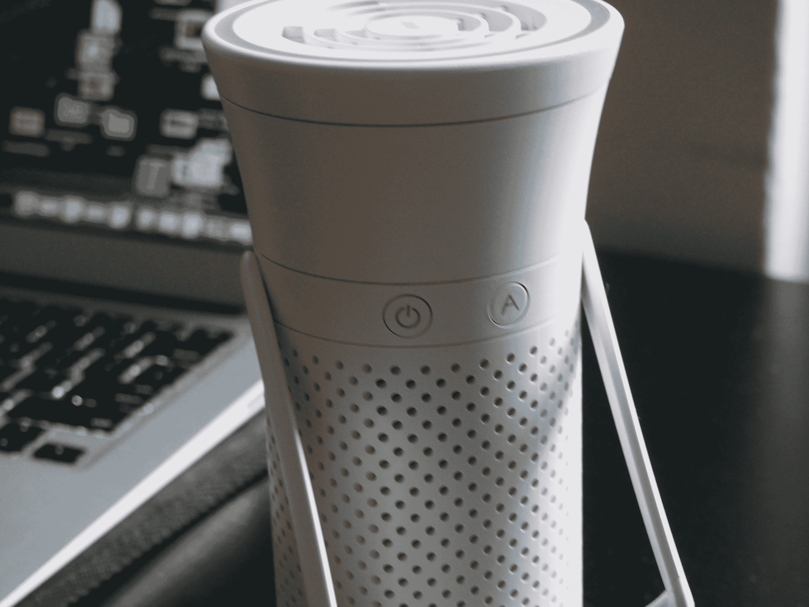
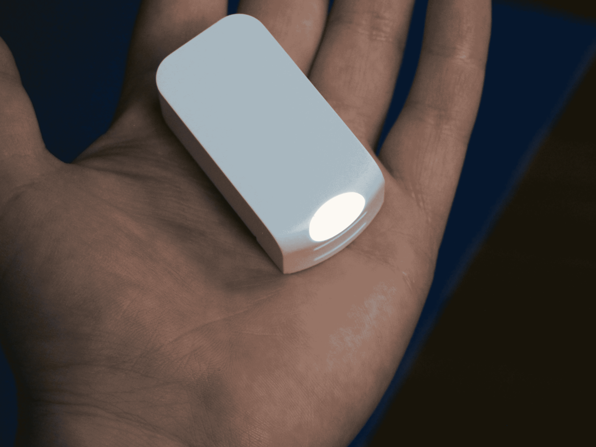
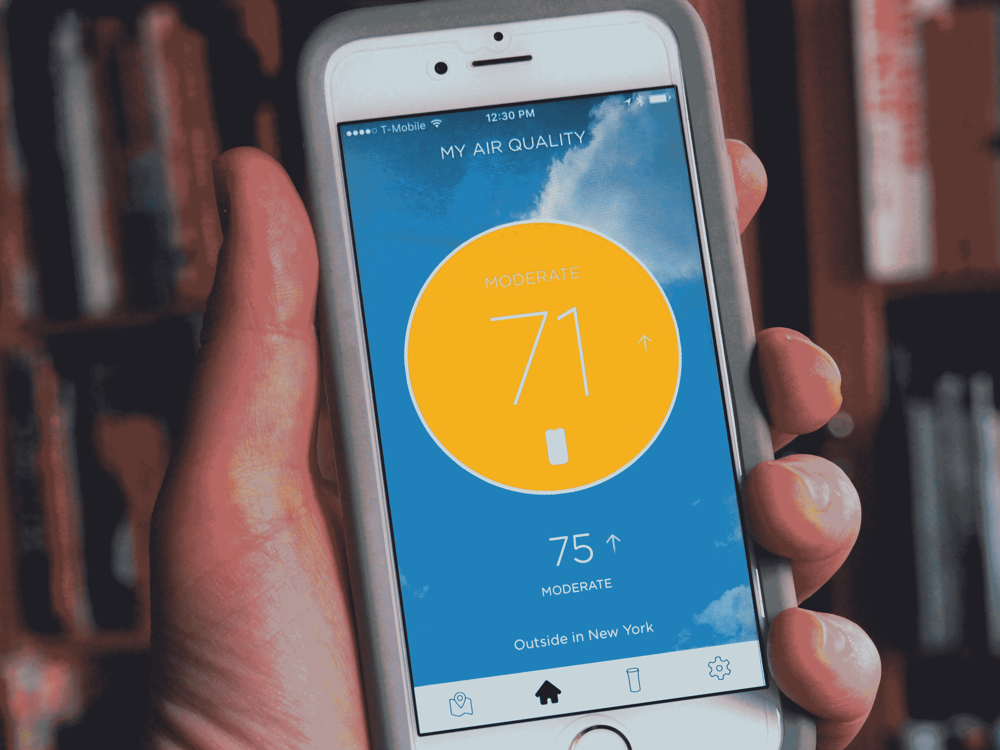
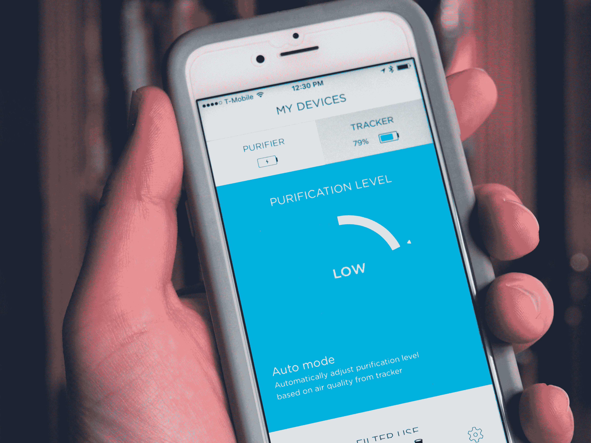

# Wynd 的空气净化器雄心勃勃，但收效甚微 

> 原文：<https://web.archive.org/web/https://techcrunch.com/2017/04/30/wynds-air-purifier-has-broad-ambitions-but-a-short-reach/>

[Wynd smart 空气净化器](https://web.archive.org/web/20221025222727/https://beta.techcrunch.com/2016/06/02/wynd-air-filter/)旨在创造新鲜空气的“气泡”——微小的单人呼吸来自污染、过敏原和其他漂浮在乙醚中的有害颗粒。这感觉几乎是反乌托邦的，在这个世界里，我们需要武装自己对抗我们周围的空气，但产品[显然触动了神经](https://web.archive.org/web/20221025222727/https://beta.techcrunch.com/2016/09/28/wynd-funding/)，去年年底，超过 3400 名支持者支持该项目，总额达 604792 美元。

该产品最引人注目的地方在于它超越了简单的空气净化产品。市场上已经有 100 万个这样的系统，一个单一的、水瓶大小的系统只能做这么多。然而，通过将 Wynd 与移动设备相连，该公司能够对净化器本身以及我们周围的世界提供一些有趣的见解，它最终旨在保护我们。

## 制造泡泡

Wynd 系统由两个关键部分组成:主要的空气净化器和一个插入设备后部的小型监视器。该产品是可移动的，可以夹在衣服上，在旅途中提供对空气质量的洞察。从某种意义上说，这个系统是服务于独立但相关功能的非常不同的部分。

这是一个非常聪明的设计，这家初创公司显然投入了大量工作，将尽可能多的功能打包到尽可能小的外形中。最终的包装是圆锥形的，顶部向外张开。

这个位在一个环内装有一个前置风扇，当电源打开时它会亮起，并根据空气质量读数调整颜色。该系统有一个“自动”设置，可以根据周围的空气改变风扇的速度，或者你可以通过旋转系统的顶部来手动改变气流。

过滤器其余表面区域的大部分被用于进气的孔覆盖。根据该公司的新闻材料，周围的空气在被吹出顶部之前，会通过一个小的圆形布过滤器，大约一半的细颗粒和 70%的较大的粗颗粒被去除。该系统的背面可以拧下并拆除，以便于接触过滤器和内置的可充电电池。

它基本上是一个相当不错的工业设计，尽管有几个关键的地方有所欠缺。支架可以使空气输出朝向你的脸，有点不稳定，而且只能提供一个位置。与此同时，USB-C 充电插槽位于前面，如果你想在使用时插入系统，它会挡住支架。

说真的，最大的问题是净化器的尺寸。便携式空气过滤器的想法很好，但在现实世界中，它最终不会清洁那么多。因此，几乎是客观主义的“气泡”概念——不包含周围空气中有害颗粒的小口袋。这实际上意味着，为了最大限度地利用这个东西，你必须把它直接对准你的脸。因此，应用程序受到硬件的限制。例如，你可以把它贴在你的书桌上，或者床头柜上。

该公司还使用了婴儿车或汽车的例子，作为一个封闭的空间，它有更多的影响。如果你想填满一个房间，你可以花不到 200 美元买到一套好的系统。例如，我以这个 [Winix PlasmaWave](https://web.archive.org/web/20221025222727/https://www.amazon.com/gp/product/B001RUS05E/ref=s9_acsd_al_bw_c_x_1_w) 发誓。现在亚马逊上的价格是 139 美元——巧合的是和 Wynd 的价格一样。它不能连接到我的智能手机上，但自从我拿起它，我早上醒来时因为过敏而闭上眼睛的次数少了很多。

## 在移动中

Wynd 通过利用目前在消费电子产品中风靡一时的两个元素加快了游戏步伐:可穿戴设备和众包数据地图。这两个部分都是通过嵌入设备底部的方形传感器来实现的。当它在里面时，它在净化器旁边充电，当它被取出时，它大约有一个粉红色橡皮擦那么大。

侧面有一个按钮，可以打开传感器，顶部有一个大灯，根据检测到的空气质量改变颜色。蓝色很好，你越接近红色，你就越应该考虑购买一个外科口罩，在日常生活中佩戴。底部有一个夹子，可以系在衣服或背包带上。然而，这里还有一个地方的设计有待改进——当我穿着它在城市里闲逛时，它确实掉了几次。

传感器的目的有两个。第一部分是提供空气质量的局部读数。我真的不知道该如何处理这些信息，也许除了避开某些区域，比如说地铁站，它们会把光线变成令人不安的深红色。

对于过去几年一直关注硬件创业公司的人来说，这个大局应该是熟悉的。该公司打算利用连接的节点建立一种空气质量状况的实时地图——这可能会在空气质量是一个真正持续的健康问题的世界部分地区证明是有用的。

然而，为了让它成为真正有用的资源，还需要在世界范围内部署更多的连接节点。

## 新鲜空气

应用程序体验非常有用，设计简洁。它会让你知道设备有多少电量，什么时候该换过滤器了。与此同时，气泡部分显示了所有的传感器读数，提供了对你周围空气的洞察。

Wynd 的价格为 139 美元，与体积大得多的空气净化器类似，比吹到你脸上的空气量大得多。另一方面，传感器确实是最引人注目和最有用的功能，可以让你对周围的世界有所了解。但是在 Wynd 制造出工业规模的净化器之前，你实际上要做的事情会更加困难。