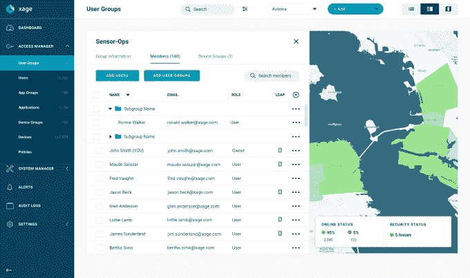

# Xage 安全自动化工具可以保护电网免受黑客攻击

> 原文：<https://web.archive.org/web/https://techcrunch.com/2018/08/28/xage-security-automation-tool-could-protect-power-grid-from-hackers/>

# Xage 安全自动化工具可以保护电网免受黑客攻击

希望使用区块链帮助基础设施更加安全的公司 Xage 宣布了一种新的策略管理器工具，以帮助保护公用事业和其他关键基础设施免受黑客攻击，并自动遵守法规。

Xage 首席执行官邓肯·格瑞特伍德(Duncan Greatwood)表示，该产品在一定程度上是为了满足产品组合的需求，但也是为了帮助客户遵守美国国土安全部(Department of Homeland Security)出台的新一波法规，这些法规旨在保护电网免受黑客攻击，特别是来自敌对民族国家的黑客攻击。

Greatwood 表示，政府以前只担心核心网络资产，但随着时间的推移，很明显黑客一直在寻求攻击变电站和本地控制中心等公用事业网络边缘的技术，甚至是传感器和电压控制器。

《纽约时报》今年早些时候报道称[俄罗斯黑客已经瞄准了](https://web.archive.org/web/20230225043053/https://www.nytimes.com/2018/07/27/us/politics/russian-hackers-electric-grid-elections-.html)美国电网，这是 DHS 一直推动公用事业公司升级其处理密码轮换和控制远程访问等方式的一大原因。

这是一个大规模的问题，因为你可能在谈论一个拥有 10，000 到 20，000 个变电站的单个公用事业公司，每个变电站内部都有数百个组件。随着 DHS 新规明年生效，企业现在必须开始考虑如何实施这些规定。

“从现在到明年年底，公用事业公司必须有一个自动化系统的方法，”Greatwood 解释说。Xage 提供了一种方法来设置策略，以符合美国政府的新规定，然后在区块链上强制执行，确保它没有被篡改。

x 策略管理器。截图:Xage

部分问题在于，终端用户使用笔记本电脑、平板电脑和智能手机等设备来访问网络。Xage 的策略管理工具可以提供谁可以在什么设备上访问系统的明确定义，有助于阻止黑客。

“我们的数据策略管理的一部分是定义允许谁从什么机器获得访问权限的规则。并不是所有的笔记本电脑都可以上网，”他说。它需要一个经批准的 MAC 地址和一个经批准的指纹，以及一个由适当部门安装的证书，以确保它是它声称的机器。

区块链有助于确保如果(或当)不良行为者确实渗透到系统中，他们将无法在整个网络中自由移动。“如果确实出了问题，那也是局部性的。如果区块链中有一个表现不佳的节点，它会被检测出来，您可以锁定该扇区。这使得在整个电网或区域内推广软件变得更加困难，”他说。