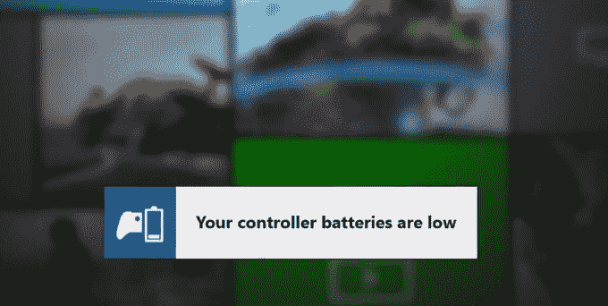

# 以下是 Xbox One 月更新 的新内容

> 原文：<https://web.archive.org/web/http://techcrunch.com/2014/07/18/xbox-one-august-update-patch-notes/>

# 以下是 Xbox One 月更新中的新内容

自发布以来的每个月， [Xbox One](https://web.archive.org/web/20230326065506/http://www.crunchbase.com/product/xbox-one) 都会收到一次软件更新，旨在教会游戏机一些新技巧。

到目前为止，这些更新主要用于修复漏洞，调整用户界面，并重新引入从 Xbox 360 跳到 Xbox One 后莫名其妙地缺失的东西——比如[外部硬盘支持](https://web.archive.org/web/20230326065506/https://techcrunch.com/2014/05/21/xbox-one-june-update-patch-notes/)、[自动帐户登录](https://web.archive.org/web/20230326065506/https://techcrunch.com/2014/05/21/xbox-one-june-update-patch-notes/)，以及当你的朋友登录时的[提醒。](https://web.archive.org/web/20230326065506/https://techcrunch.com/2014/04/14/microsoft-rolls-out-the-april-xbox-one-update-heres-whats-inside/)

下次更新的最好消息？在死亡之前，你的控制器会给你一个提示*，而不是在一场史诗般的战斗中昏倒。*

**以下是 8 月份更新的内容:**

*   **低电量通知:**虽然自 2 月份以来，One 已经能够告诉你控制器中还剩多少电量，但它对此并不积极。如果你没有定期检查，很容易发现自己在枪战中控制器失灵了。现在，当电量不足时，它会发出警报，这样你就知道什么时候该换了。
*   **移动购买**:你现在可以通过 Xbox SmartGlass 或 Xbox.com 购买游戏/应用，它会打开你的主机，开始下载，并在完成后关闭。方便，如果你在工作，并希望获得一个新的游戏排队等待你回家。
*   **可以将通知(如好友登录提醒和游戏邀请)设置为在视频播放时不显示**
*   **上次在线时间**:你的好友列表现在会告诉你你的好友上次在线的时间，以及他们当时在玩什么游戏
*   你的朋友界面现在会显示你朋友中最受欢迎的游戏(这是一个提高游戏销量的聪明方法)，最近玩家分数增长的高分榜，以及你朋友活动的动态反馈(显示玩过的游戏、上传的视频等)。在推文流式列表中)。你可以喜欢、评论和分享每件物品，还可以发布状态更新，比如“今晚 9 点我将玩凯蒂猫岛冒险游戏。一定要在！”。看起来微软正试图弄清楚当社交人士实际上不玩游戏时，他们希望如何对待他们的游戏。
*   3D 蓝光支持
*   **OneGuide(微软的直播电视指南)在巴西、墨西哥、爱尔兰和奥地利的支持**

正如他每个月所做的那样，微软的主要尼尔森发布了一个分解新产品的视频:

[YouTube https://www.youtube.com/watch?v=ovHyso_jy24&w=560&h=315]