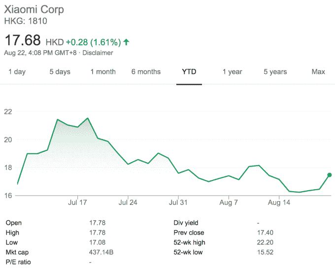

# 小米上市第一季度盈利 21 亿美元 

> 原文：<https://web.archive.org/web/https://techcrunch.com/2018/08/22/xiaomi-first-quarter/>

# 小米上市后第一季度盈利 21 亿美元

由于智能手机和硬件销售的增长，中国智能手机公司小米公布了其上市公司第一季度 21 亿美元的利润。

该公司于 7 月在香港上市，通过首次公开募股筹集了 47 亿美元，但自那以后，小米的股价稳步下跌。[该公司今天宣布](https://web.archive.org/web/20221127014922/http://www.hkexnews.hk/listedco/listconews/SEHK/2018/0822/LTN20180822385.pdf)2018 年在 Q2 的收入增长 68%，达到 452 亿元人民币，或 66 亿美元。小米公布了 146 亿元人民币(21 亿美元)的净利润，但由于上市期间的巨额管理成本，该公司同期录得 76 亿元人民币(11 亿美元)的运营亏损。[在 IPO](https://web.archive.org/web/20221127014922/https://techcrunch.com/2018/06/11/xiaomi-posts-1-1b-quarterly-loss-ahead-of-much-anticipated-ipo/) 之前，成本也拖累了它。

在撰写本文时，这些初步结果使该公司的股价上涨了 1.6%。但距离上月达到的 21.55 港元的峰值仍有一段距离。

小米的大部分收入来自智能手机销售，该公司表示，本季度出货量为 3200 万部，同比增长 44%，带来 305 亿元人民币(45 亿美元)的收入。这占总收入的 67%，不过值得注意的是，硬件销售的毛利润从去年的 8.7%下滑至 6.7%。

除了手机，包括电视和健身手环在内的其他智能产品的销售额增长了 100%以上，达到 1040 万元人民币。这大约是 15 亿美元，是小米的第二大收入来源。

小米长期以来一直预测互联网服务是其与其他手机品牌的财务差异，其总销售额每年增长 64%，达到 400 万元人民币，合 5.85 亿美元。小米直到最近才开始将这一部门的重点放在中国以外的市场，这些市场占其 2.069 亿月活跃用户的大部分。这个数字是小米一年前说的 1.46 亿。

从更广泛的角度来看其全球化战略，小米本季度 36%的收入来自中国以外，该公司表示，同比增长 151%。这主要来自印度，但小米表示，它在东南亚最大的经济体印度尼西亚取得了进展，同时最近还扩展到了欧洲。

在印度，该公司在发布了其新的 Pocophone 子品牌的第一款设备后，正在寻求进一步的增长。Poco F1 旨在以低廉的价格提供高端规格，扩大中国同行一加在印度取得巨大成功的细分市场。

F1 的价格低于 500 美元，它将在印度首次亮相，然后在本月晚些时候在香港、法国和印度尼西亚销售。