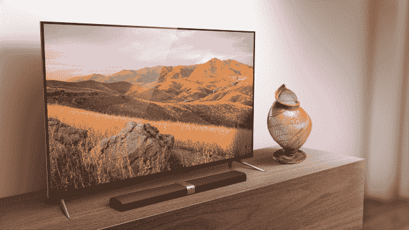

# 小米的最新手机包括双镜头摄像头和眼镜下指纹识别器 

> 原文：<https://web.archive.org/web/https://techcrunch.com/2016/09/27/xiaomi-mi-5s-mi-5s-plus/>

# 小米的最新手机包括双镜头摄像头和眼镜下指纹识别器

紧随苹果首款双摄像头智能手机 iPhone 7 Plus 的发布，中国小米也加入了双摄像头俱乐部，今天发布了小米 5s Plus。

事实上，它发布了两款苹果风格的手机。小米 5s Plus 和小米 5s 都于今天发布，作为今年早些时候发布的小米旗舰产品小米 5 的后续产品。除了双摄像头，这两款设备都包括一个指纹扫描功能，该功能位于前玻璃下方。小米表示，该技术“通过超声波识别每个用户指纹的 3D 地图”，这意味着它可以位于手机正面，而不需要物理按钮。

这两款设备将于 9 月 29 日在中国上市。米 5s(5.15 英寸)的起价为 1999 元人民币(299 美元)，而更大的 5.7 英寸米 5s Plus 的价格将超过 2299 元人民币(345 美元)。

这两款设备都采用高通骁龙 821 处理器，但 Pro 的时钟更高，拥有 6GB 内存和 128GB 存储，而米 5s 的标准配置为 3GB 内存和 64GB 存储，更贵的 4GB 内存和 128GB 存储组合为 2299 元人民币。同样，更高规格的米 5s Pro 将配备 6GB 内存和 128GB 存储空间，售价为 2599 元人民币，约合 390 美元。

[gallery ids="1392766，1392769，1392771，1392772，1392773，1392774"]

> 小米的米 5s

除了内部，摄像头是这里最明显的区别——就像新的 iPhones 一样。小米 5s 配备了一个 1300 万像素的索尼 IMX 378 摄像头，而 Pro 则配备了两个相同的摄像头。小米表示，它们协同工作，一个镜头捕捉彩色图像，另一个镜头捕捉黑白图像，只是为了产生更清晰的图像，噪点更少，细节更多。

[gallery ids="1392770，1392777，1392779，1392780"]

> 小米的米 5s Plus

正如小米新产品的常见情况一样，我们还没有关于国际可用性的细节，但我们预计，作为一个旗舰系列，它们不会仅限于中国。

小米今天还展示了其最新的智能电视——小米电视 3s。它表示，最新版本包括人工智能技术，该技术可以对内容进行分类并记住偏好，有助于为用户提供个性化的节目。小米还首次增加了腾讯视频的内容，这是在与中国最大的两个视频内容门户网站爱奇艺和优酷现有交易的基础上增加的。

