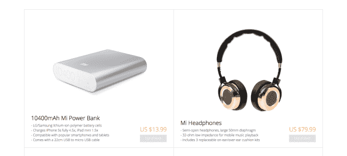

# 小米开始在美国、英国、法国和德国销售配件(但不包括手机)

> 原文：<https://web.archive.org/web/https://techcrunch.com/2015/05/18/xiaomi-mi-us-uk-france-germany/>

# 小米开始在美国、英国、法国和德国销售配件(但不包括手机)

快速增长的中国智能手机制造商小米在美国、英国、法国和德国开设了 Mi.com 的网上商店，向成为国际玩家迈出了试探性的第一步。

该公司生产了一些市场上最好的 Android 设备，其零售价格仅为苹果 iPhone 或三星 Galaxy S 系列的一小部分，但这些设备目前在西方并不存在。相反，Mi.com 正在销售小米的各种配件，包括广受欢迎的电源包、可佩戴的小米手环以及令人印象深刻的 79.99 美元小米耳机。

我们可以推测为什么小米的开放产品清单不包括智能手机，如小米 4 或 T2 的小米 4 Note 平板手机，这让我们想到了与行业竞争对手的潜在法律和专利问题，尽管小米指出运营商协议的流行使美国和其他西方市场变得艰难，但无论如何，这都是其品牌国际化的第一步。(小米目前在亚洲 11 个国家销售智能手机，包括中国和印度。)

这家中国公司经常被与“抄袭”苹果的设计联系在一起，但这种说法大大低估了创造一款价格仅为其三分之一的设备的创新和思维。(此外，如果你玩过最近的小米手机，你会很快意识到它与 i phone 和许多其他触摸屏手机一样相似。)

如果你住在美国、英国、法国或德国，你现在可以前往 Mi.com，稍微了解一下该公司背后的忙乱，该公司价值[450 亿美元](https://web.archive.org/web/20230328012210/https://techcrunch.com/2014/12/29/xiaomi-45billion/)和[预计今年将售出 1 亿部智能手机](https://web.archive.org/web/20230328012210/https://techcrunch.com/2015/01/03/xiaomi-2014/)。