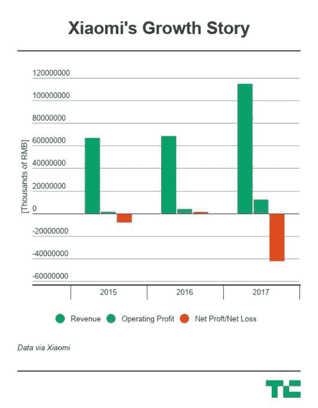

# 小米正式申请香港 IPO，据报道融资 100 亿美元

> 原文：<https://web.archive.org/web/https://techcrunch.com/2018/05/02/xiaomi-officially-files-for-hong-kong-ipo/>

在中国智能手机巨头[申请](https://web.archive.org/web/20230405040047/http://www.hkexnews.hk/APP/SEHK/2018/2018050202/Documents/SEHK201805030005.pdf)在香港证券交易所上市后，小米备受猜测的 IPO 进程正式启动。

其文件的第一稿没有包括上市的财务细节，但是[南华早报报道](https://web.archive.org/web/20230405040047/http://www.scmp.com/business/companies/article/2144422/xiaomi-applies-raise-funds-hong-kong-giving-city-pole-position)这家成立八年的公司正在努力以 1000 亿美元的估值筹集 100 亿美元。除了今年最大的 IPO——也是自 2014 年阿里巴巴(Alibaba)在纽约上市以来全球最大的融资——以外，此次上市可能使小米成为中国市值第三大的科技公司。

小米的运营方式与大多数公司不同，它以极低的利润率销售智能手机和智能设备，依靠服务和对组件的有效利用来获取利润。除了手机，它还经营自己的零售业务和互联网服务，如支付和流媒体。这一战略 CEO 雷军称之为“铁人三项”——专注于服务增长，因为[小米已经将其硬件的最高净利润限制在 5%](https://web.archive.org/web/20230405040047/https://techcrunch.com/2018/04/25/xiaomi-promises-to-give-money-back-to-customers-if-its-profits-get-too-high/)。

小米在提交的文件中表示，它有超过 1.9 亿人使用其 MIUI 版本的安卓系统——这是一个很好的洞察市场上有多少设备——而它已经销售了超过 1 亿台联网设备，包括智能手表、健身带、智能体重秤等。该公司声称，其用户每天有 4.5 个小时活跃在手机上，有 140 万客户拥有 5 台或更多联网设备。

根据分析公司 IDC 的数据，该公司在全球智能手机出货量上排名第四，i [t 是少数几家抵制中国销售放缓的原始设备制造商之一。](https://web.archive.org/web/20230405040047/https://techcrunch.com/2018/04/26/report-chinese-smartphone-shipments-drop-21-to-reach-lowest-level-since-2013/)

该公司的财务状况令人印象深刻。

该公司 2017 年的销售额为 1146 亿元人民币(180 亿美元)，高于 2016 年的 684 亿元人民币和 2015 年的 668 亿元人民币。

由于向投资者发行优先股(540 亿元人民币)，小米在 2017 年亏损 439 亿元人民币(69 亿美元)，但增长故事是健康的。营业利润跃升至 122 亿元人民币(19.2 亿美元)，同比增长逾三倍。

智能手机继续占销售额的 70%，智能设备的销售额增加了 20%，其余部分由服务部门负责。

正如你所料，中国是小米的主要收入市场，但小米对本土的依赖越来越少。就 2017 年的销售额而言，中国占 72%，但 2015 年和 2016 年分别为 94%和 87%。印度是小米最成功的海外投资，已将该业务打造为市场份额排名第一的智能手机公司，小米承诺在全球其他地区加倍努力。

有趣的是，没有提到扩大在美国的手机销售，但小米承诺将其 IPO 的 30%用于增加其在东南亚、欧洲、俄罗斯“其他地区”的存在目前，它说它在 74 个国家销售产品，这确实包括美国，小米在美国销售配件和非手机产品。

另外 30%被指定用于 R&D 和产品开发，而另外 30%将投资于小米的物联网和智能产品生态系统。剩下的 10%是营运资金。

小米没有披露其主要投资者持有的确切股份比例，但首席执行官雷军被认为是最重要的股东之一。首次公开募股可能使他成为中国首富，根据报道，他控制了超过 75%的股份。