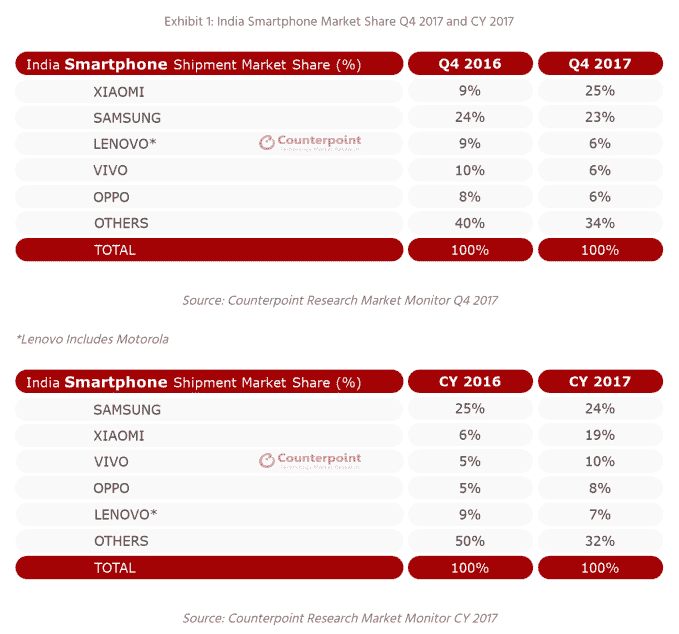
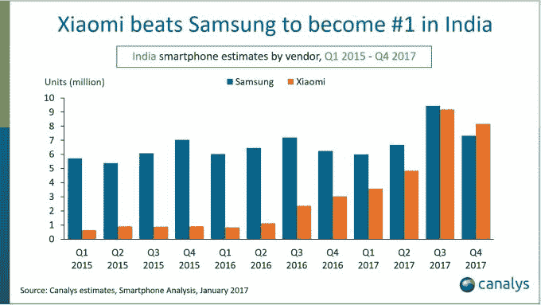

# 小米击败三星成为印度智能手机市场的老大

> 原文：<https://web.archive.org/web/https://techcrunch.com/2018/01/25/xiaomi-samsung-india/>

# 小米击败三星成为印度智能手机市场的老大

两份报告称小米已经超越三星成为印度最畅销的智能手机公司，这两份报告的时机再好不过了。

据报道，这家中国公司正在为其价值高达 1000 亿美元的首次公开募股进行路演，据说根据来自[科纳仕公司](https://web.archive.org/web/20230317214820/https://www.canalys.com/newsroom/xiaomi-beats-samsung-become-top-smartphone-vendor-india)和 [Counterpoint](https://web.archive.org/web/20230317214820/https://www.counterpointresearch.com/xiaomi-became-leading-smartphone-brand-india-reliance-jio-leads-featurephone-segment-q4-2017/) 的新数据，它已经击败了三星在印度[的销售努力，印度是仅次于中国的世界第二大智能手机市场](https://web.archive.org/web/20230317214820/https://techcrunch.com/2017/10/27/india-second-largest-smartphone-market/)。

根据科纳仕公司的数据，两家分析机构的数据显示，小米在 2017 年最后一个季度以 27%和 25%的微弱优势领先于三星，根据 Counterpoint 的数据，这两个数字分别为 25%和 23%。

Counterpoint 包括全年的数据，得出的结论是三星(24%)在更长的时间内领先于小米(19%)。看一下上一年的数据就会发现，小米已经缩小了与竞争对手之间的巨大差距。

这对搭档的统治地位也令人震惊。这两家公司合计占据了印度智能手机销售的一半以上，这是相当了不起的。

> 对位数据

科纳仕公司的 Rushabh Doshi 解释说，三星的失利是因为小米能够利用其平价 Redmi 系列在 15000 卢比(240 美元)以下市场的弱点。

然而，Doshi 指出，三星的“远优”R&D 及其供应链专业知识使其具有优势，这将有助于其与小米品牌进行激烈竞争，小米品牌在印度的营销可以说更好。

Counterpoint Research 对这一观点做出了回应，指出 150 美元至 240 美元的价格区间是增长最快的部分。该公司估计，小米在运往印度的该系列设备中约占 37%。

[随着小米在印度](https://web.archive.org/web/20230317214820/https://techcrunch.com/2017/05/12/xiaomi-mi-home-store-india/)增加线下销售，这是 2018 年值得关注的一场战斗。

> 分析数据