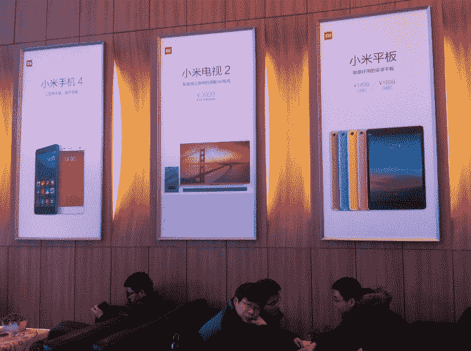

# 这就是小米保持智能手机低成本的方法

> 原文：<https://web.archive.org/web/https://techcrunch.com/2015/01/19/xiaomi-secret-sauce/>

小米手机的高规格和低价格促使该公司去年的销售额超过 6000 万。这一进步见证了[取代三星](https://web.archive.org/web/20230329125135/https://techcrunch.com/2014/08/05/xiaomi-surpasses-samsung-as-chinas-top-smartphone-vendor-says-canalys/)成为中国最畅销的智能手机公司*和*成为世界第三大畅销手机制造商。

这家中国公司的旗舰 Mi 设备通常零售价约为 300 美元——其[新 Mi Note Pro 首次突破 500 美元大关](https://web.archive.org/web/20230329125135/https://techcrunch.com/2015/01/15/mi-note-hands-on/)——而其平价 Redmi 系列不到 150 美元。相比之下，苹果高端 iPhones 的合同售价超过 1000 美元，而三星 Note 和 GalaxyS 系列的价格类似。那么小米怎么能在定价上如此激进呢？

提出了很多理论，包括小米按成本价卖，靠其他服务赚钱的说法。该公司国际副总裁雨果·巴拉上周在接受 TechCrunch 采访时披露了该公司的一些秘密。

> 小米之所以能够做出价格让步，是因为它的产品组合规模较小，而且每台设备的平均销售时间较长

Barra 解释说，小米之所以能够做出价格让步，得益于小规模的产品组合和每台设备更长的平均销售时间。

重要的是，小米继续以低价销售老款设备(以及其中的[改进版](https://web.archive.org/web/20230329125135/http://forum.xda-developers.com/xiaomi-mi-3/general/mi3-vs-mi3w-vs-mi3s-t2846264)),即使是在发布新款之后。

“一个在货架上停留 18-24 个月的产品——这是我们的大部分产品——会经历三四次降价。举例来说，Mi2 和 Mi2 本质上是同一个设备，”巴拉解释道。“军情二处/军情二处出售了 26 个月。Redmi 1 于 2013 年 9 月首次推出，[我们刚刚在本月宣布了 Redmi 2](https://web.archive.org/web/20230329125135/https://techcrunch.com/2015/01/04/xiaomi-redmi-2/) ，也就是 16 个月后。”

这一点很重要，因为更长的设备跑道给了小米与供应商达成更好组件交易的优势。

“我们降价的原因是，随着时间的推移，我们设法(与供应商)谈判降低了组件成本，这最终给我们留下了比我们希望的更大的利润，所以我们降价了，”Barra 补充道。

他解释说:“(我们设备中的)绝大多数组件仍然相同，所以在供应链和组件采购方面，我们与 Redmi 1 签订了相同的供应合同，这意味着我们仍然可以获得相同的组件折扣。”“我们可以继续利用成本曲线，因此拥有非常小的产品组合非常重要——事实上我们每年只推出几款产品，而且我们只有两个产品系列。”

Barra 说，这种动态“非常简单”，但对设备两三年的承诺不仅仅是降价。他指出，小米维护客户所需的软件更新、备件和其他服务的时间比大多数公司都长。

“投资组合越集中，我们管理这些成本的效率也越高，”他解释道。

影响成本结构的还有其他因素，包括小米精益、仅在线营销的重点，以及它靠近中国制造工厂的位置，但零部件和供应链合作伙伴关系的管理是一个至关重要的因素。

[小米今年有向亚洲](https://web.archive.org/web/20230329125135/https://techcrunch.com/2015/01/03/xiaomi-2014/)以外扩张的宏伟计划，这将使其定价模式和供应链比以往任何时候都更加重要。

该公司在大多数市场使用纯在线模式销售其手机，但最近开始在中国以外测试运营商合作伙伴关系。它正在印度与 Airtel 进行有限的试验，并在台湾、马来西亚和新加坡找到了合作伙伴。

Barra 解释说，在大多数消费者使用预付费的市场，如印度，运营商合作很困难，但很明显，小米正在寻找扩大零售足迹的方法。在印度的头五个月里，它使用 flash 销售模式售出了 100 万台设备。如果它能够超越这一点，更好地满足印度和其他新兴市场对其手机的需求，它可能会大幅提高 2015 年的销售数字。

去年，小米预计今年将售出 1 亿台设备。它在年中提高了 2014 年的目标，但我们还没有听到该公司 2015 年的新数据。