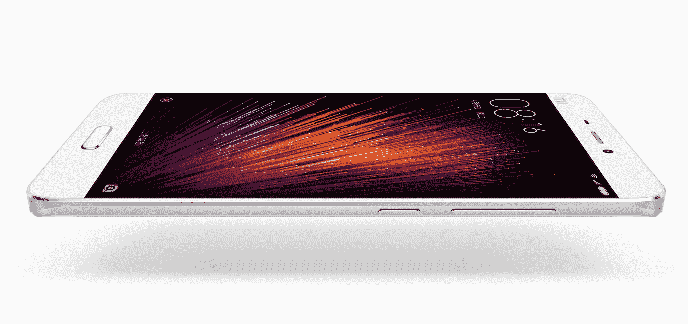

# 小米将在中国、印度和“其他全球市场”发布新的小米 5 智能手机

> 原文：<https://web.archive.org/web/https://techcrunch.com/2016/02/24/xiaomi-to-release-new-mi-5-smartphone-in-china-india-and-other-global-markets/>

小米准备再来一次。该公司刚刚推出了最新的智能手机，看起来棒极了。小米不再是一家向他人寻求灵感的公司。小米不再是一个新贵，而是一个全球领导者——一个有着[高期望](https://web.archive.org/web/20221006052343/https://beta.techcrunch.com/2016/01/14/xiaomi-70-million-sales-in-2015/)和[450 亿美元估值](https://web.archive.org/web/20221006052343/https://beta.techcrunch.com/2014/12/29/xiaomi-45billion/)的领导者——而新的小米 5 有成为潮流引领者的潜质。

[小米 5](https://web.archive.org/web/20221006052343/http://www.mi.com/mi5/) 是小米的一款重要设备，相比老款机型有很多改进。这是第一款具有物理 home 键和前置指纹传感器的小米手机。(去年的[红米 Note 3 背面有扫描仪](https://web.archive.org/web/20221006052343/https://beta.techcrunch.com/2015/11/23/xiaomi-unveils-the-redmi-note-3-its-first-phone-with-a-fingerprint-scanner/)。)甚至还有一款特别版手机，采用陶瓷制成的机身，这对小米来说也是第一次。

然而，最重要的是，这是第一款可以打入新市场的小米设备。目前，该公司只是说它将于 3 月 1 日在中国发行，印度也将紧随其后。小米副总裁雨果·巴拉今天在米 5 发布会的闭幕式上暗示了其他市场，该发布会在巴塞罗纳世界移动通信大会上举行，这是该公司在欧洲举行的首次新闻发布会。

该设备看起来很像该公司的 Mi Note 智能手机，但在几个方面进行了改进。Mi 5 像 Note 一样弯曲，但更加平滑。它也比更大的 Note 更薄更紧凑。

军情五处把很多东西装进一个小包装里。它在小米所谓的“3D 玻璃机身”或“3D 陶瓷机身”制成的机身中安装了 5.15 英寸的屏幕。表圈很小。然而，即使在这个小框架中，小米也设法为 Snapdragon 820、3,000 mAh 电池、指纹传感器和 16MP 轴图像稳定摄像头找到了空间。

这款手机有三个版本。标准版的 CPU 时钟速度为 1.8Ghz，内存为 3GB，存储为 32GB。升级到 2.15GHz 时钟速度和 64GB 存储空间的下一代手机。这两款机型都由 3D 曲面玻璃机身制成，有金色、白色和黑色可选。

米 5 Pro 版只有黑色，由陶瓷制成，配备 4GB 内存，存储容量为 128GB。

小米采用了氧化锆陶瓷，并表示这种材料比智能手机中使用的其他材料更耐用，更耐磨。显然，这种陶瓷摸起来像大理石或玉石。它只在最贵的 Mi 5 型号中可用，因为小米表示，制作外壳的成本比其他材料制成的机身高出 75%。

Mi 5 是一款重要的设备，应该会对市场产生影响。

自 6 年前推出以来，小米已经引领了智能手机世界的变革，与苹果(Apple)、三星(Samsung)和联想(Lenovo)分庭抗礼，成为中国第一、全球第五大智能手机品牌。

小米迄今为止最大的创新不是硬件，而是其分销模式，即不通过第三方零售商将手机送到消费者手中。该公司将大量设备直接运送给买家。

尽管小米去年的销售额超过 7000 万，是少数几个在全球智能手机市场份额真正增长的公司之一，但它仍未达到年度目标。这让许多专家怀疑该公司是否被高估，而其主要竞争对手已经在设备质量和直接面向消费者的分销方面提高了他们的游戏。

小米的大部分销售来自其低端系列——红米——但小米 5 的利润率更高，作为旗舰产品，良好的接受度可以提升该公司的品牌，并使其在市场上保持新鲜感。

米 5 的起价为 1999 元人民币(约合 262 美元或 238 欧元)，米 5 Pro 的起价为 2699 元人民币(约合 354 美元或 321 欧元)。

米 5 将于 3 月 1 日以上述价格在中国上市。在印度发行之后，紧接着是“其他全球市场”。美国？欧洲？该公司还没有透露。