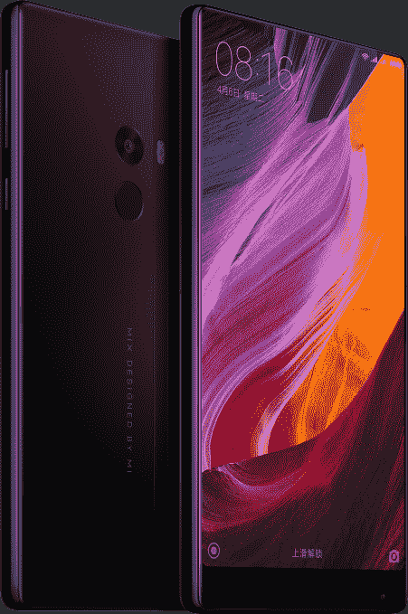
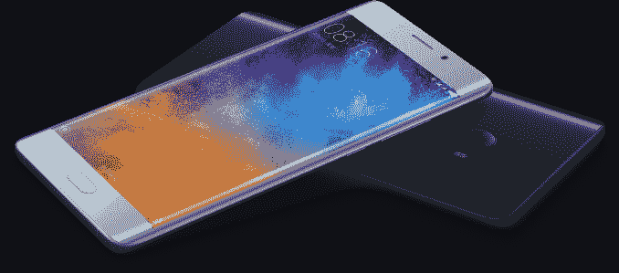

# 小米推出近无边框显示屏概念手机 

> 原文：<https://web.archive.org/web/https://techcrunch.com/2016/10/25/xiaomi-unveils-concept-phone-with-near-bezel-less-display/>

# 小米推出近无边框显示屏的概念手机

中国设备制造商小米宣布了另一批移动硬件，包括与设计师飞利浦·斯塔克合作开发的概念智能手机。

小米首席执行官兼创始人雷军称之为“未来手机的一瞥”。

Mi Mix 上近乎无边框的 6.4 英寸 17:9 显示屏覆盖了 91.3%的可用表面积。所以，如果你真的讨厌边框，你会被这种无边框的可爱景象深深吸引。

不过，不要太兴奋。尽管这款手机将于下月初在中国销售，但小米发言人强调，这款手机的“供应量有限”，但他没有证实这意味着会有多少部手机。

目前还不清楚这款设备还将面向哪些市场(如果有的话)。小米尚未将其任何智能手机带到美国——尽管它继续饶有兴趣地关注着市场。在[三星的 Note 7](https://web.archive.org/web/20221007055942/https://beta.techcrunch.com/2016/10/11/samsung-kills-the-galaxy-note-7-for-good/) 电池爆炸问题发生后，这种情况可能会更加严重。

对于 4GB + 128GB 的“标准版”，Mi Mix 的价格为 3499 元人民币(约 515 美元)。手机机身(背面、侧面、按键)由陶瓷制成。内部有一个 2.35GHz 的骁龙 821 处理器和 4400 毫安时电池。

此外，还有一款限量版的高级型号，配有额外的内存和存储空间，以及 18k 金装饰，售价为人民币 3999 元。

为了最大化屏幕与机身的比例，小米注意到 Mi Mix 没有物理耳机扬声器或接近传感器。相反，它说它使用压电陶瓷声学技术——具体来说是一种陶瓷驱动单元将电信号转化为机械能——来实现无耳机扬声器的音频。

该设备在显示屏后面还有一个超声波接近传感器，取代了传统的前置红外接近传感器。

**糜注 2**

同样在今天，小米发布了小米 Note 2 智能手机:这是一款新的旗舰产品，前后都是弯曲的玻璃，与三星 Galaxy S7 Edge 有点相似。是小米 [2015 款 Mi Note](https://web.archive.org/web/20221007055942/https://beta.techcrunch.com/2015/02/18/xiaomis-mi-note-is-a-great-phone-youll-probably-never-get-to-buy/) 的续作设备。

新旗舰将于下月初在中国上市，4GB+64GB 版本起价人民币 2799 元；而 6GB+128GB 版本和 6GB+128GB 全球版本(支持 37 个全球网络频段，包括 22 个 LTE 频段)的零售价格将分别为 3299 元和 3499 元。

小米 Note 2 拥有 5.7 英寸全高清有机发光二极管显示屏。而在引擎盖下有一个 2.35GHz 的骁龙处理器和 4070mAh 电池。

主摄像头采用 22.56MP 索尼 IMX318 传感器，f/2.0 光圈，77 度广角镜头。它还支持 4K 视频记录与电子图像稳定。

钢琴黑和冰川银是两种颜色选择。