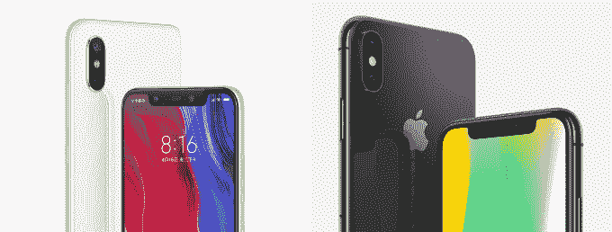
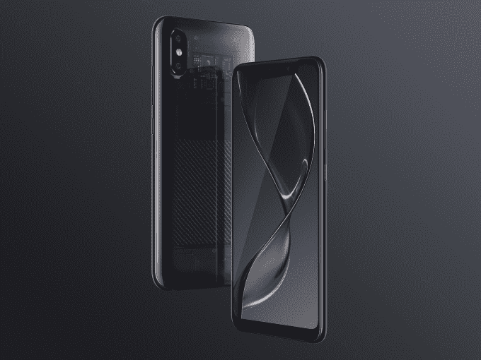

# 小米的小米 8 可能是其迄今为止最厚颜无耻的 iPhone 模仿者 

> 原文：<https://web.archive.org/web/https://techcrunch.com/2018/05/31/xiaomis-mi-8-may-be-its-most-brazen-iphone-copycat-yet/>

中国智能手机公司小米[即将赴港上市](https://web.archive.org/web/20221025222210/https://techcrunch.com/2018/05/02/xiaomi-officially-files-for-hong-kong-ipo/)，刚刚[在今天的发布会上发布了其最新旗舰智能手机和一系列其他产品。](https://web.archive.org/web/20221025222210/http://blog.mi.com/en/2018/05/31/news-xiaomi-pioneers-technology-innovations-with-groundbreaking-mi-8-series/)

小米长期以来一直被指责抄袭苹果，但近年来其设计似乎比以前更加独立。[该公司的无边框 Mi Mix](https://web.archive.org/web/20221025222210/https://techcrunch.com/2017/09/11/xiaomi-mi-mix-2-mi-note-3/) 尤其因其创新思维和设计赢得了 it 界的赞誉。但随着小米 8 的出现，这一切都变了，小米 8 在设计上非常明显地专注于 iPhone X。

小米 8 是小米的第一款手机。虽然业内许多人无情地抄袭苹果，以至于 notch 实际上已经成为标准，但小米的最新设备与 iPhone X 不仅仅是有一点相似。

> 左边是小米的米 8，右边是苹果的 iPhone X

甚至连它的命名，小米都拉了一个苹果。正如苹果推出 iPhone X (10)来纪念其作为手机制造商的第十个年头一样，小米也从之前的小米 6 模式转向了小米 8 来纪念其成立八周年。

除了凹口，双倒车摄像头的位置几乎相同，有一个玻璃面板背面和铝制边框。在软件方面，甚至电信信号、电源条和 WiFi 信号指示灯的位置都与 iPhone X 相同。高端 Mi 8 型号还包括类似 iOS 的 Animojis 和面部解锁功能，这两项功能都是苹果在 iPhone X 中首创的。

这些相似之处将不可避免地惹恼苹果和设计纯粹主义者，但这不是小米的第一次竞技。凭借 Mi 8，它正在做它最擅长的事情，邀请人们与苹果进行比较，然后包装令人印象深刻的技术(和价格)，这将吸引粉丝和那些不热衷于花 1000 美元买一部手机的人的积极关注。

当我们问小米公司是否想谈论小米 8 与 iPhone X 的相似性时，小米发言人拒绝置评。

小米 8 配备了三星的 6.21 英寸 AMOLED 屏幕，在凹槽内有一个 2000 万像素的自拍摄像头和通过扫描用户面部解锁手机的红外技术。有一个类似苹果的双摄像头阵列，配有两个 1200 万像素的摄像头。

更独特的是，该设备是世界上首批搭载高通新[骁龙 845](https://web.archive.org/web/20221025222210/https://www.qualcomm.com/products/snapdragon-845-mobile-platform) 芯片组的设备之一，这给了它一些活力和(可能令人印象深刻的)速度。它还使用了双 GPS，据称这使得定位数据更加准确。

小米表示，这款手机将于 6 月 5 日和 8 日在中国发售，提供三种不同版本。国际扩张日期没有公布，这对小米来说很常见。标准的米 8 售价将超过 2699 元人民币(合 420 美元)，较小的 5.88 英寸“SE”型号售价为 1799 元人民币(合 280 美元)。

对于那些想要更多的人，该公司还宣布了一个加强版的“探索者”版本，该版本具有压敏手指扫描仪和类似 iPhone X 的面部解锁功能。此外，后侧是透明的，这将是相当的期待。

> 军情八处的探索者增加

在进入意、法、德市场后，小米正在积极向欧洲扩张，但你不得不怀疑像小米 8 这样的设备是否能给美国带来荣耀..小米目前在北美销售配件，它最近在 T4 推出了智能家居产品[。](https://web.archive.org/web/20221025222210/https://techcrunch.com/2018/05/10/xiaomi-is-bringing-its-smart-home-devices-to-the-us-but-still-no-phones-yet/)[首席执行官雷军最近表示](https://web.archive.org/web/20221025222210/https://techcrunch.com/2018/03/05/xiaomi-phones-could-finally-go-on-sale-in-the-us-before-the-end-of-this-year/)它可能在今年年底前开始在美国销售智能手机，但你可以想象，如果时间按计划进行，某些类似苹果的设备不会出现在最初的发布名单上。

这也许并不令人惊讶，因为小米的 Redmi 系列——定价约 150 美元——已经产生了大部分销售，特别是在印度这样的扩张市场。