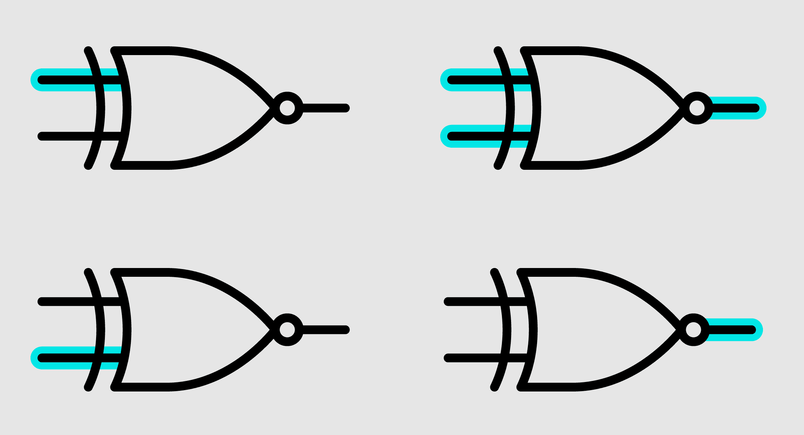
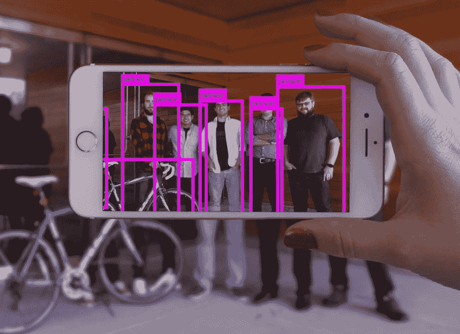

# XNOR.ai 将 ai 从超级计算机 TechCrunch 的监狱中解放出来

> 原文：<https://web.archive.org/web/https://techcrunch.com/2017/01/19/xnor-ai-frees-ai-from-the-prison-of-the-supercomputer/>

当有人谈论人工智能、机器学习或深度卷积网络时，他们真正谈论的是——就像许多计算概念一样——许多精心修剪的数学。这些多功能和强大网络的核心是相当于超级计算机才能实现的计算量。最重要的是，这种计算成本阻碍了人工智能在相对较小大脑的设备中的应用:电话、嵌入式传感器、相机。

如果成本可以降低几个数量级，人工智能将从其并行处理器库中解放出来，可以自由地驻留在几乎任何设备上——这正是 T2 艾伦人工智能研究所的突破 XNOR.ai 使之成为可能。

[XNOR.ai](https://web.archive.org/web/20230205214750/https://xnor.ai/) 本质上是一种聪明的计算机原生数学，它使类似人工智能的视觉和语音识别模型几乎可以在任何地方运行。它有潜力为行业带来变革。

“最先进的人工智能和普通计算之间存在脱节，”AI2 艾伦研究所该项目的高级研究经理阿里·法尔哈迪解释道。坐落在西雅图煤气厂公园附近的滨水区，AI2 专注于“AI 为了公共利益；它很小，但却是美国最大的非营利性人工智能研究机构。

法尔哈迪继续说道，机器学习倾向于依赖卷积神经网络(CNN)；这些包括在大规模的数字矩阵上重复执行简单但极其大量的运算。但由于操作的性质，许多操作必须串行执行，而不是并行执行。(机器学习模型[是否真正构成人工智能](https://web.archive.org/web/20230205214750/https://techcrunch.com/2017/01/10/ai-powered-is-techs-meaningless-equivalent-of-all-natural/)是另一个[到目前为止还没有答案的问题](https://web.archive.org/web/20230205214750/https://techcrunch.com/2016/12/04/wtf-is-ai/)，但是现在我们将在更广泛的意义上使用人工智能。)

例如:将一千个数字中的每一个数字乘以二很简单，因为所有这些操作都是相互独立的，可以由一千个并行工作的处理器或线程同时执行。

但是想象一下，每一次运算都依赖于前一次运算的结果——比方说，你需要将前一次运算的乘积的最后一位数字加到下一次运算中。这意味着你必须一个接一个地进行，这意味着只有一个处理器可以处理它，这意味着它可能需要一千倍于另一个处理器的时间，尽管实际上，它仍然是简单的算术。(我过于简单化了，但这是问题的本质。)

训练和运行机器学习系统执行所有这些有趣的人工智能壮举的不幸现实是，它们的计算过程非常昂贵。

## 牛肉在哪里？

“当你需要那么大的处理能力时，很难扩展，”法尔哈迪说。即使你可以将“强壮的”——他对机器学习模型受限的 GPU 封装的服务器和工作站的首选称呼——规格安装到手机中，它也会在一分钟内吸干电池。与此同时，当你想到这一点时，公认的解决方法几乎是可笑的笨拙:你拿着一堆你想要分析的数据，通过互联网将其发送到人工智能实际所在的数据中心，也许在一千英里以外的计算机以最高速度工作来计算结果，希望在一两秒钟内返回给你。

如果你不马上需要那个结果，这不是一个问题，但是想象一下，如果你为了在最高的图形设置上玩游戏而不得不这样做；您希望尽快获得这些视频帧，将它们发送出去进行远程解析是不切实际的(更不用说是不优雅的了)。但是软件和硬件的改进使它变得没有必要，我们的光线跟踪阴影和法线贴图的应用不需要求助于遥远的数据中心。

法尔哈迪和他的团队希望为更复杂的人工智能模型创造条件。但是，他们如何才能缩短进行数十亿次串行操作所需的时间呢？

“我们决定把它二进制化，”他说。通过将数学运算简化为二进制运算的大致等价形式，他们可以将人工智能模型的运行速度和效率提高几个数量级。

原因如下。即使是最简单的算术问题也涉及到大量的基础知识，因为晶体管本身并不理解数字——只理解开关状态。六减四当然是二，但是为了达到这个数字，你必须定义六、四、二和所有在这之间的数字，减是什么意思，如何检查工作以确保它是正确的，等等。从字面上来看，这需要相当多的逻辑才能得出这个简单的结果。

但是芯片确实有一些内置功能，特别是一组被称为 T2 逻辑门 T3 的简单操作。一个门可能接受一个输入 1(在这个标度上，它实际上不是一个数字而是一个电压)，并输出一个 0，反之亦然。这将是一个简单的非门，也称为反相器。或两个输入，如果其中一个是 1，它输出 1，但如果两个都不是 1，它输出 0。那是一个异或门。

像这样的 XNOR 门，如果输入电压匹配就发送 1，如果不匹配就发送 0。

这些简单的操作是在晶体管层面上进行的，因此*非常*快。事实上，它们几乎是计算机能做的最快的计算，而且即使在普通的处理器上，大量的数字阵列也能同时进行这种逻辑运算。

问题是，用逻辑门本身就能解决的术语来构建复杂的数学并不容易。更难的是创造出一种将数学运算转换成二进制运算的算法。但这正是 AI2 的工程师们所做的。

## 1%的人

法尔哈迪向我展示了他们的劳动成果，他打开手机上的一个应用程序，指向窗外。外面弗里蒙特的景色立刻被在各种物体上跳舞的盒子覆盖:船、汽车、电话，它们的标签上写着。在某种程度上，这并不令人印象深刻:毕竟，这种事情是我们一直在吹捧最新计算机视觉的博客帖子中看到的。

但是这些结果都是在超级计算机和并行 GPU 的帮助下实现的；谁知道一个最先进的算法要花多长时间才能看到一幅图像，然后说，“有六艘船，两辆车，一部电话和一片灌木丛”，并标出它们的边界。毕竟，它不仅要逐个像素地检查整个场景，还要识别场景中的离散物体及其边缘，并与已知形状进行比较，等等；对于计算机视觉系统来说，即使是最基本的物体识别也是一项非常复杂的任务。

这个原型应用运行在日常智能手机上，每秒钟可以做 10 次。

https://youtu.be/KxDs8G2EsvM

“你可以让它在你的手机上运行几个小时，”法尔哈迪说，“我们甚至没有针对电池消耗进行优化。”它在做超级计算机的工作，但消耗的能量并不比游戏多，而且只使用了一个 CPU 内核。过了一会儿，他们向我展示了在 Raspberry Pi Zero 上运行的实时物体识别，这是目前最简单、最便宜的现代计算机之一。它甚至出现在全息透镜上。

他们称之为 XNOR.ai，以提高其效率的逻辑门命名。

现在，这不是一个奇迹技术；这是效率和准确性之间的折衷。该团队意识到，CNN 的计算不必精确，因为结果是置信水平，而不是精确值。被训练来识别船的神经网络不会得出与“船”相对应的单一数值。它只是计算了一下，发现显示的值与鸭子的值有 55%的相似性，而与船的值有 84%的相似性。所以，就坐船吧。大概吧。

 该团队确信，产生这些置信度评级的操作——可能是一艘船，但也可能是一只鸭子——可以以更简单的方式复制(即二进制化)，而不会损失太多的准确性。法尔哈迪说，简化数学可能会消除 99%的数据，但如果你保留的 1%是唯一重要的 1%，那就不是问题。问题是弄清楚该保留哪 1%。

丢弃的数据有助于增强信心，但不是绝对必要的；您可能会损失 5%的准确度，但结果会快一万倍。XNOR.ai 做的权衡本质大概就是这样。

我们没有详细说明这种二进制化是如何实现的——如果是这个词的话，我不认为如果我们这样做了，我会理解。法尔哈迪说，将 CNN 的串行数学转换为二进制逻辑的算法(或一组算法)是该团队的秘密武器。

## 脱离

XNOR.ai 有大约 10 亿个应用程序:安全摄像头等极低功耗设备上的对象识别，手机上的照片分类和标记，精确的本地语音识别和合成以及无数其他 CPU 密集型进程。它可能会导致家用和工业中许多种类的电子产品的功能发生根本性的转变。

AI2 的其他项目通常旨在以某种方式复制人类智能，它们的源代码定期发布和更新，首先，XNOR.ai 也不例外:代码可以在 GitHub 上获得，一些员工已经从中分离出自己的项目。

但是，虽然研究是开放的，代码可以免费下载，但这并不意味着它可以轻松应用到你自己的项目或设备中。作为一个非营利组织，AI2 不能轻易获得像这样一个潜在的主要产品所需要的许可和支持。所以 XNOR.ai 被剥离出来，成为一家同名的独立公司。

“AI2 已经并将继续剥离令人兴奋的创业公司，以使我们开发的人工智能技术发挥最大影响，”AI2 首席执行官柳文欢·埃齐奥尼在给 TechCrunch 的一份声明中说。“通过 XNOR.ai，我们认为商业化是看到该技术发挥全部潜力的最佳途径。”

新公司负责知识产权，收入分成模式已经到位，但 AI2 拒绝提供更多细节。这并不是第一个从 AI2 分拆出来的公司——自然语言处理平台 [KITT.ai](https://web.archive.org/web/20230205214750/http://kitt.ai/) 去年在一些风险投资的资助下跳槽了——但这是一个有些不同的战略。

不可能预测 XNOR.ai 会有多成功，但我相信它所采用的方法是一种非常强大的方法，可以让机器学习超越当前的局限。我们将密切关注这家新公司，以及它不可避免的竞争对手。