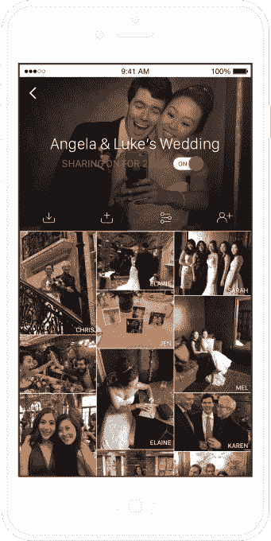

# XO 集团，The Knot 的所有者，收购婚纱照应用 Veri 

> 原文：<https://web.archive.org/web/https://techcrunch.com/2017/09/27/xo-group-owner-of-the-knot-acquires-wedding-photo-app-veri/>

# XO 集团，The Knot 的所有者，收购婚纱照应用 Veri

XO 集团已经收购了 [Veri](https://web.archive.org/web/20221025223523/https://www.veri.com/) ，一家允许用户[自动分享婚礼](https://web.archive.org/web/20221025223523/https://www.stylemepretty.com/2017/05/25/best-wedding-planning-apps/)和其他重要事件照片的初创公司。

XO 集团的旗舰产品是 [The Knot](https://web.archive.org/web/20221025223523/https://www.theknot.com/) ，已经有 2500 万对新人用它来策划他们的婚礼。因此，Veri 似乎是一个非常自然的选择——这家数字媒体公司表示，它为这家初创公司支付了 350 万美元的现金。

首席执行官 Michael Steib 和产品执行副总裁 Brent Tworetzky 都称赞了 Veri 应用程序，Tworetzky 将其描述为“对夫妇和客人来说都是一个神奇的产品。”

Steib 说，这次收购让这个婚礼到达了婚礼策划的“最后一英里”,所以这不仅仅是帮助新人为婚礼做好准备，也保存了他们在婚礼上的记忆。

他说:“我们可以把这个了不起的应用程序提供给更广泛的受众。”

Veri 不会取代专业婚礼摄影师拍摄的照片，但使用它意味着新人和他们的客人都可以获得更广泛的照片，而不必做太多额外的工作。一旦用户下载了该应用程序并获得许可，Veri 就会自动分享他们智能手机摄像头拍摄的照片和视频。

事实上，根据 XO Group 的内部研究，使用 Veri 的夫妇会收到 800 至 1000 张他们婚礼的照片，而 Instagram 上的婚礼标签只会收到 22 张。

特沃茨基说，Veri 将“在短期内独立生存”，但随着时间的推移，有计划将其与 XO 集团的资产整合，特别是 Knot。联合创始人李·霍夫曼和安吉拉·金，以及他们团队中的工程师和设计师已经加入 XO 集团，并在其纽约办公室工作。