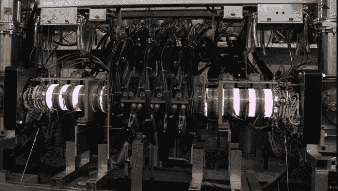
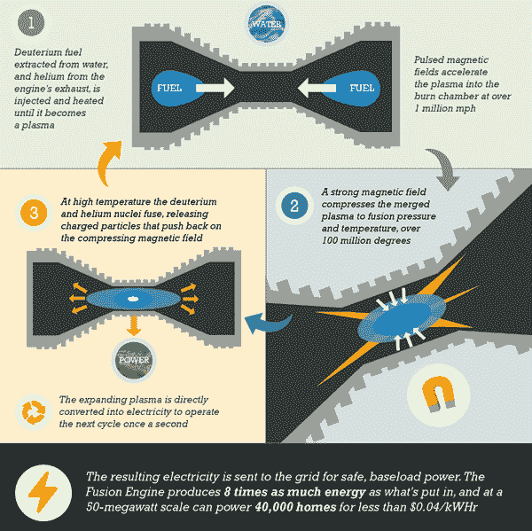

# Y Combinator 和 Mithril 投资核聚变创业公司 Helion 

> 原文：<https://web.archive.org/web/https://techcrunch.com/2014/08/14/y-combinator-and-mithril-invest-in-helion-a-nuclear-fusion-startup/>

建造一个能够产生比投入更多能量的核聚变反应堆是当今工程师面临的最大挑战之一。像量子计算一样，几十年的研究大多只是概念证明，而不是可以商业化的硬件。

因此，当听到 [Y Combinator](https://web.archive.org/web/20230104080555/http://www.ycombinator.com/) 和 [Mithril Capital Management](https://web.archive.org/web/20230104080555/http://www.mithril.com/) 向 [Helion Energy](https://web.archive.org/web/20230104080555/http://www.helionenergy.com/) 投资 150 万美元时，人们感到很惊讶。Helion Energy 是一家总部位于华盛顿州雷蒙德市的初创公司，该公司表示，它计划建造一座核聚变反应堆，实现能源输入和输出的平衡，这个挑战的解决方案已经被认为是几十年后的事情了。Helion 首席执行官 David Kirtley 表示，他的公司可以在三年内做到这一点。

Helion 由在 MSNW(从华盛顿大学分离出来的一个组织)工作的四名科学家创建，该组织专注于确定将等离子体物理研究转化为具有航空航天和发电应用的商业化硬件的可行性。

当团队离开成立自己的公司时，他们这样做的明确意图是利用其他领域的电子进步来创建一个磁惯性约束聚变反应堆。

这是今年年初首次推出 Helion 时，Mithril 对其产生兴趣的一个重要原因。“创始团队花了十年时间研究这个问题。在 2003 年至 2009 年间，他们发现了许多行不通的解决方案，许多不可行的途径，”Mithril 的常务合伙人 Ajay Royan 在电话中告诉我。

该团队看到，为空间推进和智能电网而建造的技术可以用来控制包含正在进行核聚变的等离子体的磁场，甚至可以“挤压”等离子体以提高反应速率。

与 ITER T4 不同，Helion 致力于建造世界上最大的实验性核聚变反应堆，它的目标不是设计一个全面的发电站。这带来了几个好处，最大的好处是他们不认为建造一个达到收支平衡的反应堆会花费近 500 亿美元，而且全面的等离子体实验将在 ITER 2027 年的新目标之前开始。Kirtly 说，他们估计他们的设计达到收支平衡只需要“几千万美元”

该公司不是一开始就建造十亿瓦规模的发电站，而是寻求与更小、更分散的电厂竞争，比如在必须用卡车运输燃料的地区建造大型柴油发电机。在这个市场上，目前的“最佳”解决方案并不太好，进入壁垒也比与大公司竞争要容易应对得多。

在他们设计的规模下，该团队认为一旦进入市场，它将具有显著的价格优势。他们的设计通过每个脉冲收集带电粒子，这意味着它可以发电，而不必在反应堆之外建造昂贵的涡轮机。该反应堆以氘为燃料，氘是海水中丰富的氢同位素，比一卡车的柴油更便宜。

在一个理想的世界里，在接下来的几年里，Helion 的一切都会顺利。他们实现了收支平衡，在 C 轮融资中筹集了优步式的巨额资本，开始建造工厂，并开始生产反应堆，提供可靠的无排放能源，无需处理任何核废料。随着他们从为偏远地区提供利基产品过渡到大型发电站，我们必须燃烧化石燃料来维持我们的生活方式的想法开始变得古怪。人类万岁。

一年半前，正是这个长期梦想促使 Y Combinator 总裁山姆·奥特曼开始寻找核裂变和核聚变的机会。奥特曼本周早些时候告诉我，“任何时候你能想出一种新的、更便宜的能源，它都会对每个人的生活质量产生巨大影响。”。“清洁、安全、可再生的能源是你能为世界上最贫穷的那一半人做的最好的事情。”

综上所述，三年是一段很长的时间。各种各样的公司在这种时间框架内都会遇到导致失败的障碍，而且大多数*这些*公司都没有在等离子物理学的前沿建立技术。

事情可能会按照 Helion 的计划进行。或者，事实可能证明，建造一个实际发电量大于发电量的反应堆的一些关键因素比最初预测的更棘手，该公司必须再投入 1 亿美元进行研发。

根据 Mithril 的 Royan 的说法，Mithril 和 Y Combinator 之间的合作旨在帮助 Helion 成为一家能够经受住未来几年出现的困难的公司。Mithril 向 Helion 的 A 轮投资了“远远超过 100 万美元”，“希望投资于耐用公司。”在我与 Kirtly、Altman 和 Royan 的交谈中，每个人都强调了成为当前 YC 团队的一员对于灌输一种文化是多么重要，这种文化可以取得重大进展，同时准备好解决前进道路上出现的问题。

在一个似乎最热门的东西是优步的时期，看到投资者向寻求解决大问题的公司投入数百万美元是很酷的。虽然这可能会晚几十年(2015 年*即将到来*，但是核聚变的任何进展都会让我们离这一目标更近一步:

