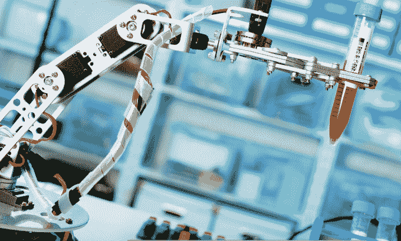

# 来自 Y Combinator 2017 年夏季演示日 1 的所有 50 家初创公司 

> 原文：<https://web.archive.org/web/https://techcrunch.com/2017/08/21/y-combinator-summer-2017/>

在 Y Combinator 的第 25 个演示日，生物技术和人工智能已经成为最热门的创业趋势。124 家公司出席了这家企业家学院一年两次的毕业典礼，这是 YC 12 年半以来规模最大的一次。

YC 合伙人迈克尔·赛贝尔(Michael Seibel)在启动仪式上重申了加速器致力于推进硅谷多元化的承诺。在这个班级中，12%的创始人是女性，9.5%是黑人或拉丁裔。

虽然这些年来这些比例相当稳定，但 YC 在国际创业公司方面表现出色。这在一定程度上要归功于通过可扩展的在线创业学校和全球活动进行的推广，这批创业公司中有 28%位于国际上。

在加州山景城的计算机历史博物馆举行的 Y Combinator 演示日之外，Pyka 展示了它的自动飞行私人飞机

YC 过去的热门网站包括 Airbnb、Dropbox 和 Stripe，以及 Twitch、Instacart 和比特币基地等新的独角兽公司。来自硅谷和世界各地的投资者挤满了山景城的计算机历史博物馆，寻找下一件大事。

以下是在演示日第一天(共两天)记录在案的每家公司。查看 **[我们精选的 7 家当今最好的创业公司](https://web.archive.org/web/20230219195301/https://techcrunch.com/gallery/demo-day-y-combinator/)** ，再回来看看所有未来公司的报道和亮点。

—

**[Zendar](https://web.archive.org/web/20230219195301/http://www.zendar.io/)–高清雷达，允许自动驾驶车辆在所有天气条件下都能看到**

Zendar 为自动驾驶汽车开发高清雷达。如今，自动驾驶汽车依赖于两种主要技术:激光雷达和传统雷达。激光雷达可以看到高清晰度，但在恶劣天气下表现不佳，而雷达在恶劣天气条件下很好，但不能看到高分辨率。Zendar 寻求为恶劣天气下的自动驾驶汽车提供高分辨率的想象，允许全天候自主。Zendar 表示，在未来三年内，将会生产 1000 万辆自动驾驶汽车，并希望尽可能多的人使用这种汽车。

*通过昏暗的激光雷达拍摄的图像*

—

**[meetbird](https://web.archive.org/web/20230219195301/https://www.meetingbird.com/)——团队会议安排优化**

整天分散开会会破坏工作效率。但是你自己很难协调会议，更不用说考虑团队的其他日程安排了。meetbird 是一个智能日历初创公司，它使计划会议变得简单，覆盖时间表以找到适合每个人的时间，并优化一切以压缩会议，以便每个人都可以回去工作。Meetingbird 现在为其优质服务与付费企业客户签约，每周增长 53 %,具有内在的病毒式传播能力。当竞争对手试图创造人工智能助手来为你处理会议交流时，Meetingbird 只是尽可能快地安排事情。

在 TechCrunch 上阅读更多关于 Meetingbird 的信息。

 —

**[主题](https://web.archive.org/web/20230219195301/https://getthematic.com/)–调查和评论的文本分析**

让人们通过评论和调查键入他们对你的产品喜欢或讨厌的所有事情可能是高质量反馈的一个很好的来源，但从大量文本中提取洞察力可能是一个噩梦。Thematic 致力于分析非结构化来源，为客户提供更可行的步骤来提高客户满意度。自今年早些时候推出以来，该公司已经分析了数百万个数据源，他们正在向沃达丰和 Stripe 等合作伙伴提供见解。

—

**[pull request](https://web.archive.org/web/20230219195301/https://www.pullrequest.com/)——代码评审市场**

Pull Request 是一个市场，它将公司代码与寻找兼职的自由代码评审员配对。该团队正在招募具有亚马逊、脸书和 Dropbox 等顶级科技公司经验的评论者。凭借这种血统，PullRequest 已经吸引了 450 个团队的兴趣。尽管只有一部分人在使用这项服务，但 PullRequest 宣称其年化收入为 136，000 美元。初创公司和财富 500 强公司加在一起，在代码审查上的花费估计有 400 亿美元。PullRequest 的秘密在于自动化技术，这使得初创公司能够更快、更准确地进行审查。

—

**[氦医疗](https://web.archive.org/web/20230219195301/https://heliumhealthcare.com/)——非洲电子病历**

纸质病历可能会导致死亡。凭借其针对非洲的“加固型”电子医疗记录系统，Helium 正在让它们成为历史。氦专为最少的培训和从任何设备离线访问而设计，可以处理医生出诊、处方和计费的患者记录。Helium 为大型医院提供现收现付和传统的企业订阅服务。拥有 20 多个设施和 500 名医疗专业人员，氦希望通过使电子病历易于采用来改善整个非洲的医疗保健。

 —

**——早在症状出现前 15 年就能发现老年痴呆症**

Darmiyan 降低了检测早发性阿尔茨海默病的成本和时间。任何超过 45 岁的人都应该接受测试，该公司已经对 3000 名患者进行了测试。甚至在提交给 FDA 之前，该公司已经签署了一份价值 100 万美元的合同。目前有 2600 万美国人应该接受测试，每次测试花费 500 美元，这意味着该公司有 130 亿美元的潜在市场。

—

**[屋顶](https://web.archive.org/web/20230219195301/https://roofr.com/)——卫星供电屋顶估计**

Roofr 使用卫星图像让消费者轻松获得屋顶的价格，然后与屋顶工人联系解决维修问题。业主可以很容易地设置他们的地址，在卫星地图上追踪他们家屋顶的图像，在 30 秒内他们就可以得到一个估价，并可以在 72 小时内与屋顶安装人员取得联系。这家初创公司收取 10%的费用，并表示他们为客户节省了 20%的费用。

—

**[无现金](https://web.archive.org/web/20230219195301/https://www.cashfree.com/)—印度市场的支付自动化**

如今支付产品多如牛毛，但 CashFree 希望它的意图和对印度市场的关注能让它与众不同。CashFree 是一个支付网关，可以自动执行入站和出站 ACH 支付。CashFree 的创始人解释说，这可以实现基于个人的即时交易，即优步式的服务可以在司机结束旅行后直接付款。该公司目前正在处理 350 万美元的支付，每笔交易的利润高达 40 个基点。

—

**[Skyways](https://web.archive.org/web/20230219195301/http://skyways.com/)–VTOL 无人机**

Skyways 正在建造垂直起降(VTOL)无人机，供军方用于运输物品，而不会将人置于危险之中。由于军方目前在几乎没有基础设施的地方开展行动，Skyways 可以提供一种运送货物的方式，而不会将人置于危险之中。他们的无人机是完全自主的，有效载荷能力为 45 磅。虽然他们是从军用无人机开始的，但该公司希望最终利用这项业务长期投资于消费车辆。

—

**[Mystro](https://web.archive.org/web/20230219195301/https://www.mystrodriver.com/)——帮助按需司机赚更多**

像优步和 Lyft 这样的不同应用程序会分散司机的注意力，导致他们错过最有利可图的乘车服务。Mystro 的服务自动为司机接受最有利可图的票价，以便他们可以专注于金钱和道路。由于它提高了司机的满意度，它正在解决优步和 Lyft 的巨大司机保留问题，96%的司机在第一年就辞职了。这就是为什么拼车服务没有阻止 Mystro，而且它正在向 Lyft 和优步以外的地方扩张。每月 12 美元的 Mystro 订阅量每周增长 25%，该服务每周处理 10 万次乘坐。凭借全球 2000 万名按需司机，Mystro 正在追逐每年 30 亿美元的商机。虽然拼车平台可能会尝试添加类似的功能，但没有一个平台可以跨平台工作，这给 Mystro 留下了一个巨大的机会。

[在 TechCrunch 上阅读更多关于 Mystro 的信息。](https://web.archive.org/web/20230219195301/https://techcrunch.com/2017/08/02/mystro-is-an-app-that-wants-to-bring-in-more-bacon-for-uber-and-lyft-drivers/)

—

**[10 乘 10](https://web.archive.org/web/20230219195301/http://10by10.io/)——招聘机构招聘市场**

对于招聘人员来说，在大型科技公司招聘是一个相当密集和昂贵的过程，10by10 正在建立一个市场，通过汇集招聘机构的数据，更快地将合格的候选人与公司匹配。这家初创公司采用了许多机构已经在非正式层面上做的事情，但将其引入初创公司的平台，以“十倍的轻松和十倍的速度”完成工作。上个月刚刚推出的 10by10 刚刚起步，该公司在过去的一个月里已经获得了 6 万美元的预订收入。创业公司与招聘人员对半分费用。

—

**[honey due](https://web.archive.org/web/20230219195301/https://www.honeydue.com/)——夫妻理财规划**

Honeydue 是一款夫妻共同理财的协作工具。我们都听说过，夫妻之间争论的首要问题是钱。这家初创公司的创始人尤金·帕克(Eugene Park)旨在通过透明度减少这种摩擦。该应用程序目前有大约 24，000 名用户监控着 6，800 万美元的现金余额。对于那些希望将金融产品瞄准千禧一代夫妇的人来说，这是一个好消息。Park 自豪地指出，通过 Honeydue 提供的金融产品点击率提高了 16 倍。

[在 TechCrunch 上阅读更多关于 Honeydue 的信息](https://web.archive.org/web/20230219195301/https://techcrunch.com/2017/08/07/honeydue-is-a-money-management-app-for-couples/)

—

**[D-ID](https://web.archive.org/web/20230219195301/http://d-id.com/)–通过面部识别技术保护您的身份。**

D-ID 开发了一种人工智能来保护你的照片免受面部识别。只需您的照片，黑客就可以窃取您的身份并侵入您的设备。但是和密码不一样，你不能改脸。D-ID 已经创建了处理您的照片的软件，并创建了一个看起来与肉眼相似的受保护的图像。该公司的目标是存储用户照片的客户和安全机构，并签署了两份 100 万美元的意向书。

—

**[生活机器人](https://web.archive.org/web/20230219195301/http://www.asklifebot.com/)——一个语音 app 搞定一切**

当你没有像手机上那样的图标浏览时，很难记住所有不同语音应用的名称和脚本。这就是为什么 Life Bot 说亚马逊 Alexa 应用程序的平均保留率为 3%，而它有 52%，并计划在谷歌主页和微软 Cortana 上推出。Life Bot 的应用程序可以给你个性化的新闻，管理你的日历，或找到你的手机。由于它知道你的电话号码，即使你不在家，它也能给你发送提醒。最终它想在你的车上和其他设备上工作。虽然它可能不得不与亚马逊和谷歌等语音平台的原生全方位应用竞争，但语音机器人领域正在爆炸式增长，而且几乎没有知名品牌。

[在 TechCrunch 上阅读更多关于生活机器人的信息](https://web.archive.org/web/20230219195301/https://techcrunch.com/2017/07/28/life-bots-new-alexa-app-can-text-you-reminders-help-with-daily-activities/)

—

**[模块化科学](https://web.archive.org/web/20230219195301/http://www.modularscience.com/)——户外机器人农业。**

埃隆·马斯克(Elon Musk)可能担心机器人会接管世界，但模块化科学只是想让机器人来耕种我们的蔬菜。这家初创公司目前已经有机器人投入使用。)的目标是在未来六个月内，通过他们的专业农业机器人，实现蔬菜种植过程中 99%的自动化。模块化科学公司希望每英亩收费 2000 美元，他们说这是农场目前支付给人工的一半。

—

**[Audm](https://web.archive.org/web/20230219195301/https://www.audm.com/)–订阅音频内容**

Audm 不惧怕苹果、Spotify 和其他现有公司，正试图在口语音频内容的货币化方面寻找空白空间。通过采取收入分成的方式，Audm 已经成功地让 Buzzfeed、The Atlantic、Wired、Esquire 等公司加入进来。大约有 1150 名用户每月支付 7 美元来访问这些音频内容。这家初创公司将自己视为 Sirius XM 的颠覆者，开始了建立播客、新闻和谈话广播库的漫长旅程。

[在 TechCrunch 上阅读更多关于 Audm 的信息](https://web.archive.org/web/20230219195301/https://techcrunch.com/2017/07/14/audm-turns-long-form-print-journalism-into-professionally-narrated-digital-audio/)

—

**[game lynx](https://web.archive.org/web/20230219195301/https://gamelynx.gg/)——下一代移动电竞**

GameLynx 希望打造一款竞技电竞游戏，将硬核游戏带到手机上。该公司认为，成功的定义不仅仅是创造一种新类型的游戏，而是创造更好的用户体验。移动设备现在足够强大，可以支持铁杆游戏玩家喜欢玩的游戏类型，所以现在该公司希望将电子竞技游戏引入该平台。通过这样做，它希望建立的电子竞技游戏不仅仅是为了游戏玩家的乐趣，而是为了每个人。GameLynx 将在未来六个月内在第一个测试市场推出第一款游戏，但已经得到了世界上最大的游戏公司之一的支持。

—

**[Gopher](https://web.archive.org/web/20230219195301/https://www.gopher.email/)——电子邮件上的应用平台**

我们都讨厌电子邮件，但仍然每天大部分时间都呆在那里。Gopher 希望通过让任何开发者为你的收件箱开发应用程序来让这段时间更有效率。例如，您可以将数据的电子邮件转发给 it 部门，以便输入到 Salesforce 或安排会议的协作计划中。它的第一个发送后续电子邮件的扩展已经为它赢得了 13，000 个月用户，300 个开发人员已经注册建立这个平台。Gopher 将帮助你在一个地方完成所有事情，而不是强迫你浪费时间在电子邮件和其他应用程序之间来回切换。

## 

**[7000 万个工作岗位](https://web.archive.org/web/20230219195301/http://www.70millionjobs.com/)——为美国前被监禁者提供的就业招聘平台**

这个国家有 7000 万有犯罪记录的美国人，当谈到找工作时，事情会变得复杂。7000 万份工作是一个以盈利为目的的招聘平台，将公司和应聘者联系起来。创始人理查德·布朗森知道最近被监禁的人面临的一些挑战，因为他在 2002 年被判证券欺诈罪后在联邦监狱呆了两年。从那时起，他加入了 Defy Ventures，帮助以前被监禁的人通过创业获得第二次机会。“我们所做的是利用先进的见解，将被忽视的人才与公司无法填补的职位联系起来，”布朗森告诉投资者。这家初创公司正在与优步等公司合作，开始招聘工作，但布朗森希望这家初创公司成为一个为有犯罪记录的人提供服务的中心。

—

**[May Mobility](https://web.archive.org/web/20230219195301/http://maymobility.com/)——城市环境下的自动驾驶汽车**

越来越多的初创公司开始涉足自动驾驶汽车领域，May Mobility 是其中最新的一家。该团队以前是密歇根大学的机器人专家，在研发方面相当深入。May 不想纯粹在技术上击败竞争对手，而是只想成为第一个进入市场的人。随着付费合作伙伴关系在底特律市排队，这实际上可能会发生。愿景是减少变量之一——车辆将在更可预测的环境中运行，如中央商务区和住宅社区。底特律并不孤单，与四个城市的谈判正在进行中，以尽快让 autonomy 上路赚钱。

[在 TechCrunch 上阅读更多关于 May Mobility 的信息。](https://web.archive.org/web/20230219195301/https://techcrunch.com/2017/08/21/may-mobility-is-a-self-driving-startup-with-a-decade-of-experience/?ncid=rss)

—

**[Flock](https://web.archive.org/web/20230219195301/http://www.flocksafety.com/)——小区无线安防系统**

Flock 制造了可用于保护社区的无线摄像头。该公司开发了一种户外摄像机，可以跟踪汽车并记录车牌。它可以在犯罪发生时向当地警察提供数据，但也可以在被盗车辆进入社区时主动通知他们。该公司已经解决了第一起犯罪，并被多个社区使用，但相信它的目标是保护当地市政当局的 15 亿美元的市场机会。

—

**[个人](https://web.archive.org/web/20230219195301/https://indiv.io/)–视频广告 A/B 测试**

广告商知道，最好的广告来自于创造大量的变体，并把它们削减到有效的程度。这对于文本和图像来说很容易，但是对于视频来说就难多了。Indivio 将视频广告优化工作剥离出来。它可以使用动态图像代替传统的拍摄视频，为不同的地点和目标客户制作不同版本的广告。Indivio 将 Instacart 的每次收购成本降低了 25%，现在它希望优化脸书和 Instagram 上的所有视频广告。随着广告支出从电视转向社交，许多品牌将需要帮助，Indivio 将向他们收取 5%至 10%的费用，以确保他们的营销与我们快速移动的反馈产生共鸣。

—

**[关系英雄](https://web.archive.org/web/20230219195301/http://www.relationshiphero.com/)——数字时代的关系帮助**

如果说硅谷还没有证明自己擅长做什么的话，那可能就是驾驭复杂的人际关系。谢天谢地，它不是基于人工智能的，不像许多噱头十足的聊天机器人或亲爱的艾比风格的产品，Relationship Hero 希望通过电话或在线聊天将用户与实时关系专家联系起来，帮助你解决关系问题。通过初创公司所谓的“战术性逐步计划”，初创公司希望帮助你解决家庭成员、同事和其他重要人士的问题。3000 万人去治疗，关系英雄说他们想创造一个“更轻重量”的解决方案。他们也不会只给你一些随机的常识，在某些情况下，专家会告诉你在短信中应该说什么，什么时候发送。平均每个客户在这个应用上花费超过 100 美元，因为他们可以从关系教练那里得到实时的专家帮助。

—

**[shift doc](https://web.archive.org/web/20230219195301/https://shiftdoc.com/)——医疗保健专业人士的市场**

ShiftDoc 正在建立一种更好的方法来填补私人医疗实践的班次。这家初创公司正在削弱职业介绍所，并通过其市场提供比求职板更好的用户体验。应对医疗保健市场的好处在于，每一个班次的占用率都非常高。ShiftDoc 说它每完成一个班次就能赚 50 美元。当然，困难的部分是建立最初的供应和需求，以达到市场能够自我维持的程度。为此，该团队已经招募了 150 名兼职医生，他们愿意在 50 家私人诊所轮班工作。

—

**[drop leaf](https://web.archive.org/web/20230219195301/https://dropleaf.io/)——独立视频游戏的网飞**

Dropleaf 为独立制作的 PC 游戏提供订阅服务。它利用了独立游戏数量的增长——每年翻一番——和个人电脑游戏玩家的兴趣。凭借其每月 10 美元的服务，Dropleaf 向用户提供了 50 多种游戏。在一个有限的测试中，90%的用户每周至少玩两次游戏，它相信它在全球拥有 1.2 亿个人电脑游戏玩家的潜在市场。

—

**[Sunu](https://web.archive.org/web/20230219195301/http://sunu.io/index.html)–盲人声纳手环**

视力受损者经常伤害自己，每 5 秒钟就有一名盲人因头部受伤而被送往医院。但他们的选择仅限于 30 美元的低技术含量手杖或 3 万美元的昂贵导盲犬。Sunu 是一个声纳手环，它可以振动，让视力受损的人知道他们正在接近一个物体。六个月的测试表明用户减少了 90%的事故。Sunu 已经售出了价值 25，000 美元的手镯，并于 10 月份发货。现在这种产品已经制造出来并获得专利，它正试图向美国 1000 万盲人出售。人们愿意为安全性支付额外费用，所以即使出现更便宜的设备，Sunu 也可以成为一个值得信赖的品牌。

—

**[野火](https://web.archive.org/web/20230219195301/http://www.wildfireapp.io/)——大学校园的安易牦牛**

Wildfire 似乎有点像 Yik Yak 和 Patch 的混合体，带来了本地用户提交的新闻和校园警报，虽然没有得到大学行政部门的正式批准，但它们是可以容忍的。该应用程序最初的吸引力是作为一个系统发送校园安全警告通知，以便学生在校园发生抢劫或活跃的枪手情况下得到警告。在不那么可怕的日常使用案例中，该应用程序是一个“超本地新闻应用程序”，允许用户分享校园里发生的事情，无论是课外活动还是聚会。Wildfire 表示，它在六个大学校园中拥有 2.3 万个 mau，并将于今年年底在 50 个校园中提供。

—

**[OncoBox](https://web.archive.org/web/20230219195301/http://oncobox.com/)——晚期癌症患者更好的药物治疗决策**

当患者患有晚期癌症时，肿瘤学家做出的每一个治疗决定都会对潜在存活率产生巨大影响。今天市场上有超过 150 种癌症药物——每个人都喜欢万能药，但今天的实际问题是决定应该给哪些病人分配哪些药物。OncoBox 提供预测试，以估计给定药物改善特定患者结果的可能性。该团队的测试收费为 1000 美元，并估计每年约有 50 万次测试。这个 5 亿美元的市场只是这家初创公司的一个起点，它承诺比医生多 2 倍的有效药物匹配。

—

**[verge sense](https://web.archive.org/web/20230219195301/http://www.vergesense.com/)——AI 助力的设施管理**

VergeSense 使用硬件传感器和机器学习技术来帮助公司更有效地运营建筑物。对于大多数公司来说，房地产成本是他们业务的第二大成本，但 VergeSense 认为它可以降低 10%到 15%的成本。通过在公司建筑物周围安装无线传感器，它可以识别人员流动，并向客户提出建议以降低成本。VergeSense 已经有了两个财富 500 强客户的付费飞行员，但相信每个大公司都需要像它所生产的产品一样的产品。

—

**[Pyka](https://web.archive.org/web/20230219195301/https://flypyka.com/)–自动驾驶个人飞行器**

Pyka 希望通过其自动驾驶的单人飞机使“飞行汽车”成为现实。该公司已经制造了一架 400 磅重的飞机，它可以自己飞行，可以在 90 英尺内起飞和降落。但由于监管机构希望在允许人类登机前看到大量测试，Pyka 在新西兰开发了一项占位业务，进行作物喷粉。这有助于它每小时赚 600 美元，同时为人类运输市场做必要的准备。在美国，仅作物喷粉一项就价值 15 亿美元。但 Pyka 的员工来自 Zee airplanes 和谷歌的 Waymo，它的目标是成为自动驾驶个人飞机的先行者。

—

**[快速键盘](https://web.archive.org/web/20230219195301/http://fastpad.com/)–印度求职者跟踪系统**

Fastpad 正在为印度市场开发招聘软件，该软件可以清除垃圾邮件，确保公司可以快速看到真实候选人的照片。Fastpad 声称，印度的大多数职位空缺都有成千上万份申请，求职者往往甚至没有阅读职位描述就提出申请。正因为如此，大约 70%的实际招聘最终来自第三方招聘机构。Fastpad 希望通过打破印度招聘市场的喧嚣，创造一个占主导地位的招聘市场。印度招聘市场的年增长率为 40%。

—

**[古斯塔夫](https://web.archive.org/web/20230219195301/https://hellogustav.com/)——市场聚集小型职业介绍所**

Gustav 可能看起来不像传统的职业介绍所，但这并没有阻止它像传统的职业介绍所一样赚钱。这家初创公司与公司合作来填补临时职位。传统上，这项工作由大型职业介绍所完成，但 Gustav 正在测试其论点，即小型职业介绍所的集合优于大型传统机构。迄今为止，优步、索尼、H&M、Vice 和其他公司已经雇佣了大约 20 名员工。即使作为中间人，利用自动化组织美国 19，000 个小型人事代理机构，Gustav 也可以收取支付给承包商的工资的 3%。在 LTV，这往往会给每名员工 1000 美元左右的报酬。

—

**[永远的实验室](https://web.archive.org/web/20230219195301/https://foreverlabs.com/)——将你的干细胞移植给年老的自己以对抗衰老**

Forever Labs 希望帮助用户低温冷冻他们的干细胞，允许他们在未来使用这些细胞来对抗与年龄相关的疾病。干细胞已被证明有助于改善小鼠 16%的寿命，但随着年龄的增长，它们在帮助对抗疾病方面的帮助越来越少。现在，Forever Labs 有 20 名医生提供该程序，但预计明年这个时候将进入美国每个主要市场。该公司认为，干细胞银行可能是一个 560 亿美元的市场。

[在 TechCrunch 上阅读更多关于 Forever Labs 的信息。](https://web.archive.org/web/20230219195301/https://techcrunch.com/2017/08/17/forever-labs-preserves-young-stem-cells-to-prevent-your-older-self-from-aging/)

—

**[Ubiq](https://web.archive.org/web/20230219195301/https://www.goubiq.com/)–企业会议室屏幕共享解决方案**

无论技术进步看起来有多惊人，网真商务会议仍然很糟糕。Ubiq 旨在通过他们的无线设置简化会议室屏幕共享，减少混乱，让企业专注于手头的任务。它基本上是通过无线 HDMI 输出将企业级 AirPlay 般的流媒体技术带入会议室。这家初创公司的解决方案已经在 150 多家公司部署，并在过去四个月内将收入提高了 3.5 倍。

—

**[空气硫](https://web.archive.org/web/20230219195301/http://www.airthium.com/)——利用热泵储能**

能量储存是每个人都知道存在的圣杯之一，但是没有人能够接近它。Airthium 正在利用其使用热泵的储能装置来瓜分这个巨大市场的一小部分。它通过利用热能储存电能来解决兆瓦级固定储能市场的问题。物理学家和流体动力学专家团队正在建造没有移动部件的小型系统，这一决定为 Airthium 节省了大量资金。尽管业务的 R&D 性质，Airthium 已经设法获得了两个每年价值 400 万美元的意向书，以及一个较小的 30 万美元的能源系统的第三个意向书。

2.Airthium: Airthium 使用热力学储能来储存能量。它们通过压缩气体(氩气，而不是氢气)储存热量，并从压缩中提取热量。

–创始人问你是否愿意将描述更新为:使用热泵的能量储存(而不是“使用氢气压缩机的能量储存”)

**–**对于第二句话，他们这样描述他们正在做的事情: Airthium 通过使用热量作为电力存储介质，正在追逐兆瓦级固定储能市场。

—

**[UpCodes](https://web.archive.org/web/20230219195301/https://up.codes/)——建筑合法合规**

UpCodes 帮助建筑行业实现合规性。目前，大多数合规代码隐藏在实体书籍和 pdf 中，这意味着数百万美元的错误在行业中很常见。UpCodes 将这些模拟合规资源放到网上，仅通过搜索引擎优化，每月就有 61，000 人访问其网站。它有一个免费增值模式，用来吸引全球 1800 万名处理法规遵从性的专业人士。

[在 TechCrunch 上阅读更多关于 UpCodes 的内容](https://web.archive.org/web/20230219195301/https://techcrunch.com/2017/07/27/upcodes/)

—

**[剑桥癌症基因组学](https://web.archive.org/web/20230219195301/https://www.cancergenomics.co.uk/)——验血癌症治疗监测**

癌症患者的医生可能需要六个月才能知道他们选择的化疗方案是否有效，但 2/3 的治疗失败了。剑桥癌症基因组公司开发了一种血液测试，可以比标准监测快几个月发现失败的治疗，因此医生可以在必要时更快地改变计划。由 4 名具有癌症研究经验的博士创立的 CGC 也在利用一个数据集构建用于个性化癌症治疗的人工智能，该数据集据说比公众可用的数据集大 4 倍，因为它从它签约的每个医疗机构吸收数据。

—

**[助穿](https://web.archive.org/web/20230219195301/http://helpwear.ca/)**——医用级心脏监测可穿戴设备

对于 1700 万患有急性心脏病的美国人来说，HelpWear 正在建立一个更加通用的心电图系统。现有的系统是由电线和粘合剂组成的不舒适的汞合金，只能佩戴 72 小时，并且在淋浴前必须脱掉，这对患有急性心脏病的人来说是一个很大的不便。HelpWear 的解决方案是一个更加纤薄的系统，由三个可穿戴单元组成，类似于无线健身追踪器，可以全天候佩戴，并且防水。这家初创公司有望在 9 个月内获得美国食品和药物管理局的批准。

—

**[net 30](https://web.archive.org/web/20230219195301/https://net30.io/)——让建筑工人更快拿到工资**

尽管初创公司越来越重视建筑业，但在建筑业，似乎总是有无数陈旧的流程需要解决。Net30 正在为建筑公司推行在线发票和支付。一般来说，总承包商会向分包商收取发票，但这个看似简单的过程往往涉及超过 200 页的复杂账目。最终结果是基本上不可接受的 70 天工资延迟。凭借建筑项目管理的背景，Net30 正在将工资支付期缩短至 30 天。这个案例被证明非常有吸引力，以至于这家初创公司预计年收入为 40 万美元。

[在 TechCrunch 上阅读更多关于 Net30 的信息。](https://web.archive.org/web/20230219195301/https://techcrunch.com/2017/07/27/net30/)

—

**[Guggy](https://web.archive.org/web/20230219195301/http://guggy.com/)——将短信转换成个性化的搞笑 gif。**

如今，GIF 无处不在，截至 2014 年，GIF 浏览量增长了 100 多倍。考虑到这一点，Guggy 帮助用户用个性化的 gif 表达自己。使用理解俚语和情感的自然语言处理引擎，该公司可以立即创建代表他们的话的 gif。该公司的 API 已经有 100 万活跃用户，但它希望建立未来的消息应用程序，并将其直接交付给消费者。

—

**[埃舍尔现实](https://web.archive.org/web/20230219195301/http://www.escherreality.com/)——增强现实的数据后端**

为了增强现实世界，你需要关于它的数据。Escher Reality 从人们的拍照手机中聚集 AR 视频数据，并将其固定到位置，以便其他开发人员可以在 rop 上建立更好的体验。虽然脸书和苹果有自己的 AR 平台，但埃舍尔在开发者的应用程序中跨 iOS 和 Android 工作。它现在有 600 名开发人员在等待名单上，10 份来自游戏工作室等潜在客户的意向书，以及一项为大片机器人格斗电影《环太平洋》提供 AR 应用的签署协议。如果埃舍尔现实可以成为 AR 的设备和平台无关的引擎，它可能会成为大量开发者支出和消费者时间花费的门户。

在 TechCrunch 上阅读更多关于埃舍尔现实的信息。

—

**[胡萝卜生育](https://web.archive.org/web/20230219195301/https://get-carrot.com/)–企业健康计划的生育福利**

Carrot Fertility 希望将生育福利纳入公司健康计划，这样雇主就可以像支付视力或牙科费用一样，支付 IVF 或卵子冷冻等生育程序。尽管苹果、脸书和谷歌等大型科技公司已经在为员工提供生育福利，但其他现金不那么充裕的公司可能没有能力找到增加这一覆盖范围的最佳途径。胡萝卜生育使公司更容易将该服务添加到健康计划中，帮助他们保持其福利清单对潜在新员工的吸引力。

—

**[羽毛](https://web.archive.org/web/20230219195301/https://rentfeather.com/)——千禧一代的时尚家具租赁**

现在是 2017 年——拥有东西并不酷，因为拥有东西很昂贵，需要承诺。羽毛通过其家具租赁服务将千禧一代从宜家的炼狱中解救出来。通过关注风格，Feather 希望提供人们真正想要的家具。这家总部位于纽约的初创公司每个月的订单收入约为 275 美元。平均订单规模为 2，200 美元，Feather 的收入为 830 美元。该公司在实际上不拥有任何自己的家具的情况下管理这一切。这家初创公司与一个债务资本合伙人合作，作为中间人租赁家具，以便利溢价租回给客户。

[在 TechCrunch 上阅读更多关于 Feather 的信息。](https://web.archive.org/web/20230219195301/https://techcrunch.com/2017/06/27/feather-launches-a-high-end-furniture-rental-service-for-liminal-living/)

—

**[Prism IO](https://web.archive.org/web/20230219195301/http://app.prism.io/)——帮助企业修复流失**

流失扼杀公司，但 Prism IO 希望帮助扼杀流失。大多数公司都试图量化客户忠诚度，因为随着规模的扩大，他们再也不能像过去那样与客户交流了。为了帮助他们，Prism IO 与那些已经离职的客户进行了交谈，以找出他们离开的原因，以及公司如何才能赢回他们的心。在过去的几个月里，Prism IO 的 MRR 增长了 12 倍，达到 10，000 美元，目前拥有 20 家 B2B 和 B2C 付费客户。

—

**[PayFazz](https://web.archive.org/web/20230219195301/https://www.payfazz.com/)–印度尼西亚的无银行支付**

中国有微信支付。印度有 PayTM。这家初创公司希望为印尼提供自己的账单支付和转账应用。PayFazz 通过验证人们成为移动银行代理来工作。PayFazz 用户可以将现金交给代理，然后代理将钱转到相应的银行或为用户支付余额。代理人从他们的服务和风险中获利，而 PayFazz 收取 1%的费用。它现在有 70%的月环比增长率，每月处理超过 100 万美元。随着世界各地越来越多没有银行账户的人想要进入电子商务和按需就业的世界，PayFazz 可以帮助印度尼西亚实现现代化。

在 TechCrunch 上阅读更多关于 PayFazz 的信息。

—

**[六十](https://web.archive.org/web/20230219195301/http://usesixty.com/)——按需网络应用支撑平台**

Web 应用程序在几乎每个办公室都变得越来越重要，新的更新带来了许多 IT 部门并不总是有能力处理的新问题。Sixty 正在建立一个平台，让应用内点播专家帮助用户浏览 QuickBooks 或 MailChimp 等网络应用的细节。这家初创公司发现，一些网络服务的近 20%的支持票最适合付费的专业帮助，60 是这些问题的一个很好的出口，因此企业不会背负最棘手的问题，客户也不会在此期间等待。

—

**[图腾实验室](https://web.archive.org/web/20230219195301/http://www.totemiclabs.com/)——老年人安全装置**

图腾实验室正在颠覆传统的老年人跌倒检测解决方案。每年有数百万老年人跌倒，即使老年人拥有项链和其他可穿戴设备，他们也会经常忘记佩戴。这既是安全隐患，也是产品设计的失败。图腾实验室正在建造一种类似亚马逊 Echo 的设备，使用无线信号来识别跌倒并自动做出反应。该团队承诺，一台设备可以监控整个家庭。由于这些努力，Totemic 在 120 亿美元的市场中每台设备每年能赚 300 美元。

—

**[peer grade](https://web.archive.org/web/20230219195301/https://www.peergrade.io/)——学生反馈与评分平台**

Peergrade 希望通过让学生互相评分来帮助教师节省时间，提高教学效率。当学生匿名提供反馈并给同事的作业打分时，他们也学到了东西。与此同时，教师的工作量大大减少，并且可以大幅降低成本——通过用 PeerGrade 取代助教，大学平均每年可以节省 13，000 美元。该公司已经有 15 万美元的 ARR，但它面前有一个巨大的市场机会，有超过 10 万个大学部门可以追逐。

—

**[红隼材料](https://web.archive.org/web/20230219195301/http://materialcomforts.com/)–温度感应面料**

威廉·戈尔通过发明透气防水的 Gor-Tex 织物建立了数十年的事业。Kestrel 希望在纺织科学上实现下一个飞跃。它正在开发一种面料，这种面料可以通过弯曲来产生空气囊，从而吸收热量，使人们保持温暖。但是，当空气变暖时，这些气穴会塌陷，因此截留的热量更少，人们会保持凉爽。Kestrel 已经从 Casper 那里拿到了一份意向书，要在床上用品中使用它的材料。随着人们在外套、运动服等方面花费大量金钱，温度反应技术可能会进入我们日常生活中的面料。

—

**[SMB 利率](https://web.archive.org/web/20230219195301/http://smbrate.com/)–小企业贷款 Kayak】**

SMB Rate 旨在帮助小企业获得贷款，并建立他们所需的信用记录，以便有资格获得更具吸引力的贷款。在贷款方面，SMB Rate 会查看客户的财务状况，并使用其分析平台来确定最适合企业的贷款利率，然后将企业与贷款人联系起来。

—

你最喜欢的在名单上吗？ **[查看 TechCrunch 从 YC 展示日 1](https://web.archive.org/web/20230219195301/https://techcrunch.com/gallery/demo-day-y-combinator/)** 中挑选的前 7 家创业公司