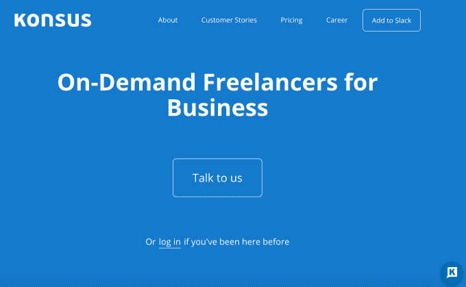
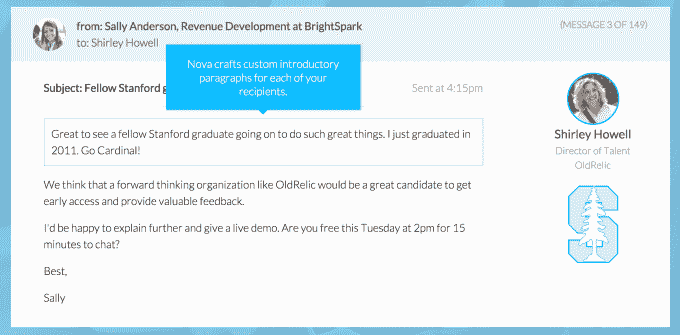
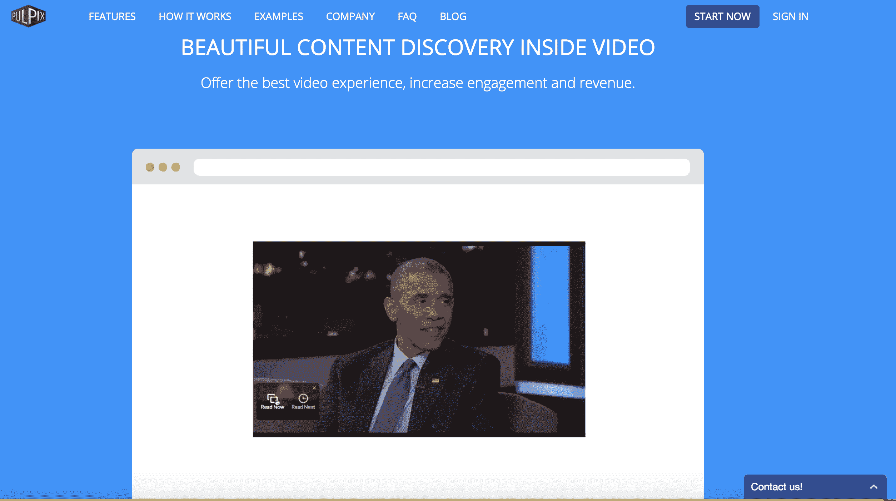
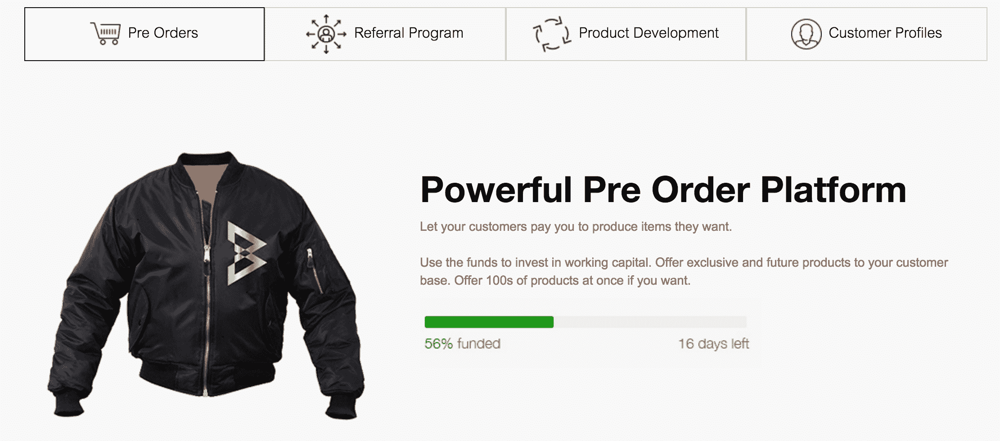

# 以下是在 Y Combinator Winter 2016 年演示日 2  上演示的 59 家初创公司

> 原文：<https://web.archive.org/web/https://techcrunch.com/2016/03/23/y-combinator-winter-2016/>

“食品、住房、医疗保健、交通。生活必需品变得更好、更实惠。”合伙人保罗·布克海特说，这些就是今天在 Y Combinator 2016 年冬季演示日 2 上演示的创业公司类型。昨天，我们报道了第一批 [60 家创业公司](https://web.archive.org/web/20230228105444/https://techcrunch.com/2016/03/22/y-combinator-demo-day-winter-2016/)，[选出了我们最喜欢的 7 家](https://web.archive.org/web/20230228105444/https://techcrunch.com/gallery/best-y-combinator-startups/)。另外，看看[我们从这 59 家公司中挑选出的前 8 家创业公司](https://web.archive.org/web/20230228105444/https://techcrunch.com/2016/03/23/y-combinator-winter-2016/)。

Buchheit 接着谈到了今天的远大抱负，“对于一家初创公司来说，这些挑战似乎太大或太复杂了。但正如凯尔和丹通过克鲁斯向我们展示的那样，最困难的问题往往是最好的投资。”他指的是通用汽车以 10 亿美元收购 YC 初创公司 Cruise，该公司开发自动驾驶汽车技术。

Y Combinator 合伙人保罗·布赫海特

今天，房间里挤满了人，为昨天被迫坐在地板上的富有投资者带来了更多的椅子。Buchheit 在 2005 年夏天拿第一批 YC 开玩笑说，“那时候没人想去演示日。”人群中有人喊道，“15 个人想去演示日。”现在，有数百名风投热切地关注着这些演示。

在过去的几年里，Y Combinator 已经扩展到接受比传统应用更广泛的行业的创业公司，包括生物技术，能源，硬件和国际物流。当我们过去与投资者交谈时，一些人担心他们可能不具备评估这些公司所需的专业知识。

现在，YC 总裁萨姆·奥尔特曼告诉我，许多风险投资公司已经“聘请了其他专家”来填补空白。他表示，“聘请首席科学官已经成为一种时尚。”因此，奥尔特曼认为，在资金方面，这些另类创业公司“似乎比传统软件公司做得好得多”。

这是今天在计算机历史博物馆记录在案的 59 家创业公司:

**[脊柱奇点](https://web.archive.org/web/20230228105444/http://www.spinalsingularity.com/)–更好的导管**
去年，超过 500 万人接受了导管插入术。Spinal Singularity 希望通过一种连接导管进入价值 20 亿美元的导尿管市场，这种连接导管允许您通过启动磁阀来控制尿液的流动。连接的导管是微创的，可以在自己家里插入或拔出。Spinal Singularity 今年开始人体临床试验，并计划明年开始直接向消费者销售。

**[Konsus](//web.archive.org/web/20230228105444/https://www.konsus.com/)——按需自由职业者**

Konsus 帮公司找自由职业者，自由职业者找客户。公司会给他们一个任务，如内容写作、lead gen 和其他商业任务，然后 Konsus 会为这些任务找到合适的自由职业者。这家初创公司表示，自 28 周前推出以来，它每周增长 10%，收入已经达到 55，000 美元，毛利率为 40%，并声称三分之二的客户会回来做更多的工作。

**[新星](//web.archive.org/web/20230228105444/https://www.nova.ai/)——写销售邮件的 AI**

当销售邮件与收件人的信息联系在一起时，比普通邮件表现得更好。Nova 使用人工智能自动编写这些电子邮件。它可以在网络和社交媒体上搜索关于收件人的事实，并将其包含在电子邮件中，比如他们最近是一篇新闻文章的主题，或者喜欢某个特定的爱好。Nova 的邮件表现比人类好。他们获得了 67%的打开率和 11%的点击率。Nova 希望向美国 400 万 B2B 销售人员收取每月每个座位 99 美元的费用，并且已经与优步和 Monster 签约。有了 Salesforce 的 CMO 作为联合创始人，Nova 可以用电脑化的优秀产品取代糟糕的销售邮件。[在 TechCrunch 上阅读更多关于 Nova 的信息。](https://web.archive.org/web/20230228105444/https://techcrunch.com/2016/02/23/nova-powers-your-sales-leads-with-artificially-intelligent-personalization/)

**[梅森美国](https://web.archive.org/web/20230228105444/http://www.bymason.com/)——行业应用定制安卓设备**

梅森美国公司希望企业授权其低成本的安卓设备，而不是依赖昂贵的机器，如心率监测器和包裹扫描仪。Mason America 还提供应用程序访问、软件更新和远程跟踪设备的能力。迄今为止，Mason America 已经完成了一项价值 160 万美元的授权交易，为心率监测设备供电。

**[get accept](//web.archive.org/web/20230228105444/https://www.getaccept.com/)–销售建议书工作流程**

GetAccept 正在重新设计销售提案，以达成更多销售。销售经理发送附有视频的建议书。然后启动个性化的重新定位活动，让参与者参与 esign 工作流。这家初创公司声称完成了该行业 80%以上的交易，客户每月收取 45 美元的服务费。这家初创公司声称自去年 12 月以来已经获得了 20 万美元的 ARR，并表示其周环比增长率为 23%。

**[flex receipts](//web.archive.org/web/20230228105444/https://www.flexreceipts.com/)—用电子邮件代替纸质收据**

零售商每年在纸质收据上花费 20 亿美元，但通过转向电子邮件，他们可以收集有价值的联系信息，并传递有针对性的营销信息。flexReceipts 让他们可以轻松地做到这一点，同时它收集天空、数量、价格、位置和更多数据。它可以利用这一点来跟踪客户跨业务的线下购买习惯。通过使用这些电子邮件地址来支持定制受众脸书广告和其他基于电子邮件的广告定位，flexReceipts 的点击率是其客户的 10 倍。flexReceipts 正在创建用于购买跟踪的脱机 cookie。

**[PaveIQ](https://web.archive.org/web/20230228105444/https://www.paveiq.com/)–简化的网络分析**

分析网络和营销数据会花费很多时间。有了 PaveIQ，公司可以每月支付 200 美元来访问其网络分析和营销数据分析工具和建议。PaveIQ 目前有 86 个付费客户，包括四季酒店和英国灰狗酒店。

**[DeepGram](//web.archive.org/web/20230228105444/https://www.deepgram.com/)——声音的搜索引擎**

DeepGram 搜索不完美的语音到文本的录制语音。抄本错误扼杀搜索。示例:Siri 可能会将对“Y Combinator”的询问解释为“为什么是承包商”现在人类分析这些叫声，但是 DeepGram 用精确的语音搜索取代了它。该团队由黑暗粒子物理学家组成，并计划将录制的讲话转移到整个网络。

**[驱动电机](https://web.archive.org/web/20230228105444/https://www.drivemotors.com/)——汽车经销商在线购买插件**

大多数汽车经销商实际上不能允许在其网站上进行完整的购买交易。他们的购买流程最终会让你不得不与经销商通电话，导致销售损失。Drive Motors 开发了一个插件，让客户可以在家舒适地在线购买汽车，即使实体经销店已经关门。Drive Motors 使经销商无需额外工作就能赚更多的钱，因为它集成到了他们现有的财务和库存软件中。下一步，它可以扩展业务，提供汽车维修的在线销售。[在 TechCrunch 上阅读更多关于驱动电机的信息。](https://web.archive.org/web/20230228105444/https://techcrunch.com/2016/02/11/software-eats-dealerships/)

**[DoseDr](https://web.archive.org/web/20230228105444/https://www.dosedr.com/)–帮助糖尿病患者的 iOS 应用**

当人们不正确地注射胰岛素时，会导致并发症和住院。通过 DoseDr，糖尿病患者可以使用移动应用程序输入他们的血糖水平，以准确了解需要服用多少胰岛素。今年早些时候，DoseDr 在五个诊所和 50 名高危患者中启动了一个试点项目。在该计划的第一个月，DoseDr 能够将 93%的患者纳入安全范围。

 **PocketSuite 帮助当地企业通过智能手机运营业务，在一个应用程序中包含日历、支付和消息。自推出以来，PocketSuite 的收入逐月增长了 38%。目前有 1100 家企业活跃在该平台上。本月，这些企业将通过 PocketSuite 处理超过 100 万美元的支付。

**[OpenTrons](//web.archive.org/web/20230228105444/https://opentrons.com/)–$ 3K 联网实验跑步机器人**

大多数生命科学研究仍然是手工完成的。移液可能是一个繁琐的过程，研究人员必须一次填充一个样品瓶。但是 OpenTrons 使湿实验室自动化，使过程更快，更轻松。例如，想要改造农作物的农民或在车库里开发新的超级材料的科学家可以使用该平台来减少时间。

OpenTrons 自称为“生命科学的第一台个人电脑”，同时销售软件和试剂。这家初创公司首先在中国推出了 Haxclr8tr，并在 2014 年成功运行了 Kickstarter。现在它声称每月增长 50%,运行率为 100 万美元。目前有超过 400 万生物学家手动运行这些实验，OpenTrons 计划在他们所说的目前 470 亿美元的市场中发展，这个市场仍然是手动运行实验室。[点击这里](https://web.archive.org/web/20230228105444/https://techcrunch.com/2016/02/01/opentrons-aims-to-be-the-pc-of-biotech-labs/)阅读 TechCrunch 上关于 OpenTrons 的更多信息。

**[SunFarmer](//web.archive.org/web/20230228105444/https://sunfarmer.org/)——一家非盈利性建筑可持续太阳能企业**

第三世界需要太阳能，但有初始成本。SunFarmer 是一家非营利组织，它利用初始捐款在尼泊尔等发展中国家建立可持续发展的太阳能公司。太阳能电池板被安装在学校和政府大楼里，这样医院可以为设备供电，学校可以为电灯和电脑供电。SunFarmer 在尼泊尔的第一家子公司将于 2016 年盈利，现在它正在寻求 150 万美元在另外两个国家推出。太阳能不一定需要无止境的慈善。SunFarmer 使太阳能装置的启动无需讲义即可重复。

**[msg . ai](https://web.archive.org/web/20230228105444/http://msg.ai/)——管理聊天机器人**

聊天机器人可能是企业与客户沟通的未来。但是同时在多个平台上操作这些聊天机器人很复杂。Msg.ai 提供了一个集中的仪表板，通过分析来检测趋势和观点，并与 Salesforce Desk 和 Zendesk 集成。借助 Msg.ai 的智能和 A/B 测试，企业可以最大限度地发挥聊天机器人的优势。

**[histo wiz](//web.archive.org/web/20230228105444/https://histowiz.com/)–癌症研究的组织病理学**

科学家浪费时间切割和拼接组织样本。HistoWiz 承诺，通过允许科学家邮寄组织样本和创建研究数据库，可以节省多达两周的时间。科学家在线观看载玻片，并可以即时远程访问虚拟显微镜。HistoWiz 由一组癌症研究人员和计算机科学家组成，并表示它现在在全球拥有 400 多名客户，年运营率为 120 万美元，在 560 亿美元的市场中年增长率为 300%。

“直到现在，这些组织数据都没有在一个地方收集过，”丰德·常可在台上说。“我们已经拥有了世界上最大的数据库。”

**[Zen prospect](https://web.archive.org/web/20230228105444/https://www.zenprospect.com/)——B2B 团队增加对外电子邮件活动的软件**

为了让对外销售变得容易，ZenProspect 帮助企业找到最有利可图的潜在客户。自推出以来，ZenProspect 每月增长 45%，在 ARR 中增长到 100 万美元，净利润率为 70%。它目前有 110 名客户，平均每月支付 800 美元。

**[Loop Genomics](https://web.archive.org/web/20230228105444/http://www.loopgenomics.com/)——基因制造和诊断工具**

缩放 DNA 生产会导致 DNA 生产中的错误。原因？据创始人 Tuval Ben-Yehezkel 说，我们正在使用只能处理少量字母的 DNA。Loop Genomics 可以用每个分子 2 美元做更多的事情。这家初创公司现在拥有一个 5 万美元的试点项目，以及 Twist Biosciences 每年 2100 万美元的试点客户。最重要的是，同样的技术可以用于诊断人类 DNA，如癌症。Loop Genomics 认为这是一个额外的 300 亿美元的机会。

**[地点](https://web.archive.org/web/20230228105444/https://locent.com/)——短信广告活动管理**

Locent 致力于提高消息阅读率，是一项建立和管理自动化文本活动的服务。与平均 23%的电子邮件打开率相比，Locent 声称在三分钟内打开率达到 95%。朗讯目前正与诊所合作，让患者在需要服药时收到短信提醒。朗讯每周增加 100 家企业。[在 TechCrunch 上阅读更多关于 Locent 的信息。](https://web.archive.org/web/20230228105444/https://techcrunch.com/2015/07/31/yc-backed-locent-lets-businesses-sell-products-via-text-message/)

**[戈洛里](https://web.archive.org/web/20230228105444/http://www.golorry.com/)——印度的货运物流
**

在印度，70%的卡车要么由车主运营，要么由拥有不到 10 辆卡车的车主运营。这使得需要卡车运输服务的企业很难找到并管理它们。GoLorry 是一款连接企业、卡车车主和司机的移动应用程序，因此他们可以找到工作帮助，处理物流交付和交易支付。在印度，卡车运输是一项价值 1790 亿美元的巨大业务，随着国家变得更加成功，它还在增长。GoLorry 可以成为平滑操作的关键后勤层。

**[OS vehicle](https://web.archive.org/web/20230228105444/https://www.osvehicle.com/)——电动车底盘
**

OSVehicle 打造电动汽车的“内脏”。大多数人会想到特斯拉和乘用车市场，但电动汽车市场还有另一种类型的车辆，这就是这家初创公司的切入点。OSVehicle 已经有 13 个客户，并声称这些客户提供了 3 亿美元的机会。该团队来自宝马、杜卡迪和 Vespa 等汽车行业，这家初创公司在 6000 亿美元的市场中拥有超过 30 万美元的收入，并且正在扩张，相信车辆在全球范围内不可避免地成为电动的，它可以帮助制造商以一半的时间和成本生产车辆。

**[X-Zell](https://web.archive.org/web/20230228105444/http://www.x-zell.com/)——早期癌症检测**

癌症的早期发现可以挽救许多生命。X-Zell 是一种简单的血液测试，它可以在早期发现癌症。它通过从血液样本中移除健康细胞，然后将癌细胞沉积在标准载玻片上来实现这一点。这是病理学家进行评估的时候。在测试中，X-Zell 有超过 90%的成功率。

**[点阵](https://web.archive.org/web/20230228105444/http://latticehq.com/)——设定并跟踪 KPI**

员工不知道他们的目标如何符合大局。Lattice 确保每个人都专注于边界目标，团队保持一致。这家初创公司表示，它通过强调问题和解决方案来提高透明度，目标制定是一项 60 亿美元的业务。

**[铁牛](https://web.archive.org/web/20230228105444/http://www.ironox.com/)——机器人大棚**
农作物生产成本的三分之一以上是劳动力。Iron Ox 正在开发一套可以自动运行温室的机器人。这样，可以在没有人类帮助的情况下下单和运送食物。Iron Ox 已经拥有可以削减 10%和 20%农场劳动力的机器人，目前正在种植生菜、罗勒和白菜。凭借 Google X 无人机送货实验室的人才，铁牛希望引领农业自动化的未来。

**[生理健康](https://web.archive.org/web/20230228105444/https://physioh.com/)——员工健康教练**

Physio health 是一个移动健康平台，奖励员工并努力为雇主降低成本。只有一小部分员工倾向于参加健康激励计划。但 Physio 表示，33%的员工在该平台上保持活跃，比其他项目高出 5 倍。它的工作原理是每个员工都有一个移动应用程序，可以连接到 Fitbit 等其他应用程序。员工的健康行为会得到奖励，而这些奖励是员工想要的。员工得到了他们想要的东西，公司节省了资金，品牌也很高兴，因为他们接触到了更多的人。Physio 也是靠 SAAS 费和介绍费赚钱的。到目前为止，这家初创公司有三个全球客户，涵盖 32，000 名员工和一支由哈佛 MBA、行为心理学家和游戏玩家组成的团队，致力于改善 300 亿美元的企业健康产业。

**[SHRI](https://web.archive.org/web/20230228105444/http://www.sanrights.org/)——利用人类排泄物制造饮用水**

由于缺乏合适的厕所，每天有 6 亿印度公民在户外排便。这导致疾病传播，导致每年 50 万人死亡和巨大的生产力损失。印度卫生和健康权利组织(SHRI)建造了一个厕所，将粪便转化为甲烷气体，为水过滤系统提供动力，从而产生清洁的饮用水。SHRI 然后在当地社区出售水，使整个系统可持续发展。仅 4 个设施每月就能生产 90，000 升水。他们想筹集 100 万美元，为成千上万的人提供干净的水和厕所。此外，SHRI 在 YC 的演讲中做了最令人难忘的总结，他说:“如果你对解决世界上最大的发展挑战有兴趣，请过来和我们谈谈。”

**[吊杆](https://web.archive.org/web/20230228105444/http://boom.aero/)——超音速客机**

乘飞机旅行很糟糕，除非你有很多钱可以花在头等舱上。尽管如此，头等舱不会改变你从 A 点到 b 点的速度。Boom 希望成为有史以来最快的客机，据说比任何其他客机都快 2.6 倍。Boom 可以让你在 4.5 小时内到达东京，而不是从旧金山到东京的 11 小时飞行。首批 10 架吊杆飞机属于维珍集团，首次试飞将于明年进行。[在 TechCrunch 上阅读更多关于 Boom 的信息。](https://web.archive.org/web/20230228105444/https://techcrunch.com/2016/03/23/boom-the-startup-that-wants-to-build-supersonic-planes-just-signed-a-massive-deal-with-virgin/)

**[TrendMD](https://web.archive.org/web/20230228105444/https://www.trendmd.com/)——医生文章推荐**

有更好的药物，但医生可能不知道它们的存在。TrendMD 告知医生他们需要了解的药物试验。这家初创公司与 2000 多种医学期刊合作，获得了 50 万次点击。制药公司花费 340 亿美元来接触 900 万名医生，TrendMD 认为它有更好的方法来接触这些客户。Trend 表示，这是获得在线文档的唯一渠道。它通过一个嵌入式小工具做到了这一点，并声称年运行率为 5.28 亿美元，月环比增长率为 90%。它与《自然》和《BMJ》等主要期刊合作，并表示迄今为止拥有 100%的客户保留率。

 **[乔其纱包装](https://web.archive.org/web/20230228105444/https://www.georgettepackaging.com/)–包装即服务**

乔其特包装是去后，1300 亿美元的小型烘焙包装行业简单的印刷行业的把戏。创始人莎拉·兰斯特里特(Sarah Landstreet)拥有机械工程背景和前面包店老板的身份，在这方面具有独特的优势。仅在美国，面包店就在包装上花费了 11 亿美元，但乔吉特已经向 150 家企业出售了面包店包装，运营成本为 100 万美元，月环比增长率为 36%。客户可以只购买 100 个小批量的包装，而不是通常通过这家初创公司购买的大量包装。

**[MRE lief](https://web.archive.org/web/20230228105444/https://www.mrelief.com/)——帮助美国人获得食品券的非营利组织**

每年有 110 亿美元的食品券福利无人认领，因为申请过程非常艰难。每个家庭成员可能需要 90 分钟的电话面试、18 页的申请和 10 份文件。mRelief 通过给人们发 10 个简单的问题来帮助他们获得食品券。这为政府节省了时间，并使其帮助的家庭总收入增加了 20%。埃利夫先生已经帮助了 5000 个家庭，并刚刚与芝加哥市签署了一项协议。它希望最终帮助人们申请住房、医疗保险、公共事业援助等，因为它已经成为一个自负盈亏的非营利组织。在 TechCrunch 上阅读更多关于 mRelief 的内容。

**[Protonet](https://web.archive.org/web/20230228105444/https://protonetinc.com/)–内部 Dropbox**

Protonet 是一个安全的本地云存储解决方案，您可以在不到五分钟的时间内完成设置。今天，有 2045 家公司使用 Protonet，包括宝马、奥迪和空客。Protonet 已经通过众筹为该产品筹集了超过 400 万美元的资金，并产生了 250 万美元的销售收入。在 TechCrunch 上阅读更多关于 Protonet 的信息。

**[Mux](https://web.archive.org/web/20230228105444/http://mux.io/)–AWS for video**
传统的视频广播公司想要上线，提供类似网飞的服务，但是没有技术。Mux 希望为价值 4000 亿美元的在线电视行业提供这种技术。其套件中的第一个产品是性能分析，让公司像网飞一样了解缓冲率和加载时间。接下来，它将进入托管、流媒体和回放领域。它已经监控了数百万个流，该团队之前以 3000 万美元的价格出售了视频业务 ZenCoder，并建立了 Twitter 和 Instagram 使用的 video.js 视频播放器。Mux 最终可能让任何频道或工作室与网飞竞争。

**[iSono Health](https://web.archive.org/web/20230228105444/http://www.isonohealth.com/)–家用乳腺癌扫描仪**
如今，有 860 万女性处于乳腺癌的高危状态。iSono Health 希望让女性更容易筛查乳房癌症。它将通过创建一个附着在可穿戴设备上的 3D 超声波来实现这一点，以便在家中自动和可重复成像。它没有辐射，只需要两分钟，女性可以每月做一次来检测和跟踪任何变化。iSono Health 计划明年推出。尚不清楚该产品的确切价格。

**[Pluot](https://web.archive.org/web/20230228105444/https://pluot.co/)–大屏幕视频会议即服务**

Pluot 是一款“好用”的经济型会议软件。视频会议目前是一个 20 亿美元的行业，Pluot 希望为下一个 9900 万个会议室提供服务。据创始人说，你可以在 5 分钟内接通电源并安装好。背后的团队已经向财富 500 强公司出售了 2000 万美元的视频会议，创始人希望通过赠送硬件和收取每个房间 50 美元的月费，或 600 亿美元的 ARR，在自己的创业公司中创造重复的成功。

**[【吉格韦尔】](https://web.archive.org/web/20230228105444/http://www.gigwell.com/)——音乐会预订软件**
预订代理依赖于电子邮件、word 文档、pdf 和电子表格的过时组合。Gigwell 提供了一个软件套件，专门为音乐家和公共演说家等演艺人员设计。它让旅行社自动创建合同，制定旅游路线，并收取费用。吉格威尔每月向每个代理收取 100 至 600 美元，外加 1%至 6%的交易费。由于音乐家 70%的收入都是在路上赚的，而且音乐会业务正在增长，因此需要一种更智能的方式来预订现场娱乐节目，Gigwell 正在打造这种方式。在 TechCrunch 上阅读更多关于吉格韦尔的信息。

**[Pulpix](https://web.archive.org/web/20230228105444/https://www.pulpix.com/)–视频内容推荐**

每个出版商都希望人们观看他们的视频，因为这是你现在赚钱的方式。借助 Pulpix，出版商可以在视频中提供额外的内容发现，从而增加 20%的浏览量和参与度。Pulpix 的客户包括 GQ、WB、Vice 和 30 多家其他公司，每月处理 1000 万次视频观看。

**[emb course](https://web.archive.org/web/20230228105444/https://www.emburse.com//)–执行费用政策的公司卡**
emb course 使用执行公司政策的卡以及虚拟卡在线使用。它可以立即通知用户，让首席财务官的生活更轻松。它每月增长 30%。客户包括 Shyp 和 Wealthfront。Emburse 还致力于一个推荐项目。它管理采购订单、付款和其他与费用相关的交易。

**[科皮亚](https://web.archive.org/web/20230228105444/https://www.gocopia.com/)——捐赠剩余食物获得税收减免**

企业浪费了令人难以置信的大量食物，扔掉了没用的东西。但是这很快就变得不合法了，对不捐赠剩菜的公司处以高额罚款。Copia 提供一项服务，企业可以打电话给它的卡车，把他们的剩菜捡起来，把食物送到无家可归者收容所，然后让 Copia 做所有的文书工作。这为企业带来了巨大的税收优惠，Copia 收取其中的 25%加上提货费，该公司已经为企业节省了 160 万美元的税收优惠，2016 年的收入已经达到 100 万美元。扔掉食物不仅仅是错误的。这是违法的。Copia 通过做正确的事情很容易获得税收减免。

**[开始关闭](https://web.archive.org/web/20230228105444/http://startclosing.com/)——物业维修市场负责人**

StartClosing 表示，飓风和洪水等严重风暴会影响呼叫中心。但是承包商试图以一种老式的方式出售信息。这家初创公司通过为严重风暴后的维修线索创建一个市场来提供帮助。StartClosing 声称，使用其 lead gen 平台，行业线索转化率提高了 3 倍。自发布以来，它已经产生了 75，000 美元的市场销售线索，60，000 美元的利润和 78%的月增长率。创始人以前专注于风暴损害，并希望扩大同样的成功。

**-场馆/组织者包车管理**

包租巴士行业可以引进技术。Sharethebus 将参加活动的人、团体和体育迷与网络中 3000 家巴士公司之一联系起来。通过 Sharethebus，乘客可以实时跟踪他们的公交车，如果他们迟到了，就给司机发信息。在过去的 12 个月里，Sharethebus 已经帮助 50，000 多人乘坐了 1，200 次公交车。这弥补了 100 万美元的巴士预订。本季度，Sharethebus 促成了 50 万美元的公交预订。

**[月份](https://web.archive.org/web/20230228105444/http://www.monthli.com/)–HOAs 软件**

蒙特利认为，物业经理是超过 36 万 HOA 的必经之路。这家初创公司为物业经理提供了一个平台，帮助他们通过预订和跟踪功能检查物业。它目前拥有 5000 个家庭的领先一代，并在一个 20 亿美元的行业中从事佣金和直接服务。

**[珀尔斯坦实验室](https://web.archive.org/web/20230228105444/http://www.plab.co/)——罕见疾病的自动化药物发现**

按照这种速度，7000 种罕见疾病的长尾将需要 400 年才能治愈。但是每 12 个人中就有一个人患有一种罕见的疾病，他们将为每个人支付 50 万美元才能康复。Perlstein 实验室使用 CRISPR(编辑基因组的命令行)来测试蠕虫、苍蝇和鱼，以寻找治愈这些疾病的方法。然后，珀尔斯坦实验室可以出售这些药物，或者以版税的形式许可它们。它已经与大型制药公司达成了协议，并正在与业界认为太小而不值得关注的患者团体合作。系统的、科技化的药物测试最终可以帮助我们治愈疾病，即使只有少数人患病，因为每个生命都是宝贵的。在 TechCrunch 上阅读更多关于 Perlstein 实验室的信息。

**[指标](https://web.archive.org/web/20230228105444/http://www.index.io/)-企业关系管理**

LinkedIn 试图给你做介绍，但这真的不好，至少在我们的经验中是这样。Index 使用收件箱中的数据查找新联系人的介绍。它知道你经常发邮件的人是好的联系人，那些回复迅速的人也是。Index 已经上线八周了，已经在 Box 和 Atomico 等公司进行了 15 次试点。它向客户收取每个用户每月 50 美元的费用。

**[州际分析](https://web.archive.org/web/20230228105444/https://interstateanalytics.com/)–广告 Mixpanel】**

洲际是在线广告分析。美国广告商去年在网络广告上花费了 500 亿美元，但广告商仍在使用 Excel 电子表格来跟踪广告支出。Interstate 通过跟踪和提供数据分析目标来提供帮助，可以创建易于与谷歌、Twitter 和脸书同步的受众。这家初创公司表示，它在 3 个月内增长了 9 倍，分析只是一个开始。它声称是第一个解决这个问题的公司，并且这是一个每年 20 亿美元的收入机会。

**[SendBird](https://web.archive.org/web/20230228105444/https://sendbird.com/)——手机应用和网站聊天 API**

聊天使应用程序更具粘性，但构建起来很复杂。SendBird 提供 UI、SDK 和后端，让任何网站或应用程序在五分钟内添加聊天。它支持一对一聊天、群发消息、跨平台同步、阅读回执和脏话过滤器。它已经与易贝、SK 电讯和更多的客户合作，每天发送 100 万条信息。SendBird 团队之前以 1000 万美元的价格出售了一家拥有 500 万用户的游戏公司，现在它希望在消息传递方面击败大牌，并将聊天引入每个应用程序。在 TechCrunch 上阅读更多关于 SendBird 的信息。

**——静脉假体瓣膜** 
静脉护理在美国是一项大生意，每年总共有 400 万人在这上面花费数百万美元。InnoVein 公司已经为静脉制造了一种人工瓣膜，试图为患者提供治愈性治疗。InnoVein 在绵羊身上进行了成功的试验，并计划于 2017 年在 Q1 开始人体试验。

**[NetBeez](https://web.archive.org/web/20230228105444/https://netbeez.net/)–网络监控硬件和软件**

NetBeez 是一种网络监控技术，它可以在用户发现问题之前发现问题。内部网宕机会给公司造成每小时 30 万美元的损失。用户比 IT 部门更清楚网络故障。NetBeez 使用网络传感器来检测网络何时关闭，并向 IT 人员发出警报，这样用户就不必告诉他们。这家初创公司声称每月经常性收入为 34，000 美元，在过去 12 个月中增长了 4 倍。NetBeez 已经与 1000 多家办公室合作，并表示该产品有可能在美国达到 560 万家办公室。

**[城堡](https://web.archive.org/web/20230228105444/https://entercastle.com/)——物业管理即服务**

每 15 个美国人中就有一个拥有出租房产，但人们讨厌成为房东。很难找到租户，收取租金，处理维修和处理紧急情况。而且传统的物业管理服务价格贵，服务差。Castle 使用自动化和按需劳动力，让一个客户经理处理 120 处房产，是标准经理的 4 倍。通过对每个物业每月收取 79 美元的费用，城堡可以赢得 350 亿美元的市场，随着物业管理变得更加容易，这个市场可能会增长。软件在吃地主。[在 TechCrunch 上阅读更多关于城堡的信息。](https://web.archive.org/web/20230228105444/https://techcrunch.com/2016/02/29/castle-is-a-property-management-platform-from-the-future/)

**[莱戈斯](https://web.archive.org/web/20230228105444/https://lygos.com/)——酵母制造工业化学品**

今天大约有 70，000 种化学物质，其中 99%是由石油制成的。Lygos 正在改造酵母，将糖转化为特种化学品，从而将关键工业化学品的生产成本降低了 3 倍。Lygos 已经确定了首批 10 种使用酵母技术生产的化学物质。首先是丙二酸，Lygos 已经在卖了。

**[yard book](https://web.archive.org/web/20230228105444/https://www.yardbook.com/)——园林公司的商业软件**
园林绿化看似简单，但它需要大量的客户管理、时间安排和付款。Yardbook 让他们通过网络和移动软件来处理这一切。一年后，客户节省了时间，收入平均增加了 32%。它已经纳入了 10，000 家景观美化公司，为 170，000 个家庭提供服务，并处理了 5，600 万美元的发票。接下来，Yardbook 将实现交易费和付费营销服务。虽然景观美化是一项基本的线下业务，但这并不意味着它不能通过技术来增强。[在 TechCrunch 上阅读更多关于 Yardbook 的信息。](https://web.archive.org/web/20230228105444/https://techcrunch.com/2016/02/10/backed-by-ycombinator-yardbook-is-an-online-marketplace-for-the-30-9-billion-lawncare-business/)

**[讲台](https://web.archive.org/web/20230228105444/https://podium.co/)——网络口碑和评论管理**

网上评论决定着生意的成败，但除非你是一家顶级餐厅，或者是镇上最差的餐厅，否则很难得到评论。Podium 帮助企业收集谷歌和脸书等网站的在线评论。今年 1 月，powder 与 10，000 个地点的三家企业客户启动了试点项目。迄今为止，Podium 已经获得了 300 万美元的 ARR。

**[盆景](https://web.archive.org/web/20230228105444/https://www.hellobonsai.com/)——自由职业者的合同和支付工具**
白领自由职业者本质上是一个人的生意，他们必须有自己的管理员、会计师和律师。但是他们不知道怎么做。50%的人没有按时拿到工资，或者根本没有拿到工资。Bonsai 提供简单的合同和支付工具，让自由职业者与客户签订协议，Bonsai 确保他们按时获得报酬。Bonsai 将很快发布每月 19 美元的高级版本，带有额外的工作流和管理工具，并将开发用于托管、收款和现金预付款的现金流工具。有 1000 万全职熟练自由职业者，Bonsai 让他们像成熟的企业一样工作。在 TechCrunch 上阅读更多关于 Bonsai 的信息。

**[comp gun](https://web.archive.org/web/20230228105444/http://compgun.com/)——销售薪酬软件**
各行业的销售团队面临一个大问题，他们要支付超过 8000 亿美元的销售佣金。他们中的许多人用 Excel 和电子邮件来做，这两个过程很容易出错。通过 Compgun，公司可以计算和优化销售佣金。公司也可以实时做佣金，不用等到月底。这个想法是，看到你的佣金数额将推动销售业绩。

**[hinge to](https://web.archive.org/web/20230228105444/https://www.hingeto.com/)——服装白标众筹**
服装公司浪费大量金钱制造无人问津的产品。蔻驰去年烧掉了价值 3000 万美元的钱包和其他卖不出去的商品。Hingeto 允许服装品牌开设店铺，提供设计方案，并且只有在销售的情况下才实际制作。它的运作方式很像 Kickstarter，但针对的是知名品牌，Hingeto 的回报率为 15%。这个团队之前已经和很多卖衣服的品牌合作过，他们正在帮助客户增加 20%的销售额。服装品牌很快就不用去猜测什么会流行，他们只会生产畅销的服装。

**[洗脱](https://web.archive.org/web/20230228105444/https://getelucify.com/)–自动修复不良 CRM 数据**

客户关系管理工具可能需要做一些工作。这是因为销售人员仍然会浪费时间来修改和添加联系信息到 CRM 中。Elucify 已经开发了在这些系统中添加和固定联系人的软件。它通过抓取公共数据来做到这一点，每月处理 2.5 亿个数据点。它还允许客户为产品贡献数据。Elucify 正在追逐一个 32 亿美元的市场，拥有 3 万美元的 ARR。

**[乌玛](https://web.archive.org/web/20230228105444/http://www.unima.com.mx/nsite/index.html)——快速廉价的试纸条疾病诊断**

目前的实验室检查每项费用为 20 美元，需要数小时或数天才能得出结果，而且必须送到实验室。Unima 的纸带每张售价 1 美元，需要 15 分钟，而且可以由没有经验的人在现场运行。这是因为它发现了支持这些检测的 vNAR 抗体。您采集血样，将血样放入纸质微流体设备中，然后在 15 分钟内用智能手机拍摄一张照片，并在 3 秒钟内获得结果。这是首个准确率为 96%的 HIV 和结核病检测，而当前检测的准确率为 75%。Unima 预计明年上市，并计划对流感、登革热和性传播疾病进行检测。

**[基普健康](https://web.archive.org/web/20230228105444/http://www.kiphealth.com/)——心理治疗师患者沟通**

每年有五分之一的美国人遭受心理健康问题的困扰。考虑到这一点，Kip Health 的使命是利用基于测量的数据来改善治疗——这将是从明年开始对临床医生的要求。Kip 是一款移动应用程序，患者可以使用它来跟踪一整天的症状和进展。这些数据与他们的治疗师共享，治疗师可以利用这些信息来定制治疗方案。在过去的六周里，Kip Health 已经让 90 名临床医生加入了这个平台。

**[strong 简介](https://web.archive.org/web/20230228105444/https://strongintro.com/)——帮助公司雇佣员工认识的人**

招聘是大公司的头号问题。引荐是团队成长的最好方式，但大多数公司没有得到足够的引荐。StrongIntro 帮助公司举办寻源聚会，让员工导入他们的电子邮件、脸书和 LinkedIn 联系人，这些都是空缺职位的参考信息。然后可以向他们发送招聘信息，StrongIntro 从每雇佣一名员工中收取 10%的费用。它已经帮助 Zesty 和 Teespring 这样的公司获得了 15 到 20 倍的推荐，因此他们可以明智地建立自己的团队并保持他们的文化。

**[小鸟](https://web.archive.org/web/20230228105444/http://www.getbirdly.com/)——通过 Slack 使用企业软件**

Slack 已经成为一个巨大的平台——大到公司都在为它建造。Birdly 是一个 Slack bot，用于团队从 Intercom、Salesforce、Zendesk 和 Stripe 获取和共享数据。在过去的两个月里，超过 900 家公司使用了 Birdly 的机器人，该公司每周的使用量增长了 23%。为了推动增长，Birdly 计划增加更多的集成。

**[git prime](https://web.archive.org/web/20230228105444/https://gitprime.com/)–软件团队生产率分析**
工程效率至关重要，但没有基准。站立会议或编写的代码数量通常不能解释工程师是否更接近完成某件事情。GitPrime 可以跟踪代码的生命周期，以检查代码的变动或被丢弃的代码，以及更多真实进度的指标。每个有软件工程团队的公司都需要这个。SolarCity、Ooyala 和 Sphero 已经加入其中，并且每月增长 73%。不要只是更努力地编码，更聪明地编码。

**[【节能微系统(REM)](https://web.archive.org/web/20230228105444/http://remicro.com/)——低功耗微处理器**

你可能会认为，如果你的手机需要处理一些简单的事情，比如 1+1 的加法，那么它需要的处理能力比加载一个大量使用 JavaScript 的网站要少。嗯，目前情况并非如此。节能微系统公司正在制造异步处理器，以便更简单的操作花费更少的时间。其商业上可行的专利异步处理方法已经为一个客户制造了一个真正的芯片，这是一份 30 万美元合同的一部分。这种芯片是完全异步的，使处理器的效率提高了 2-3 倍。节能微系统公司计划用其技术解决 IOT 工业问题。

**