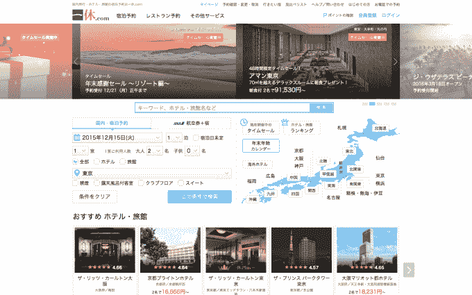

# 雅虎日本出价约 8.3 亿美元收购旅游预订网站 Ikyu 

> 原文：<https://web.archive.org/web/https://techcrunch.com/2015/12/15/yahoo-japan-bids-to-buy-travel-booking-site-ikyu-for-around-830m/>

# 雅虎日本出价约 8.3 亿美元收购旅游预订网站 Ikyu

雅虎日本，软银和雅虎的合资公司，发起了以大约 8 . 3 亿美元收购 T2 在线旅游和餐馆预订平台 Ikyu T3 的竞标。

[雅虎日本提出以每股 3433 日元(28.36 美元)的价格收购在日本证券交易所上市的 Ikyu。这意味着 Ikyu 最近的股价有 42%的溢价，这意味着雅虎日本可能为这笔交易支付超过 1000 亿日元。(根据目前的汇率，这一数字调整为 8.29 亿美元左右。)](https://web.archive.org/web/20221208173244/http://cdn.softbank.jp/en/corp/set/data/news/press/sb/2015/20151215_01/pdf/20151215_01.pdf)

Ikyu 成立于 1998 年，两年后开始提供酒店和日式旅馆的在线预订服务。2006 年，它将业务扩展到餐厅预订，如今，它拥有 413 万客户，还为商业用户提供“廉价”酒店服务、水疗预订和海外酒店预订平台。

雅虎日本已经在运营旅游和餐馆预订服务，两者之间有很大的协同效应。事实上，Ikyu 的创始人(也是最大的股东)Masabumi Mori 主动接触可能的合作伙伴，让他们将公司的业务推进到其他垂直领域。雅虎日本表示，这将有助于推动该公司的酒店和餐厅预订核心市场，同时也有助于其进军新垂直市场的雄心，成为“为高端客户提供丰富生活的平台”。

雅虎公司因其在阿里巴巴的巨额股份而闻名，在股东的压力下，它刚刚取消了剥离 T2 的计划，但雅虎日本是另一个为美国公司带来繁荣的亚洲投资。雅虎持有该组织 35.5%的股份，价值约 870 亿美元——软银持有另外 36.4%的股份。今年早些时候，[雅虎开始调查出售雅虎日本股份](https://web.archive.org/web/20221208173244/https://beta.techcrunch.com/2015/04/21/yahoo-calls-in-advisors-to-decide-the-future-of-its-35-5-stake-in-yahoo-japan/)的可能性，但它不会就此罢休。在改变其持有阿里巴巴股份的计划后，雅虎日本控股将被转移到一家新成立的公司，该公司将容纳雅虎公司的其他“核心”资产和业务，如 Tumblr。