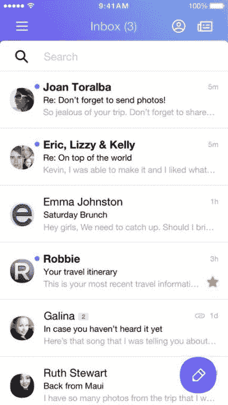

# 雅虎推出新的移动邮件应用并取消密码

> 原文：<https://web.archive.org/web/https://techcrunch.com/2015/10/15/yahoo-launches-new-mobile-mail-app-and-eliminates-passwords/>

雅虎周四发布了一款新的手机邮件应用，可以让你整合多个账户，免去密码。

尽管该应用首次支持其他电子邮件提供商，但它不支持 Gmail 或企业 Outlook 账户。因此，这是一个接收雅虎、个人 Outlook、Hotmail 或 AOL 账户上你从未删除的所有电子邮件的好工具。

雅虎的新应用连接了脸书、LinkedIn 和 Twitter。利用你的社交网络的力量，这个应用程序为给你发邮件的人提取照片和联系信息。该应用程序还从 Flickr 获取照片，这样每个账户都有一张头像照片——即使只有姓名首字母。

根据雅虎旧金山办公室的演示，这款应用似乎速度很快。它有 iOS 和 Android 版本，融合了手机用户熟悉的手势。向右滑动会将邮件标记为已读，向左滑动会将其删除。如果长按，可以选择多条消息。

该公司试图通过允许你直接在邮件中发送照片和电子邮件来改进附件，而不是作为附件放在底部。该公司还指出，许多人会给自己发送电子邮件提醒，所以他们制作了这个功能，这样你就可以通过按住撰写按钮直接给自己发送电子邮件。

雅虎通过最新的重新设计加大了搜索力度。该公司已经改进了按发件人搜索的方式，并提供了巧妙的建议。雅虎通信产品主管杰夫·邦福特(Jeff Bonforte)表示，这款工具非常智能，如果你选择了某个联系人的个人电子邮件，它会为你添加到信息中的所有其他人推荐个人电子邮件。

这款应用目前没有整合雅虎新的视频信息应用 Livetext。不过，你可以在应用程序中访问雅虎新闻。

**消除密码**

该公司周四还推出了 Account Key，用雅虎的话来说，你可以“免密码”。前提非常类似于按需密码。当你登录你的帐户，而不是输入你的密码，你选择一个按钮，发送你的手机上的推送通知。然后选择推送通知，打开应用程序，它会询问您是否正在尝试登录。

一旦您批准在手机上登录，该帐户将在您的浏览器中打开，无论是在手机上还是在桌面上。该公司还推出了备份功能，以防手机丢失或电池没电。它也可以发短信或电子邮件给你一个密码。

该产品是雅虎对高调黑客攻击的回应，因为许多人继续在多个账户上使用相同的密码。然而，目前还不清楚有多少人会采用这种服务。目前只有 3%到 4%的用户利用雅虎的按需密码服务。典型的雅虎账户所有者可能只是坚持使用“密码 123”，而不是处理当你离开手机时可能出错的服务。

Account Key 将与 Yahoo accounts 一起推出，产品副总裁 Dylan Casey 表示，该公司没有计划将这项服务用作社交网络等其他服务的认证方法。不过他说，如果产品成功，雅虎也有可能这么做。