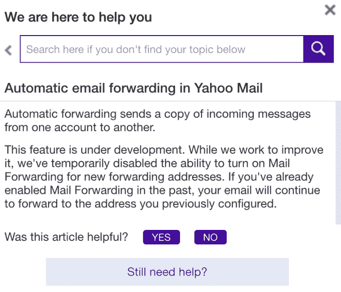

# 雅虎通过禁用自动邮件转发使其服务难以退出

> 原文：<https://web.archive.org/web/https://techcrunch.com/2016/10/10/yahoo-makes-it-difficult-to-leave-its-service-by-disabling-email-forwarding/>

继雅虎 9 月份宣布影响 5 亿用户账户的数据泄露事件后，该公司已经加大了雅虎邮箱用户转向其他电子邮件服务的难度。10 月初，雅虎禁用了电子邮件转发功能，该功能允许用户自动将发送到其雅虎地址的电子邮件重定向到另一个账户。

*(披露:TechCrunch 母公司威瑞森正在收购雅虎。)*

[美联社首先报道了这一变化](https://web.archive.org/web/20230228071608/http://hosted.ap.org/dynamic/stories/U/US_TEC_YAHOO_BREACH?SITE=AP&SECTION=HOME&TEMPLATE=DEFAULt)，引用了与几位雅虎客户的对话，这些客户在数据泄露的消息传出后寻求该功能。

禁用电子邮件转发是一个相当透明的举措，旨在阻止雅虎邮箱向其他电子邮件提供商的潜在流失。

当被问及停止支持电子邮件转发的决定时，雅虎拒绝置评，而是让美联社指向其帮助网站上的一篇解释该功能状态的帖子。

该消息内容如下:

> 这项功能正在开发中。虽然我们正在努力改进它，但我们暂时禁用了为新的转发地址打开邮件转发的功能。如果您过去已经启用了邮件转发，您的电子邮件将继续转发到您之前配置的地址。

换句话说，已经设置了转发功能的雅虎邮箱用户不会受到影响，但是现在任何试图转发邮件的人都没有这个选项。

当然，电子邮件转发是当今所有主要电子邮件提供商都提供的一项基本功能，并且已经提供了多年。这不是什么新东西，或者需要关闭才能“改进”。雅虎只是让雅虎邮箱的长期用户很难转向新的服务。

反过来，这可能会使客户的账户保持活跃——鉴于威瑞森收购雅虎的交易尚未完成，雅虎可能希望这样做。(事实上，最近的报道表明，威瑞森正在向 T2 索要 10 亿美元的折扣。)

邮件转发是切换过程中至关重要的一部分——就像转发邮件一样，它可以确保在您提醒联系人您的新电子邮件地址时，不会错过任何新电子邮件。这对于那些收到不在联系人列表中的人发来的电子邮件的人来说尤其重要，比如那些公开宣传自己电子邮件地址的企业。

作为一种变通方法，想要转移到另一个帐户的用户可以打开他们的假期响应器，而不是自动回复电子邮件，并注明他们的新地址。

其他人可能会决定放弃转发过程，干脆彻底删除他们的雅虎邮箱账户。

除非雅虎也取消了这个选项。

事实证明，这并不是雅虎在泄露消息传出后第一次难以放弃其服务。本月早些时候，其电子邮件被外包给雅虎的英国电信客户也发现，他们离开雅虎的能力已被禁用。

[据报道，](https://web.archive.org/web/20230228071608/http://www.theregister.co.uk/2016/10/07/bt_yahoo_customers_unable_to_delete_webmail_accounts/)英国电信/雅虎的客户无法转发他们的电子邮件，也无法访问允许他们删除电子邮件帐户的选项。

甚至在被入侵之前，雅虎邮箱就已经在走下坡路了，[把用户的权利让给了 Hotmail 和 Gmail。](https://web.archive.org/web/20230228071608/http://venturebeat.com/2012/06/28/gmail-hotmail-yahoo-email-users/)截至今年夏天，雅虎[报告称](https://web.archive.org/web/20230228071608/https://yahoomail.tumblr.com/post/146407464896/its-all-a-matter-of-scale)其电子邮件服务每月支持约 2.5 亿活跃用户，这一数字多年来一直在稳步下降。

东部时间 2016 年 10 月 10 日下午 5:30 更新

雅虎向 TechCrunch 分享了以下声明:

> “我们正在努力尽快恢复自动转发功能，因为我们知道它对我们的用户非常有用。作为之前计划维护的一部分，该功能被临时禁用，以改善用户不同帐户之间的功能。用户可以期待自动转发功能的更新很快。同时，我们将继续支持多账户管理。”