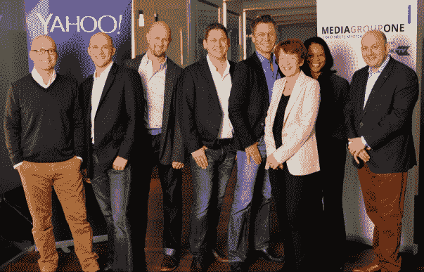

# 雅虎在 Q1 以 2300 万美元悄悄地收购了德国的第一媒体集团 

> 原文：<https://web.archive.org/web/https://techcrunch.com/2015/07/24/yahoo-media-group-one/>

[雅虎将技术和人才带回这家互联网公司的陈旧收购路线，是首席执行官玛丽莎·梅耶尔(Marissa Mayer)任期内更显著的人生标志之一。虽然 M & A 在 2015 年似乎显著减缓了](https://web.archive.org/web/20221205134857/http://www.yahoo.com/)的增长，但这并没有完全停止:雅虎今年早些时候悄悄在欧洲进行了一项收购，以扩大其在该地区的广告业务，现在我们发现这是一笔 2300 万美元的交易。

2014 年 12 月，雅虎 T4 宣布将收购慕尼黑一家名为[媒体集团一](https://web.archive.org/web/20221205134857/http://mediagroupone.de/)的公司。

你可以认为第一媒体集团是联合媒体的一部分，也是 YouTube 式网络的一部分——考虑到雅虎很久以前就挫败了收购 DailyMotion 的野心，这本身就很有趣。

MGO 向大约 800 个合作伙伴网站销售和联合广告，部分方式是将这些网站的内容组织成三个德语“超级垂直市场”— [ENTANIA、](https://web.archive.org/web/20221205134857/http://entania.com/) [FABALISTA](https://web.archive.org/web/20221205134857/http://www.fabalista.com/) 、以及 [ZOLANIS](https://web.archive.org/web/20221205134857/http://www.zolanis.com/) 。另一个部门运营着一个名为 [SnackTV](https://web.archive.org/web/20221205134857/http://www.snacktv.de/) 的视频网络，该网络汇集了来自不同出版商的内容，并提供了一种在其他网站上自动整合的方式。

弄清雅虎的收购需要一些调查。这笔交易实际上是在 12 月份公开的，但是很少被英语媒体(包括我们)注意到——可能是因为这条消息是发布在雅虎德国的新闻网站上，而不是其美国主要网站。

然后，当交易在 1 月正式结束时，没有提到支付的价格。

但是在今年五月提交的一份 10-Q 表格中有一个小说明，称雅虎在 Q1 进行了一笔 2300 万美元的收购。10-Q 还提到了与 EMEA 收购案相关的 2000 万美元商誉。

综合考虑，我们问了一下，雅虎证实了发生的事情。“Media Group One 是在 Q1 完成的收购，”一位发言人说，他指的是 Media Group One 自己发布的[新闻稿。](https://web.archive.org/web/20221205134857/http://mediagroupone.de/fileadmin/user_upload/presse/Pressebilder_und_Downloadmaterial/PMYahooAkquisition_EN.pdf)

根据这份声明，这笔交易将被用来扩展[雅虎双子星](https://web.archive.org/web/20221205134857/https://advertising.yahoo.com/Blog/gemini-announcement.html)的移动和原生广告市场，将其与媒体集团 One 的出版商网络 SnackTV 视频门户网站相结合。

“雅虎和第一媒体集团的能力非常好地互补，”王高·奥斯汀指出，他在雅虎之前一直是德国公司的总经理，现在是雅虎的销售和出版商管理副总裁。“一个特别的亮点是我们的视频联合产品 SnackTV，它为雅虎对视频的关注提供了一个完美的增强。我们期待着与雅虎团队合作，并对双方组织、我们的业务合作伙伴和媒体集团 ONE publishers 的所有新机会感到特别兴奋。”

下图是整个管理团队与雅虎的 EMEA·SVP·道恩·艾雷的合影，他们已经加入雅虎，如下图所示。

## 雅虎和欧洲

雅虎通过 Media Group One 扩大欧洲业务的举措，正值该公司国际业务(尤其是欧洲业务)的关键时刻。

Media Group One 填补了该公司的几个重要空白:它扩大了雅虎在欧洲，特别是德国的影响力，尤其是在雅虎希望变得更加活跃的网络内容领域:优质视频内容。

这一刻不会来得太早:雅虎在旧世界一直萎靡不振。虽然梅耶尔领导下的雅虎一直在大力投资改善其主要市场——美洲，特别是美国——的业务，但规模小得多的国际业务最近在收入和业务上都出现了下滑。

根据该公司本周早些时候发布的 [Q2 收益报表](https://web.archive.org/web/20221205134857/https://investor.yahoo.net/releasedetail.cfm?ReleaseID=923083)，EMEA 不包括交通收购成本的 GAAP 收入为 7290 万美元，而去年同期为 8760 万美元。六个月的数字显示下降了近 3000 万美元，至 1.42 亿美元。相比之下，本季度美洲地区不含 TAC 的收入增长至 8.11 亿美元，上半年增长至 16 亿美元。

6 月初，雅虎[最新的春季大扫除报告](https://web.archive.org/web/20221205134857/http://yahoo.tumblr.com/post/120700756894/q2-2015-progress-report-on-our-product)也指出，许多国际网站将被关闭，以“简化我们的编辑服务”，内容将在雅虎网络的其他部分重新分发。

欧洲的关闭包括法国的雅虎音乐、西班牙的雅虎电影、英国、法国、德国、西班牙和意大利的雅虎电视以及英国、法国、德国、西班牙和意大利的雅虎汽车。

今年早些时候发表的一篇对艾雷的采访，突显了在她 2013 年上任之前，该公司在广告业务方面一直面临的一些挑战。

她告诉[竞选杂志](https://web.archive.org/web/20221205134857/http://www.campaignlive.co.uk/article/1343799/dawn-airey-predicts-renaissance-year-yahoo)，该公司已经从在英国与机构联络的模式转变为与客户和垂直行业联络，“这是一个烂摊子”。

与此同时，她不得不应对全球消费者从台式电脑和基本网站转向移动和更动态的内容(如视频)的影响。

“我想——我需要——逐步改变我们的收入，我希望达到两位数的增长，”她告诉 Campaing。“但个人电脑正在衰落——优秀的老式展示广告不像以前那样有利可图了。所以我们的专家(雅虎的移动视频原生广告组合)很重要。他们还没有完全抵消其他地方的下降，但我们正在努力使今年成为一个转折点。”

出于所有这些原因，Media Group One 对雅虎来说似乎很有意义，因为它主要将 M&A 进军美国..

媒体集团一项业务不是一项无足轻重的业务。该公司表示，合并后的业务使其成为德国十大营销和广告公司之一。其内容“大型垂直市场”每月有超过 1800 万的独立访问者。

SnackTV 内容由大约 200 家出版商的 33 万条内容组成，其中包括电视台、制作公司和专门为互联网开发内容的公司。