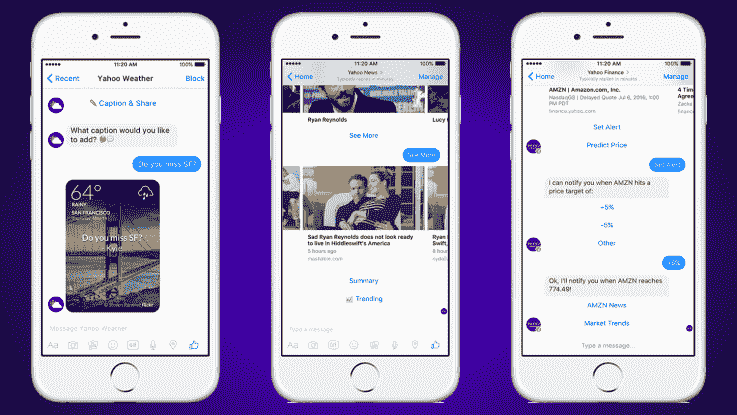
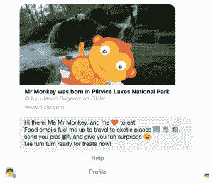

# 多亏了雅虎 TechCrunch，Messenger 现在有了虚拟猴子

> 原文：<https://web.archive.org/web/https://techcrunch.com/2016/07/07/yahoo-news-finance-weather-bot/>

# 多亏了雅虎，Messenger 现在有了虚拟猴子

像雅虎这样陷入困境的可怜品牌该怎么办？当然是用它聪明的工程师来跳上最热门的潮流。今天，该公司推出了一个机器人，为[的 Facebook Messenger](https://web.archive.org/web/20221207055614/https://www.messenger.com/) 模拟一只宠物猴子。哦，还有一些稍微有用的机器人，比如那些会告诉你天气、最新消息和你的股票投资组合表现如何的机器人。

该公司今天宣布了一系列机器人来帮助你的收件箱塞满或多或少有用的信息。

## 我喜欢大机器人，我不能说谎

新的机器人包括[一个雅虎金融机器人](https://web.archive.org/web/20221207055614/http://m.me/YahooFinance)，帮助你了解股票市场的最新动态，可以选择阅读金融新闻，玩游戏。)并与你的朋友分享你的最佳股票技巧。还有，你知道，你对你不喜欢的人的最糟糕的股票提示。

雅虎天气、新闻和财经

如果你不喜欢钱，但是喜欢新闻，你仍然可以和雅虎——[雅虎新闻机器人](https://web.archive.org/web/20221207055614/http://m.me/YahooNews)与你分享热门故事，或者你可以用它来搜索你感兴趣的话题。

我现在有一只猴子宠物，叫猴子先生。我很有想象力。

对于那些热衷于温度和湿度领域的千里眼的人，雅虎有第三个机器人可以帮助你确定你是否需要带雨伞或防晒霜；雅虎天气机器人还与 Flickr 整合，帮助将天气预报与图像结合起来。

如果你讨厌天气、政治、新闻、金钱、其他人和生活，不要担心你美好、阳光的自己:雅虎也为你准备了完美的机器人。 [Monkeypet 是一个电子鸡风格的虚拟宠物机器人](https://web.archive.org/web/20221207055614/http://m.me/monkeypet)，它认为自己是一只猴子，如果你给它喂食稳定的食物表情，它会给你发送它在世界各地旅行时的表情自拍。