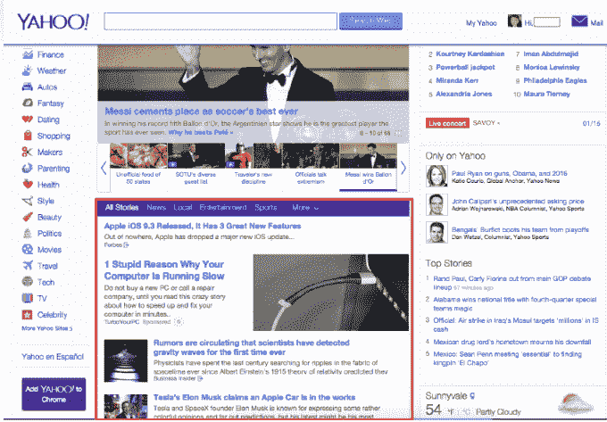

# 雅虎向研究社区 发布了有史以来最大的机器学习数据集

> 原文：<https://web.archive.org/web/http://techcrunch.com/2016/01/14/yahoo-releases-its-biggest-ever-machine-learning-dataset-to-the-research-community/>

雅虎[今天早上宣布](https://web.archive.org/web/20230325210856/http://yahoo.tumblr.com/post/137282204964/yahoo-releases-the-largest-ever-machine-learning)它正在通过其正在进行的项目雅虎实验室 [Webscope](https://web.archive.org/web/20230325210856/http://webscope.sandbox.yahoo.com/) 向学术研究社区提供有史以来最大的机器学习数据集。新数据集的大小高达 13.5 TB(未压缩)，由匿名的用户交互数据组成。具体来说，它包含了从 2015 年 2 月到 2015 年 5 月约 2000 万用户的互动，包括发生在雅虎主页、雅虎新闻、雅虎体育、雅虎金融和雅虎房地产上的互动。

除了用户交互数据，数据集还包括人口统计信息，如年龄范围、性别和广义地理数据，而数据集中的项目包括所讨论的新闻文章的标题、摘要和关键短语，加上本地时间戳和部分设备信息。

[雅虎实验室个性化科学主任 Suju Rajan](https://web.archive.org/web/20230325210856/https://labs.yahoo.com/researchers/suju) 解释道，“数据是机器学习研究的生命线。然而，访问真正大规模的数据集是传统上为在大公司工作的机器学习研究人员和数据科学家保留的特权——对大多数学术研究人员来说遥不可及。”

正如你所想象的，无法根据“真实世界”的数据进行测试会阻碍创新。反过来，会减缓进展。

卡内基梅隆大学、加州大学圣地亚哥分校和 UMass Amherst 数据科学中心的研究人员已经表示，他们将在自己的研究中使用新发布的数据集。例如，在 CMU，研究人员将能够研究如何自动发现哪些用户对哪些新闻感兴趣，[指出，](https://web.archive.org/web/20230325210856/http://www.businesswire.com/news/home/20160114005200/en/Yahoo-Releases-Largest-ever-Machine-Learning-Dataset-Researchers)机器学习系主任 Tom Mitchell。

Rajan 还表示，雅虎实验室的那些人已经使用类似这样的大规模数据集来研究受面向消费者的产品启发的大规模机器学习问题，特别是在搜索排名、计算广告、信息检索和核心机器学习等领域。

然而，她补充说，雅虎希望“在工业和学术研究之间建立公平的竞争环境”，这就是为什么它要向更广泛的社区发布新的数据集。

虽然看到雅虎对机器学习社区的巨大贡献肯定是一个受欢迎的消息，但这并不完全是利他主义的举动。雅虎在这里的更大目标是推进机器学习的研究——这是从人工智能研究中发展出来的，现在专注于开发可以通过使用数据进行学习和预测的算法。但是，如果它通过让研究人员加快创新步伐而获得成功，雅虎也将受益于能够将这些知识应用于自己的产品。

当然，雅虎也不是唯一一家做出如此大规模贡献的大型科技公司。11 月，[谷歌开源了机器学习技术 TensorFlow](https://web.archive.org/web/20230325210856/https://techcrunch.com/2015/11/09/google-open-sources-the-machine-learning-tech-behind-google-photos-search-smart-reply-and-more/#.s2agxy:Kscc) ，该技术支持谷歌照片搜索、Gmail 的“智能回复”、谷歌应用程序中的语音识别等。此外，IBM Watson、Amazon Machine Learning 和 Azure Machine Learning 也是这个领域中值得注意的名字。

雅虎的 Webscope 计划并不新鲜，它已经提供了大量由匿名用户数据组成的数据集用于非商业用途。然而，这个 13.5 TB 的机器学习数据转储是其迄今为止最大的。其网站上的其他数据集可以用 GB 来衡量，而不是 TB，比如超过 50 GB 的[数据集](https://web.archive.org/web/20230325210856/http://webscope.sandbox.yahoo.com/catalog.php?datatype=l)，其中包含一个带有 HTML 表单的页面样本。

“访问这种规模的数据集对于设计和开发可扩展到真正‘大’数据的机器学习算法和技术至关重要，”加州大学圣地亚哥分校电气和计算机工程系教授 Gert Lanckriet 在一份声明中说。“在加州大学圣地亚哥分校的雅各布工程学院，它将直接和显著地有益于机器学习、人工智能、信息检索和大数据应用领域的各种正在进行的研究。”