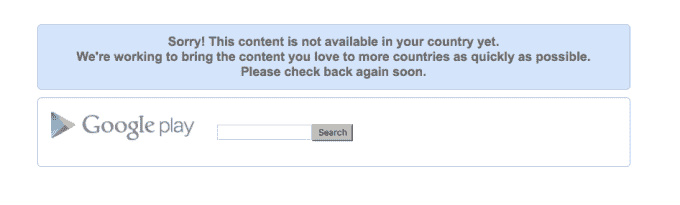

# 雅虎关闭了 Yahoo Screen，它是“社区”等原创内容的大本营

> 原文：<https://web.archive.org/web/https://techcrunch.com/2016/01/04/yahoo-shuts-down-yahoo-screen-its-home-for-original-content/>

# 雅虎关闭 Yahoo Screen，它是“社区”等原创内容的大本营

根据 Variety 的报道，并得到雅虎的证实，雅虎屏幕已经关闭，其内容被拆分到不同的杂志资产中。

屏幕[于 2013 年推出](https://web.archive.org/web/20221025230706/https://beta.techcrunch.com/2013/09/09/yahoo-launches-yahoo-screen-on-mobile/)，作为存放雅虎原创内容的地方，该公司已经退出(还记得 4200 万美元的减记吗？).从带回节目“社区”到播放海外 NFL 比赛，计划是将屏幕变成一个更精致的 YouTube 版本。很明显没用。

综艺报道称，凯蒂·柯丽克将继续她的每日新闻节目，可能会在雅虎新闻旗下。以下是雅虎向该刊物提供的声明:

> 在雅虎，我们不断地审查和迭代我们的产品，因为我们努力创造最好的用户体验。考虑到这一点，雅虎以及我们合作伙伴的视频内容已经从雅虎屏幕转移到我们的数字杂志，因此用户可以在一个地方发现补充内容。

这项服务已于上周关闭，应用程序也已从苹果应用商店和 Google Play 中移除:

屏幕曾经是梅耶尔的“专家”转变方法的皇冠上的宝石，并吹嘘超过一千小时的可视内容，包括 T2 的周六夜现场目录。