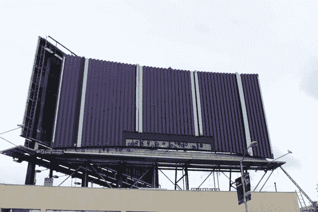
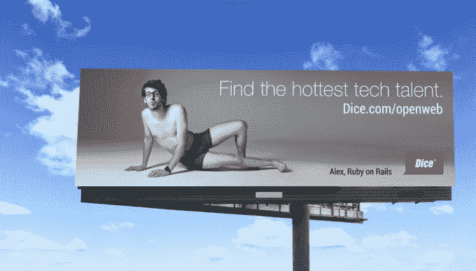

# 雅虎将夺回其标志性的旧金山广告牌 

> 原文：<https://web.archive.org/web/https://techcrunch.com/2015/08/08/yahooooooooooooooo-billboard/>

# 雅虎将收回其标志性的旧金山广告牌

20 岁生日快乐，雅虎！

你得到了什么，你得到了什么？我打赌会有很多派对。礼物，奖品。礼物！

–**一个广告牌！**

广告牌？

–**[广告牌](https://web.archive.org/web/20221007221835/http://yahoo.tumblr.com/post/126124481964/yahoo-reclaims-iconic-sf-billboard)。**

如果你住在或曾经去过湾区，你可能见过雅虎广告牌(它在 80 号州际公路上)。当它在 2011 年[被拿下](https://web.archive.org/web/20221007221835/https://beta.techcrunch.com/2011/11/17/yahoos-iconic-sf-billboard-comes-down-after-outlasting-4-ceos/)的时候，对于很多雅虎人来说，这是一个非常悲伤的日子，而梅耶尔就是要保持紫色公司的遗产完整无缺。

**有趣的事实:**那块广告牌经历了四任不同的 CEO。现在是第五次了。它于 1999 年在蒂姆·库格尔的领导下成立。

当然，它会有一个新的外观，同时也是一个公司可以推销其新老产品的地方。

下面来看看现在的构造:

该公司正在将它的新品牌注入湾区的所有地方，包括利瓦伊体育场。每一个。单身。时间。49 人队得分，播放“雅虎约德尔”。这真的很烦人。

欢迎回来，广告牌。没有你就不一样了。你比这个强多了:

*( **披露:**我在雅虎工作了一分钟。)*