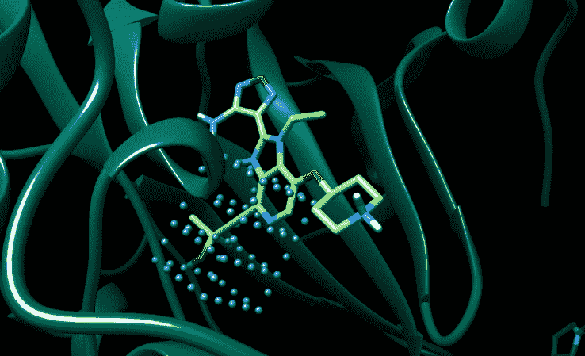

# YC 大学校友 Atomwise 筹集 600 万美元，进一步推动人工智能在药物发现领域的发展

> 原文：<https://web.archive.org/web/https://techcrunch.com/2015/06/03/yc-alum-atomwise-raises-6-million-to-advance-artificial-intelligence-in-drug-discovery/>

# YC 大学校友 Atomwise 募集 600 万美元，用于进一步推进人工智能在药物研发中的应用

药物发现平台 [Atomwise](https://web.archive.org/web/20230301143217/http://www.atomwise.com/) 已经筹集了 600 万美元的种子资金，用于深入挖掘人工智能，并有可能加快我们发现新药的过程。

资金来自风险投资公司，这些公司都有某种以科学为重点的成分。Data Collective 领投，科斯拉风投、DFJ、AME 云风投和 OS Fund 参与其中。

Atomwise [于今年春天在 YC 推出](https://web.archive.org/web/20230301143217/https://techcrunch.com/2015/03/06/y-combinator-backed-atomwise-discovers-drugs-for-diseases-that-dont-even-exist-yet/)，目标是找到常见病和孤儿病的治疗方法，否则这些疾病将过于昂贵和耗时。它与 IBM 和其他机构合作，启动了十多个项目，解决从多发性硬化症到埃博拉病毒的各种问题。在 YC 期间，它还宣布了与默克公司、著名实验室和哈佛医学院的合作。

> 对于拥有我们特定投资组合的投资者来说，一家在所有这些领域都取得巨大成功的公司是显而易见的。马特·奥科，DCVC

该系统使用一种专门的算法来运行数百万个分子结构，以确定某些疾病最可能的组合。Atomwise 的联合创始人 Alex Levy 过去解释说，该系统使用神经网络来提出处理数据的新方法，就像大脑一样。

实验室可以利用这些信息，开始用新发现的材料测试化合物，以便找到治疗方法。另一位 YC 校友，著名实验室已经能够使用 Atomwise 解析现有的药物，这些药物用于在实验室中测试对癌组织的影响。

进行模拟药物研究。这张图片是一个假想的药物分子被嵌入到它可能与之相互作用的蛋白质中。

Atomwise 的独特之处在于，它从生命或死亡过程中提取了大量数据。但 Data Collective 的 Matt Ocko 提到，它还解决了制药行业的一个“生死”问题，因为它涉及到极其昂贵和耗时的药物发现。根据塔夫茨药物开发研究中心的数据，一种新药上市平均需要 12 年时间和大约 26 亿美元。

Data Collective 的马特·奥科(Matt Ocko)对 TechCrunch 表示:“对于拥有我们特定投资组合的投资者来说，一家在所有这些领域都取得巨大成功的公司是显而易见的。”

即使取得了早期的胜利，这家初创公司仍将需要应对一个通常行动缓慢的监管行业。发现可能挽救某人生命的化合物是一回事，获得 FDA 批准是另一回事。以 23andMe 为例。2013 年末，FDA 停止了该公司告知新用户某些与他们健康相关的基因组标记的能力。从那以后， [FDA 已经为 23andMe 的某些与遗传疾病相关的测试开放了可能性](https://web.archive.org/web/20230301143217/http://www.fda.gov/NewsEvents/Newsroom/PressAnnouncements/UCM435003)，其中一项布鲁姆综合征测试的[许可](https://web.archive.org/web/20230301143217/http://blog.23andme.com/news/a-note-to-our-customers-regarding-the-fda/)，但尚未批准其他有关遗传健康的信息。

Ocko 承认 Atomwise 的潜在绊脚石，但他表示，根据他在该领域的投资和观察，他认为这家初创公司是“小马”之一。“当你开始进入动物试验，展示证据，应用已经获得 FDA 批准的药物时，我认为你会看到蜂拥而至，”他说。

这家初创公司计划在现有合作关系的基础上继续发展，并寻求新的合作关系。它还将利用这笔钱聘请那些在机器学习、计算生物学、药物化学、业务发展、销售、营销和合作伙伴关系方面具有专业知识的人。