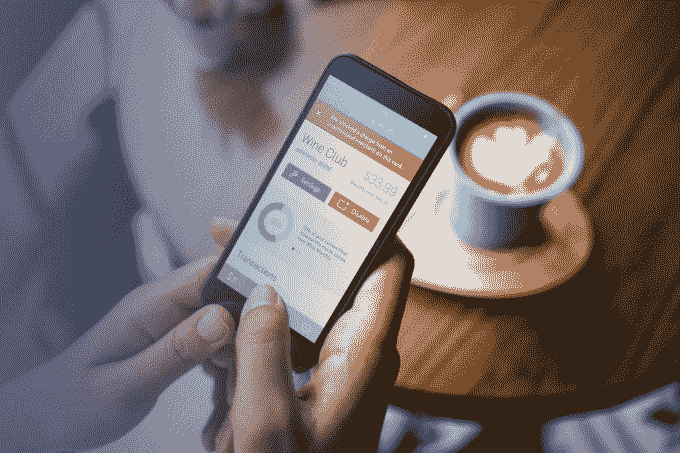
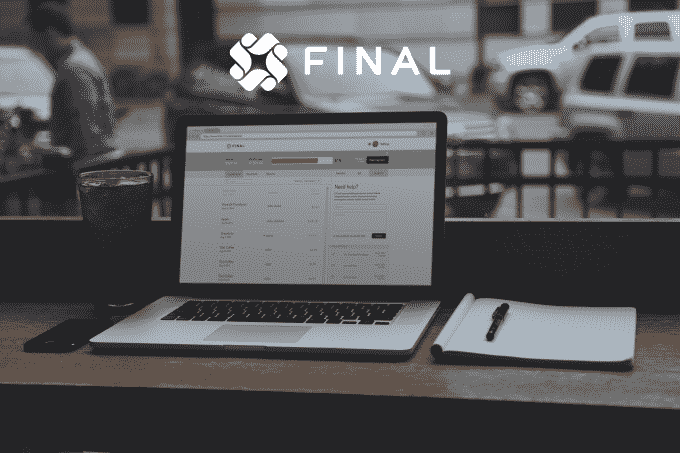

# YC 支持的 Final 为其反欺诈信用卡 TechCrunch 筹集了 100 万美元

> 原文：<https://web.archive.org/web/https://techcrunch.com/2015/01/27/yc-backed-final-raises-a-million-for-its-fraud-fighting-credit-card/>

信用卡初创公司 [Final](https://web.archive.org/web/20221207010421/https://getfinal.com/) 专注于打击在线和离线欺诈，同时让消费者对自己的支出拥有更多控制权，在推出 2015 年试点计划之前，该公司从包括 Ludlow Ventures、T5 Capital Partners、Y Combinator 和其他金融科技天使投资人那里筹集了 100 万美元的种子资金。

该公司告诉我们，已经有 37，000 名消费者在等待名单上注册，以便在新卡上市时试用。

Final 是一年前由一个团队成立的，该团队的背景包括在 it、移动支付和各种初创公司(包括总部位于博尔德的 Simple Energy)的经验。

联合创始人 Aaron Frank、Matt Rothstein 和 Andrew Dietrich 表示，在 2013 年成为目标数据泄露事件的受害者后，他们首先想到了更好地防止欺诈的信用卡的想法。

Frank 解释说:“在我们都受到违规事件的影响，并且我们的信用卡突然被关闭后，我们认为必须有一个更好的系统来改善这个问题。Final 的目标是重新设想消费者如何与他们的金融机构互动，让他们能够更好地控制自己的支付以及与商家和其他服务提供商的关系。

该团队想出的是一种基于 EMV(芯片和密码)的信用卡，它还为消费者提供生成多个唯一号码的能力，这些号码可用于个体零售商。在注册并收到他们的 Final 卡后——这个过程与今天申请任何其他信用卡类似——客户可以使用 Final 的网络应用程序、浏览器插件或移动应用程序生成新的卡号。

这些号码既可以用于一次性交易，也可以作为单个商家的新的唯一卡号。例如，最终用户可以创建一个只适用于他们在 Amazon.com 购物的卡号。

当然，创建唯一的临时信用卡号码的能力并不是一个新想法。这项技术已经开发了一段时间，尽管它的几个早期采用者，包括 Discover、PayPal 和 T5 在内的 T2 早已停止了他们的项目。在过去，这种技术的用户采用率很低，部分原因是消费者可能没有意识到欺诈，也因为一次性号码技术通常需要浏览器插件，这使得更多主流或非技术用户无法使用。

自那以后，情况发生了变化。由于家得宝(Home Depot)、史泰博(Staples)、内曼马库斯(Neiman Marcus)、迈克尔(Michael's)、PF Chang's、艾伯森(Albertsons)、摩根大通(JP Morgan Chase)、凯马特(Kmart)等零售商的大量数据泄露，消费者现在对反欺诈技术更感兴趣，并更好地了解反欺诈系统的工作原理，这要归功于他们的银行关闭他们的卡(有时看起来是随机的),因为他们的活动会触发偏离其典型行为模式的红旗。

与此同时，美国现在终于过渡到更安全的芯片和 PIN 基础设施，这将有助于解决销售点的问题。Final 的卡也将作为芯片和密码卡发售，在以传统方式使用时更加安全。

## 更多控制

但与过去提供临时号码的其他服务不同的是，它们可以为个人商户和一次性交易建立。然后，由于网络和移动应用，消费者可以跟踪他们的各种账户和订阅，为每个账户和订阅设置特定的规则。

例如，消费者可以对一个卡号设置金额限制，或者可以取消一个特定的卡号，以便在不影响其他人的情况下结束与商家的关系。该系统还可以在发生数据泄露时提供帮助。

Rothstein 解释说:“如果你有一张在销售点被攻破的传统卡，那么这张静态号码在任何地方都是可用的。”“如果(Final 的唯一)数字中的一个遭到破坏，这意味着其他任何关系都不会受到影响。”

## 试点计划

该公司表示，它正在与一些金融机构进行讨论，这些机构可能会在信用卡和技术上与 Final 合作，但由于那里的监管环境，信用卡行业的发展可能会比初创公司慢一些。但是他们仍然希望在今年推出一个试点项目。

就他们的商业模式而言，Final 表示，这将是非常标准的，从交易中分得一杯羹，并在一定规模上从债务中分得一杯羹，但目前还没有到深入研究其费用结构细节的时候。然而，该团队表示，他们的目标是不要像其他人一样“掠夺”，考虑如何让消费者了解他们的财务健康状况，并普遍为他们的客户辩护。

该公司是目前几家试图在信用卡领域创新的公司之一，此外还有通用的“连接”卡，如 [Coin](https://web.archive.org/web/20221207010421/https://www.crunchbase.com/organization/coin) 、 [Plastc](https://web.archive.org/web/20221207010421/https://www.crunchbase.com/organization/plastc) 和 [Swyp](https://web.archive.org/web/20221207010421/http://www.swypcard.com/) ，以及其他钱包技术，如 [LoopPay](https://web.archive.org/web/20221207010421/http://www.looppay.com/) 。但其中一些公司还没有完全想好如何应对 EMV 的过渡，其他公司可能还没有准备好应对 ApplePay 日益普及的威胁。

Final 可能有一些优势，但可能会受到它是否能够与金融机构和整体监管环境建立所需关系的限制。

今天的消费者可以在该公司的网站上注册加入等候名单。

[YouTube https://www.youtube.com/watch?v=8ZtG5DX5FR0]