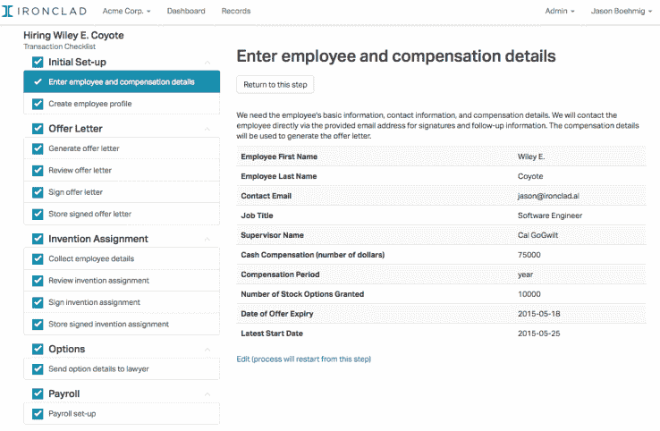

# YC 支持的铁甲是公司的自动化法律助理 

> 原文：<https://web.archive.org/web/https://techcrunch.com/2015/07/30/yc-backed-ironclad-is-an-automated-legal-assistant-for-companies/>

# YC 支持的 Ironclad 是公司的自动化法律助理

推出了最新的 YC 类，[铁甲](https://web.archive.org/web/20230206121820/https://www.ironcladapp.com/)是一个自动化服务，帮助公司起草，组织和执行共同的法律文书工作。

对于年轻的初创公司来说，昂贵的法律费用通常是一个不受欢迎的现实。律师每小时收费数百美元，但通常是公司正确准备财务文件和销售合同等事宜的唯一选择。

以下是 iron cladded 的工作方式:当一家公司首次注册时，该服务会创建一个共享的 Dropbox 文件夹，用于存放和组织公司的所有法律文件。

当创始人需要准备一份像 NDA 或销售协议这样的文件时，他们会前往 Ironclad 的网站，选择一种文件类型，并输入双方的基本信息。然后，iron cladded 将创建一份草稿文档，并将其保存在公司的 Dropbox 中。

获得批准后，iron cladded 将通过 HelloSign 发送文件，供双方执行。

iron cladded 的联合创始人 Jason Boehmig 解释说，目前起草和执行法律文件的方法极其分散。例如，一家试图完成销售协议的初创公司必须在他们的律师、文档存储解决方案和电子签名公司之间分别移动文档。

有了铁甲，这整个过程是自动化的，这让公司节省了大量的时间和金钱。

值得注意的是，铁甲不会取代律师。事实上，Boehmig 解释说，公司的目标是成为律师的运营层，本质上是巩固他们的工作流程，并赋予他们超能力。

支持这一点的事实是，尽管 iron cladded 将向用户提供常见法律文件的模板，但该服务也有一个让公司从自己的律师那里导入文件的计划。

iron cladded 目前有 200 家公司处于测试阶段，并提供了一个用户可以创建和执行 NDA 的免费层。他们还将收取 49 美元/月的额外文件访问费，如销售和承包商协议，或 199 美元/月的导入定制模板的能力。

该公司还提供企业选项，为律师事务所和内部法律部门量身定制。

Boehmig 告诉 TechCrunch，在未来，该公司希望提供创业公司所需的任何法律文件，从成立到筹集 a 轮融资。