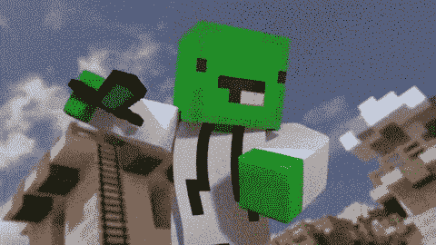

# YC 支持的回扣提供了一个简单的方法来发挥《我的世界》的竞争力 

> 原文：<https://web.archive.org/web/https://techcrunch.com/2015/03/02/yc-backed-kickback-offers-an-easy-way-to-play-minecraft-competitively/>

从《星际争霸》到《英雄联盟》,电子竞技市场在过去的五年里经历了巨大的扩张。在成千上万的观众面前玩视频游戏，无论是现场直播还是在线直播，都关系到数百万美元的赌注。

Y Combinator 支持的 [Kickback](https://web.archive.org/web/20230216193052/https://kickback.gg/) 正寻求通过围绕现有游戏建立竞争生态系统来扩大市场范围。它的最初版本是建立在[《我的世界》](https://web.archive.org/web/20230216193052/https://minecraft.net/)的基础上的，这个冒险工具箱[现在归微软](https://web.archive.org/web/20230216193052/https://techcrunch.com/2014/09/15/microsoft-has-acquired-minecraft/)所有。

Kickback 的方法将整个体验视为一种产品。虽然游戏在《我的世界》应用程序中进行，但这家初创公司运行主办比赛的服务器，安排游戏，设计游戏进行的“地图”，编纂每种地图类型的规则，并记录玩家的输赢。

服务器架构是基于去年夏天为《我的世界》社区创建的免费服务器托管服务 Kickback 所做的工作。自 Triangle 推出以来，已有超过 200，000 台服务器托管在 Triangle 上，为该团队带来了大量玩家来测试其主要平台。

《我的世界》很容易用新的武器、规则和地图来修改，所以 Kickback 可以很好地控制它能实现的比赛类型。比赛可以有两到几十个玩家参加，有不同的死亡竞赛和团队战斗规则。来自社区的志愿者为不同的玩家数量和比赛类型贡献地图，让初创公司以比大多数工作室制作可下载内容更快的速度添加新的比赛场地。

与三角游戏一样，Kickback 的配对系统免费提供给那些只想玩游戏炫耀的人。这家初创公司计划从那些愿意下注自己比其他玩家更优秀的玩家身上赚钱。每场比赛 1 美元，自信的《我的世界》玩家可以投入一个底池，有机会在 10 到 20 分钟内赢钱。

这些付费比赛提供了和免费选项一样多的选择，尽管竞争者的数量显然会影响潜在的支付。Kickback 的联合创始人 Vlad Nov 表示，付费动态在两个方面帮助了这家初创公司。

首先，有一种独特的体验，那就是在一场竞技比赛中押上一些钱，让每场比赛都变得更加激动人心。还有一个事实是，游戏的最大赢家往往也是最直言不讳的活动家，他们招募了更多的朋友在平台上玩，而不是那些可能只把回扣视为获得《我的世界》补丁的便捷方式，但可以在其他地方找到服务器的免费玩家。

关于引入社区的话题，Kickback 的另一位联合创始人马克·普罗库丁(Mark Prokoudine)表示，这家初创公司正在研究《我的世界》社区中使其独一无二的方面。他们与社区最受欢迎的动画师之一合作制作了一个宣传视频(你可以在下面的 GIF 中看到预览)，他们计划在未来几周内与一个受欢迎的 Twitch streamer 合作发布。

为了利用 Twitch 可以给游戏或活动带来的巨大关注，这家初创公司还致力于让用户从 web 应用程序中跳转到 Twitch 流中观看当前比赛，使其成为玩*和*观看其他人相互比赛的目的地。

展望未来，这家 10 人创业公司的两大重点是为《我的世界》增加更多地图和比赛类型，并将其他游戏引入平台。当它开始与新游戏合作时，它不会有《我的世界》带来的一些优势，但 Prokoudine 说，最困难的工作——制作可扩展的后端和匹配系统——旨在没有太多麻烦的情况下进行。