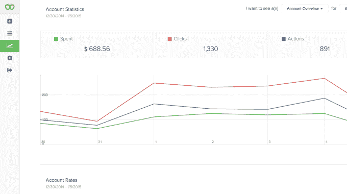

# YC 支持的 Kuhcoon 承诺为小企业自动化脸书广告活动

> 原文：<https://web.archive.org/web/https://techcrunch.com/2015/02/19/yc-backed-kuhcoon-promises-to-automate-facebook-ad-campaigns-for-small-businesses/>

许多广告技术公司都喜欢谈论自动化，但安德鲁·托尔巴，Kuhcoon 的联合创始人兼首席执行官，似乎特别热情:“我们的宏伟计划是实现互联网上所有付费媒体支出的自动化。”

这家初创公司还没有在 T2 站稳脚跟，但它表示已经与 90 多个国家的 6000 多家广告商合作。(这些广告商包括 Y Combinator 的许多初创公司，Kuhcoon 是冬季班的一部分。)目前仅限于脸书广告，但 Torba 表示，Kuhcoon 的 Google Adwords 即将推出，Twitter 和 Pinterest 也有推出计划。

Torba 和他的联合创始人/首席技术官 Charles Szymanski 承认，还有其他的脸书广告自动化产品。然而，Szymanski 认为，那些提供“全自动化”的网站，如 Nanigans 和 Kenshoo，专注于大型广告客户。当涉及到中小型企业时(Torba 说，Kuhcoon 为每月花费 2 万至 100 万美元的广告商服务，重点是那些花费低于 10 万美元的广告商)，可用的工具更多的是手动的。

托尔巴说:“【AdEspresso 怎么做，他们就会说，‘这个广告效果不好，你应该暂停它。’”“实际上，我们将为您暂停它。”

听起来很简单，对吧？嗯，Szymanski 说，要把他和 Torba 学到的社交媒体广告变成一个自动化的过程，需要大量的开发工作。

与众不同的一个要点是 Kuhcoon 如何优化其活动。通过正常的测试过程，一个广告商可能会上传一堆不同的广告到脸书，在第一天就全部测试完，然后专注于看到最佳结果的广告。Szymanski 说，这可能会浪费很多钱，但真正的问题是“你实际上是在与脸书自己的优化算法竞争。”换句话说，当你在一个活动中上传一堆可能的广告时，脸书会选择可能做得最好的版本，其余的可能就放在那里。

另一方面，Kuhcoon 通常一次只为每个受众群投放一个广告，在整个活动过程中在不同的变体之间轮换。

“我们不能让脸书替我们猜测，”希曼斯基说。

这两个人带我经历了活动的创建过程，这个过程非常简单。你输入你的目标和预算，上传你的创意资产，然后 Kuhcoon 很快接管，开始并优化活动，而你没有额外的工作，尽管你可以监控结果(从桌面或通过移动应用程序)，并根据你的需要随时调整活动。

Torba 建议，一旦 Kuhcoon 扩张，它也可以自动化如何在不同的平台上花钱，尽管你也可以选择将 60%的支出导向脸书，40%导向谷歌，或其他任何地方。

我自己没有在脸书做过任何广告活动，但是 Kuhcoon 网站有一些热情的客户推荐。例如，支持的行李箱追踪软件 BlueSmart 的联合创始人 Brian Chen 说，Kuhcoon“让我一天的时间又回来了几个小时，省去了我制作广告集、对这些广告进行 A/B 测试的麻烦，也省去了我在脸书笨拙的广告管理器中的麻烦。”

Kuhcoon 表示，它平均每周为广告商节省 40%的支出和 20 多个小时。