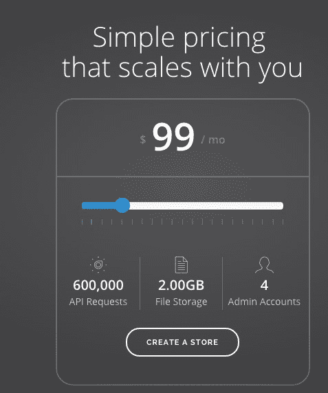

# YC 支持的 Moltin 希望简化电子商务开发 

> 原文：<https://web.archive.org/web/https://techcrunch.com/2015/03/18/yc-backed-moltin-wants-to-simplify-ecommerce-development/>

2015 年 [Y Combinator](https://web.archive.org/web/20230216193049/https://www.ycombinator.com/) 冬季班的成员 [Moltin](https://web.archive.org/web/20230216193049/https://moltin.com/) 的三位创始人，像许多其他成员一样，出于需要产生了他们的公司想法，想出了一种方法来解决他们面临的根深蒂固的问题。

在这种情况下，他们为英国的一家设计机构工作，他们发现向网站添加购物车等电子商务功能太难了，而且通常成本很高。

他们决定通过创建一个后来成为 Moltin 的基于 API 的框架来简化它。Moltin 的 CCO Adam stur rock 解释说，该产品背后的想法是让开发人员更容易用几行代码添加电子商务功能。

“我们在电子商务领域有一些组件和互动，(我们已将其)转化为基本通话，”他表示。程序员可以通过编写一些代码并链接到购物车或结账页面等功能来访问这些组件。

对于那些不太懂技术的人来说，比如想在网站上添加电子商务组件的博客作者，他们通过创建 HTML 小部件来为你打电话，从而进一步简化了网站。

据 Sturrock 报道，如今，他们的平台上有 1600 名开发人员，5 或 6 个现场安装，30 个左右在开发中。

你可以用一个小商店和 30 个免费 API 调用，20 GB 的存储和一个管理员帐户免费试用该产品。随着规模的扩大，您需要根据 API 调用次数和使用的存储空间支付更高的[月费，从每月 49 美元开始，300，000 个 API 请求、1 GB 存储空间和 3 个管理员帐户，一直到 500 美元，500 万个请求、10 GB 存储空间和无限的管理员帐户。](https://web.archive.org/web/20230216193049/https://moltin.com/pricing)

该团队设计了一种创造性的方法来确定您的定价需求，使用滑块拖动并查看每个定价级别为您提供了什么。

大约 18 个月前，他们开始在英国发展公司，在那里他们加入了一个名为 Ignite 100 的加速器项目。他们筹集了一些资金，增加了一些功能，几个月前搬到了旧金山，成为 Y Combinator 项目的一部分。

事实上，他们需要申请去美国的护照，并获得加入 YC 的面试机会。

今天，这个项目即将结束，Sturrock 说这是一次很棒的经历。这不是该团队的第一个加速器，所以他们认为他们知道会发生什么，但 Y Combinator 的工作方式有点不同——以一种好的方式。

“它的效果如此之好，令人震惊，”他说。“这是一次长时间的紧张体验，但它让我们重新思考如何描述和销售我们的产品。”

他说，合作伙伴帮助他们开发了关键信息，让开发者了解 Moltin 是什么。

前两周结束时，他们已经建立了一个网站，并吸引了很多人加入。他们写了一本入门指南，让人们快速上手，总体来说，这是一个更好的服务。

他说，他们也在尝试销售方法。他们尝试直接与代理商合作，但他们倾向于使用更成熟的产品，如 Magento 或 T2 Shopify。

他们意识到开发者想要尝试一些东西，所以他们想出了免费版本。

他们发现现有的解决方案对许多开发人员来说太复杂或太昂贵——如果他们侵入了自己的解决方案，他们就不得不维护它。

Moltin 提供了基本的构建模块，并试图让用户尽可能容易地使用它。

“人们不需要庞大臃肿的系统，”斯特罗克说。“我们想减轻他们的痛苦。”