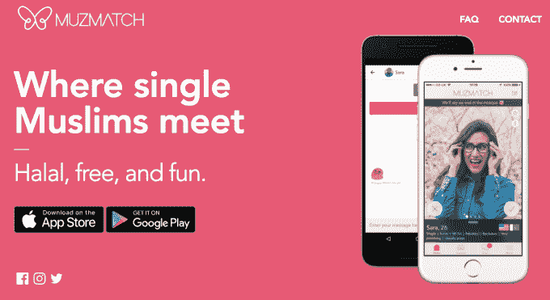

# YC 支持的 Muzmatch 肯定不想成为穆斯林的火种

> 原文：<https://web.archive.org/web/https://techcrunch.com/2017/08/03/yc-backed-muzmatch-definitely-doesnt-want-to-be-tinder-for-muslims/>

乍一看，YC 支持的 Muzmatch 约会应用程序可能最好被描述为“穆斯林的火种”。但联合创始人沙赫扎德·尤纳斯和瑞安·布罗迪很清楚，是什么让他们的目标受众不同于那些随意约会/勾搭的人群:为了结婚而寻找伴侣的真实意图。

他们说，这就是为什么他们绝对不只是为穆斯林克隆火绒。

布罗迪说:“我们的观众被深深吸引住了，他们对这一搜索如此投入。”“对于一个 20 多岁的穆斯林来说，他们的教育一直是以寻找丈夫或妻子为中心。这是对大多数穆斯林而言的。我想有些人认为这就像犹太人的 JCrush 一样。但从我们的角度来看，这完全不是问题。

“不仅仅是市场规模——例如，我们的市场比犹太市场大 100 多倍——真正的区别是严肃性和意图。不是随便约会。在伊斯兰教中有这样一个概念，没有你的配偶，你只能走到半路。这就是它的核心。几乎我们所有的用户都是从这里开始的。”

联合创始人表示，在推出第一版应用大约两年后，Muzmatch 已拥有约 20 万用户，分布在约 160 个国家，并以每月约 10%的速度增长。

“我们在世界各地都举办过婚礼，”尤纳斯说。“现在每天大约有 30 人离开我们的应用程序，并明确告诉我们，我在你的应用程序上找到了我的伴侣，或者我刚刚订婚，或者我们刚刚结婚。”

他们说，到目前为止，通过穆斯林社区的口碑推荐，增长是有机的。大约一半的 Muzmatch 用户在英国；大约三分之一在美国和加拿大；其余的分布在世界各地。就性别而言，大约三分之二是男性，三分之一是女性。平均年龄是二十多岁。

创始人表示，到目前为止，这款婚介应用已经促成了约 6000 对夫妇的结合，以及“至少 600 场确认的婚礼”，尽管他们不能确定这个数字是否会更高，因为不是每个人都给他们发消息讲述自己的故事。

他们讲述了一个有趣的故事，一名来自乌干达的男子给他们发了电子邮件，感谢他们通过该应用程序帮助他认识了他的妻子——当他们去查看他们在乌干达到底有多少用户时，嗯，只有这两个人。“命中注定，就是命中注定！”尤纳斯说。

尽管有一些“世界其他地方”的成功，他们目前的“集中焦点”是在西方的穆斯林——解决他们所说的这个 6000 万社区的“关键问题”:“穆斯林的低密度”。这意味着，在英国、美国和加拿大等地的城镇寻找相同信仰伴侣的穆斯林单身人士可能会面临潜在伴侣短缺的问题。至少在它们的近邻。

布罗迪认为，这些动态对 Muzmatch 有利，因为他们的目标市场已经准备好投入额外的工作来寻找“那个人”。因此，他们也很可能会喜欢能让他们的搜索变得更容易的技术工具。

“对我们来说，最棒的是已经有了运动的预期，所以我们从来不用担心网络效应。他告诉 TechCrunch:“大多数约会应用程序，每个用户都期望在一英里之外遇到自己的另一半——幸运的是，这种期望并不存在，这很棒。”

根据创始人的说法，解决这样一个积极参与的用户群的另一个优势是，Muzmatch 的单身人士会受到激励，在他们的个人资料中填写大量详细信息——考虑到他们的搜索中有多少标准可以发挥作用(即，除了他们是否认为潜在的伴侣有吸引力之外，还与家庭、文化、传统、宗教信仰等其他因素有关)——然后该应用程序可以利用所有这些丰富的用户数据来改善其建议的匹配。

“通过我们的应用程序和应用程序中的技术，我们真的在努力满足那些特定的需求，”尤纳斯说，他描述了西方穆斯林在遇到一个符合他们所有标准的人时可能遇到的困难。“我们认为传统的西方约会应用程序并没有真正迎合这一点。”

这项业务已经实现了盈利，收入来源包括高级订阅和应用内购买，这些服务为用户提供了额外的功能，例如在某人喜欢你之前与他匹配的能力(作为试图吸引他们注意的一种方式)——尽管加入和使用基本应用是免费的。

尤纳斯认为:“因为有更严肃的意图，人们更愿意花钱而不是……一款休闲约会应用——在这种应用中，预期几乎是免费的。”

虽然 Muzmatch 的功能集有一些任何 Tinder 用户都熟悉的基本机制，如“喜欢”或“传递”可能的匹配，以及在应用程序内与相互匹配的人聊天的能力，但它也有反映其社区需求的差异 Younas 描述为“基本上”没有休闲约会市场，因为婚姻是“我们信仰的如此重要的一部分”。

> 世界上一半的穆斯林人口在 30 岁以下……全世界穆斯林人口的增长是惊人的。

因此，举例来说，所有用户都必须通过应用程序自拍，这样他们的个人资料就可以被手动验证，以帮助提高信任度，阻止垃圾邮件发送者；不过，用户不必提供真实姓名，也可以选择不在个人资料中显示照片，或者模糊照片，除非有匹配的照片。

用户还被要求对他们交往过的其他人进行评级——这些评级被输入到匹配算法中，目的是发现“优质用户”，并促进积极的行为，与通常真正认真寻找生活伴侣的单身群体很好地融合。

女性用户也可以选择陪伴功能，如果她们希望遵守这种伊斯兰礼仪，她们所有的应用内聊天都会通过电子邮件发送给 wali/guardian。

男性和女性对该应用的体验还有一些其他差异，例如女性对谁可以查看她们的照片有更细致的控制，在被限制之前每天可以查看更多的个人资料(创始人表示，这是因为目前有更多的男性用户)。

“这对双方都是透明的，”wali/guardian option 的尤纳斯说。“所以对话双方都知道有第三方参与其中。对我们来说，这些是我们提供给用户的可选功能——取决于他们在哪里，我们不一定要把宗教角度强加给人们，但我们想做的是给他们选择权。所以如果你非常虔诚，你可以选择这些选项。”

“对我们来说，让每个人都可以接触到，真的是拥有这个市场的关键，”他补充道。“世界上有 18 亿穆斯林，他们非常多样化——在文化、语言、世界观，特别是宗教礼仪方面，所以我们试图做的是以一种非常——我不一定说是中立的方式——但对每个人来说都非常容易理解的方式导航所有这些……到目前为止，这种方式一直很有效。”

创始人表示，他们有意努力阻止交易动态渗透到 Tinder 等约会应用中——例如，用户在 12 小时内可以浏览的档案数量是有限制的(尽管用户也可以付费取消上限)；人们也可以回去重新访问他们以前传递的个人资料，或者如果他们后来改变主意，与他们以前不匹配的人重新比赛。

布罗迪说:“实际上，我们有许多已婚夫妇回去后改变主意的例子。”。“不像在 Tinder 上说的，你实际上可以重新匹配某人。因此，如果没有成功，你可以取消匹配，然后万一 6 个月后情况发生了变化，你可以重新匹配它们。”

> 我们收到一个女孩的信息，说感谢上帝的复赛功能——因为如果没有它，我不会和这个家伙在一起

尤纳斯补充说:“我们收到一个女孩的信息，说感谢上帝的复赛功能——因为如果没有它，我不会和这个家伙在一起。”“所以我们知道这个东西是有效的。”

作为一名伦敦的年轻穆斯林，尤纳斯对现有穆斯林交友网站的质量不以为然，他形容这些网站“丑陋而可怕”，并拥有“糟糕的声誉”，他自己发起并创建了最初的应用程序。

布罗迪后来加入了，在见过尤纳斯并对早期 MVP 的吸引力感到兴奋之后——两人在去年 8 月重新推出了 Muzmatch。

随着雄心的增长，他们表示，他们开始觉得伦敦不是尝试扩展消费者应用的理想基地。因此，他们申请并加入了 Y Combinator 的项目，并将于 2017 年夏季毕业于 YC 创业公司。

“我们的野心越来越大，”布罗迪说。“我们意识到我们在这里拥有的机会，我们认为，至少在伦敦，我们不会得到我们需要的弹药或你在美国西海岸拥有的思想和信仰……(YC)有着令人难以置信的记录，所以我们只是想让我们这样做。”

虽然他们从生活在西方的穆斯林开始，但他们的野心扩展到了整个全球穆斯林市场——看到了超越他们最初关注的穆斯林密度低的市场的巨大潜力。

事实上，布罗迪认为，在大多数穆斯林国家，甚至更需要一个婚介应用程序，他说，这些国家已经有了很大的，但在他看来，无效且往往昂贵的婚介行业。因此，换句话说，高密度的潜在配偶仍然是一个配对应用程序需要解决的问题。

“(在印度尼西亚等国家)已经有了一个巨大的媒人市场。但这是非常无效的，”他说。“这不仅仅是西方的问题，那里人口密度低，即使在一个所有人都是穆斯林的国家，每个人都是如此，寻找伴侣非常困难。”

就竞争而言，撇开老一代的婚介网站不谈，布罗迪说有“少数”其他人试图为穆斯林单身人士开发约会应用程序——在应用商店快速搜索就会出现 [Minder](https://web.archive.org/web/20221007220942/http://www.minderme.co/) 和 [Salaam-Swipe](https://web.archive.org/web/20221007220942/http://salaamswipe.com/) 这两个例子——但他声称 Muzmatch 的规模至少是“我们最接近的应用程序竞争对手”的两倍。

“我们的竞争对手在这方面的做法完全错误，”他表示。“他们本质上是为穆斯林重新包装火绒，我们知道这是行不通的，这也是为什么我们的竞争对手在社区中信誉很差。”

尤纳斯补充说:“对我们来说，关键是我们试图在理解穆斯林文化以及他们如何寻找伴侣的特殊癖好和敏感性的基础上来做这件事。”

“这就是为什么对许多穆斯林来说，西方约会应用程序不起作用，因为它没有真正迎合特定的需求和意图。因此，对我们来说，从一开始我们就考虑到了这一点，并将其融入到我们的设计和产品中。我们认为，从长远来看，这将使我们与众不同。”

创始人还认为，与典型的约会应用相比，Muzmatch 可能有更好的机会在匹配和约会业务之外赚钱——通过提供相关服务，例如帮助用户找到婚礼场地。如果他们的用户正在配对并相对快速地结婚，这可能是重要的。

“我认为我们比大多数人更有机会在赛后实现盈利。布罗迪说:“因为仅仅是(穆斯林找到伴侣和结婚之间的)短暂时间跨度和与我们的关系与正在发生的事件如此接近，我认为，从长远来看，这对我们来说可能是一个有趣的空间。”。

“现在穆斯林市场很大，所以我们不会失去顾客，”尤纳斯补充道。

随着他们进入 YC 演示日，两人正在寻求筹集资金，但尤纳斯表示，鉴于 Muzmatch 已经盈利，他们打算“小心行事”——他说，目标是“真正加速事情的发展，但在更可持续的水平上”。

他们希望在本地化和扩大团队规模(目前只有他们两个人)等领域进行投资，因此任何资金都将用于为未来的增长做准备，例如投资员工和后端基础设施。

“我们有全球野心，”尤纳斯说。“我们不仅仅关注美国、加拿大和英国。我们真的想成为全球穆斯林寻找合作伙伴的全球参与者。”

“毫无疑问，十年后，会有人做到这一点。布罗迪补充说:“我们希望实现这一目标，而这次加薪的一部分将是确保我们有足够的弹药去真正实现它。我们不仅仅是一个小众约会应用。这完全不同。

“对于 18 亿人来说，这是一种独特的产品……世界上一半的穆斯林人口不到 30 岁。在沙特阿拉伯这样的国家，三分之二的人口不到 30 岁。全世界穆斯林人口的增长是惊人的。”