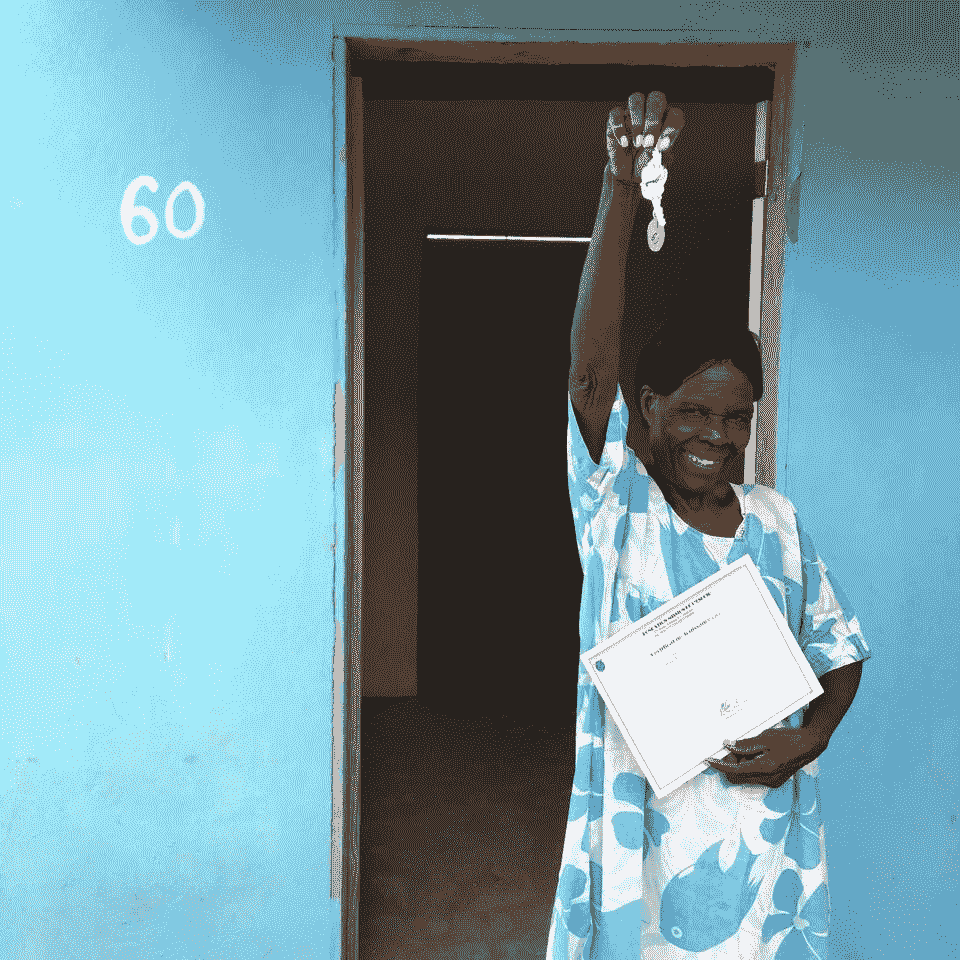
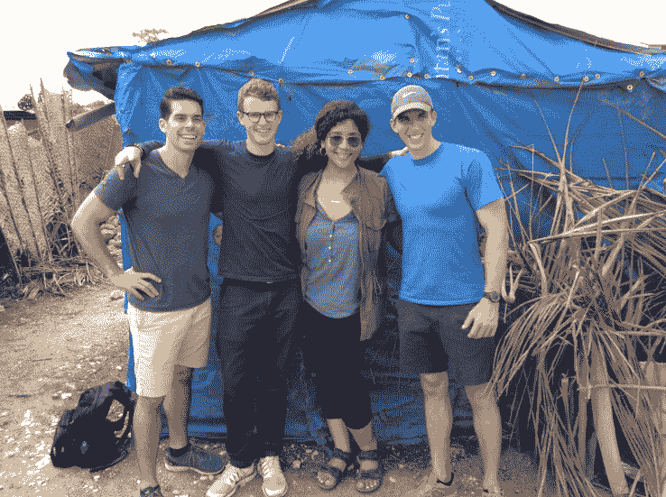

# YC 支持的新故事为无家可归的家庭众筹房屋 

> 原文：<https://web.archive.org/web/https://techcrunch.com/2015/05/15/yc-backed-new-story-crowdfunds-houses-for-homeless-families/>

Y Combinator 目前的一批创业公司中，有一家是为那些因自然灾害而失去家园的人筹集资金建造房屋的，首先从海地开始。联合创始人布雷特·哈格勒(Brett Hagler)在一次志愿者旅行中产生了这个想法，这次旅行是为了帮助那些在 2010 年地震中遭受打击的人，那次地震使成千上万的海地人无家可归。

哈格勒在电话中告诉我，“有很多事情是我们没有想到的，比如强奸和绑架儿童。”。“我和《新故事》的合作伙伴“希望使命”一起进行了一次使命之旅，我看到了所有这些因灾难而流离失所的家庭。我知道我当时想做点什么。”

玛丽亚·罗斯，一个有四个孩子的寡妇,《新故事》为她建了一个新家。

哈格勒在为一家名为 Hucksley 的具有社会意识的电子商务初创公司工作时，将这一经历和他的想法保留了几年。哈格勒的创业并不成功，他发现自己的思绪又回到了他在海地帮助过的无家可归的家庭。

哈格勒邀请两位有慈善工作背景的联合创始人亚历山大·拉菲(Alexandria Lafci)和马修·马歇尔(Matthew Marshall)帮助他创建一个众筹网站，为自然灾害的受害者筹集资金建造家园。

New Story 与 Kickstarter 或 Indiegogo 的众筹原理相同，但都是为了筹集资金建造房屋。它一次接纳一个家庭，每次活动需要在建筑开始前筹集 6000 美元。每个家需要大约 45 天来建造，那些出资建造的人在完成后会得到一张他们帮助的家庭的照片。

该慈善机构目前专注于海地的灾难受害者，但“新故事”计划扩展到其他地区，如尼泊尔——一个最近遭受 7.8 级地震袭击的国家，地震导致 8000 多人死亡，更多人受伤和流离失所。

哈格勒说:“我们不是为了第一反应和临时救援，所以现在去那里还不是时候，但我们希望以后去那里。”“我们希望带给他们一个可以持续 10 到 15 年的家。”

新故事的联合创始人在海地合影留念。

哈格勒说，这是一个资源问题，也是在其他地方建立伙伴关系，开始在那里建造房屋的问题。为此，他强调需要在网站上提供全面的声音体验。

哈格勒说:“我不喜欢‘非营利’这个词，因为它没有传达出它应该是什么样子，但我认为他们应该像初创公司一样工作，为用户提供良好的体验。”"但利润没有回到投资者手中，而是流入了家庭."

新故事是 YC 自 2013 年承诺支持的为数不多的非营利组织之一。

到目前为止，这家初创公司已经筹集了 YC 以外的 12 万美元，并为 20 个海地家庭提供了住房。那些想帮助《新故事》将更多家庭安置在家中的人可以点击[此处](https://web.archive.org/web/20221209172545/http://newstorycharity.org/)做出贡献。