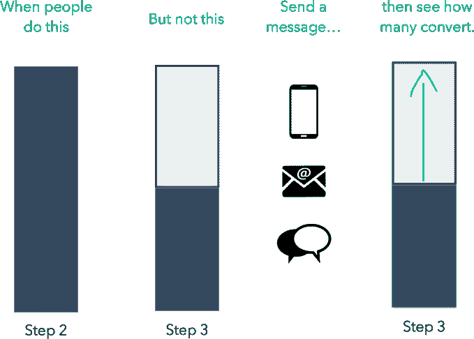

# YC 支持的 Outbound 帮助企业通过电子邮件和手机向客户发送信息 

> 原文：<https://web.archive.org/web/https://techcrunch.com/2015/03/04/yc-backed-outbound-helps-businesses-message-customers-over-both-email-and-mobile/>

随着向移动设备的转移，如今的企业需要随时随地联系到他们的客户，这包括向他们的客户进行电子邮件之外的营销。一家由 Y Combinator 支持的名为 [Outbound](https://web.archive.org/web/20230216193050/http://www.outbound.io/) 的初创公司希望帮助今天的营销人员开展不仅仅是跟踪“打开和点击”的活动，还可以通过推送通知、短信甚至应用内消息等移动友好的渠道接触客户。

这个问题是 Outbound 的联合创始人[德茹夫卡兰·梅塔](https://web.archive.org/web/20230216193050/http://www.linkedin.com/in/dhruvkaran)和[乔希·韦斯伯格](https://web.archive.org/web/20230216193050/http://www.linkedin.com/in/joshweissburg)个人非常熟悉的。两人之前曾在汽车共享公司 [Getaround](https://web.archive.org/web/20230216193050/https://www.crunchbase.com/organization/getaround) 共事，韦斯伯格在那里专注于激活，梅塔是与他一起从事增长工作的工程师。

他解释说，在 Getaround，Weissburg 面临的挑战之一是让那些在服务中列出车辆的车主完成创建个人资料的过程。人们会被困在不同的台阶上，然后就掉下去了。然后，他需要能够接触到这些特定的客户，无论他们当时身在何处——例如，通过网络或手机——并鼓励他们采取完成流程所需的下一步行动。

韦斯伯格说，建立这些有针对性的活动，通过各种渠道接触到有问题的客户，这在工程方面是一个巨大的痛苦。但这一经历给了他们一个想法，那就是开发一种产品，让非技术人员——比如营销人员——更容易发出这类信息，并找出哪些有用，哪些没用。

2013 年夏天，两人开始建立现在已经成为 [Outbound](https://web.archive.org/web/20230216193050/http://www.outbound.io/) 的服务，这项服务不仅让营销人员根据特定的触发条件自动开展活动并向用户发送消息，还可以相互测试多个活动，并与对照组进行测试，等等。

[gallery ids="1127611，1127610，1127609，1127608"]

“随着企业意识到人们正在移动，他们的大部分收入都来自那里，他们需要开始吸引这些受众，并让人们回到他们的移动资产，”梅塔解释说。“但实际情况是，许多适用于电子邮件的技术并不真正适用于推送通知……我们相信，从根本上讲，公司可以通过发送更少但更好的信息来赚更多的钱，”他补充道。

也就是说，企业需要一个解决方案，不仅要在营销自动化方面将移动设备视为一等公民，还要帮助企业找出接触这些客户的最佳方式，然后衡量他们的目标是否达到。

例如，除了让客户打开电子邮件并点击链接之外，使用 Outbound 的企业还可能试图让用户完成个人资料、添加支付信息、完成注册过程、填写缺失信息、升级帐户等等。

有了 Outbound 的服务，营销人员不必坐下来与公司的工程团队进行长时间的对话来构建他们的信息平台，也不必求助于有时昂贵的营销自动化软件，这些软件无法满足他们对多渠道战略的需求。相反，营销人员可以在线访问 Outbound 的网站，立即开始创建他们想要的活动，包括用户采取什么行动将启动活动、他们希望用户做什么作为回报以及他们希望如何(例如推送、电子邮件、短信)接触这些用户等信息。

然后，该服务返回一个“待办事项”列表，客户可以将该列表交给他们的开发人员，告诉他们要进行的确切 API 调用。或者，对于那些已经将数据发送到位于 Segment.com 的网络中心的人来说，使用 Outbound 只是拨动开关打开它。

活动开始后，营销人员可以在 Outbound 的在线仪表板上实时查看结果，并跟踪历史数据和趋势。

该公司在 2014 年夏天首次公开推出这项服务，当时它更专注于漏斗消息。然而，今年早些时候，它扩展到支持更复杂的逻辑和 A/B 测试。根据公司规模，该服务的价格从每月 149 美元(2000 名活跃用户)到每月 899 美元(30000 名用户)不等。(定价基于发送消息的活跃用户数量，而不是发送的消息数量。)

如今，Outbound 与 16 家公司合作，尤其是教育、金融服务和医疗保健领域的公司。它的一些客户包括 HealthLoop、uBiome、eTherapi、GetSmarter 和 Omada Health 等。

总部位于旧金山的 Outbound 得到了 Y Combinator、Subtraction Capital 的保罗·威拉德(Paul Willard)、InterWest Partners 的道格·佩珀(Doug Pepper)、Correlation Ventures 的特雷弗·肯泽尔(Trevor Kienzle)以及 YC 的加里·谭(Garry Tan)和亚历克西斯·奥哈尼安(Alexis Ohanian)150 万美元的投资。